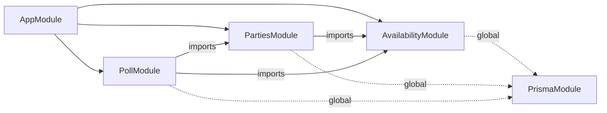
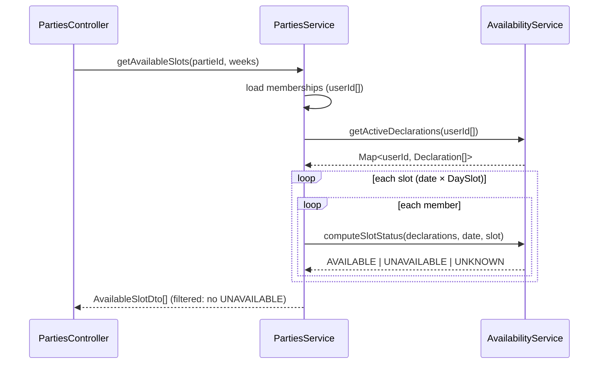

# Architecture Spine — Palier 2 : Calendrier

## Paradigme

**NestJS Modular + Angular Signals (brownfield).** Les invariants du Palier 1 s'appliquent intégralement :
- API : controller → service → PrismaService (global). Le controller ne touche jamais Prisma directement.
- Web : composants standalone, état réactif via Signals, appels HTTP dans les services `core/`.
- Auth : session-based (`AuthenticatedGuard` sur toutes les routes protégées, `req.user` disponible dans les controllers).

## Inherited Invariants (Palier 1 — read-only)

| ID | Règle héritée |
|----|--------------|
| P1-AD-1 | `PrismaService` est global — aucun module ne le déclare dans `providers`, jamais réimporté |
| P1-AD-2 | Les mutations passent exclusivement par la couche Service — un controller n'écrit pas en base |
| P1-AD-3 | `PartiesModule` exporte `PartiesService` pour les modules qui vérifient l'appartenance ou le rôle MJ |
| P1-AD-4 | Angular : `import type` pour tous les types partagés de `@master-jdr/shared` |
| P1-AD-5 | Angular : control-flow `@if/@for`, pas de `*ngIf/*ngFor` |

## Architecture Decisions

### AD-1 — AvailabilityModule : propriétaire exclusif des déclarations et du calcul de slot

**Binds :** `AvailabilityDeclaration` dans `apps/api/src/availability/`  
**Prevents :** PollModule ou PartiesModule recalculant `computeSlotStatus` en doublon  
**Rule :** `computeSlotStatus(userId, date, slot)` vit uniquement dans `AvailabilityService` et est appelé par les autres modules via l'export. Jamais reimplementé.

```
apps/api/src/availability/
  availability.module.ts       # imports: [] exports: [AvailabilityService]
  availability.service.ts      # computeSlotStatus + CRUD déclarations
  availability.controller.ts   # GET/POST/PATCH/DELETE /availability
  dto/
    create-availability.dto.ts
    update-availability.dto.ts
```

### AD-2 — PollModule : propriétaire du vote, importe AvailabilityModule

**Binds :** `SessionPoll`, `PollOption`, `PollVote` dans `apps/api/src/poll/`  
**Prevents :** PollService accédant à `AvailabilityDeclaration` via Prisma directement  
**Rule :** PollModule importe `PartiesModule` (vérif `mjId`) et `AvailabilityModule` (calcul créneaux pour les options de vote). PollService délègue le calcul de disponibilité à `AvailabilityService`.

```
apps/api/src/poll/
  poll.module.ts               # imports: [PartiesModule, AvailabilityModule]
  poll.service.ts              # logique vote + unicité OPEN
  poll.controller.ts           # /parties/:id/poll + sous-routes
  dto/
    create-poll.dto.ts
    cast-vote.dto.ts
    choose-date.dto.ts
```

### AD-3 — GET /parties/:id/available-slots dans PartiesController

**Binds :** placement de l'endpoint de calcul  
**Prevents :** duplication de la vérification d'appartenance (déjà dans PartiesService)  
**Rule :** `PartiesModule` importe `AvailabilityModule`. `PartiesController` expose `GET /parties/:id/available-slots`. `PartiesService.getAvailableSlots(partieId, weeks)` charge les membres via `Membership`, appelle `AvailabilityService.computeSlotStatus` par membre, retourne les créneaux triés.

### AD-4 — Unicité "un seul OPEN poll par partie" en service, pas en DB

**Binds :** enforcement de la contrainte métier  
**Prevents :** deux polls OPEN simultanés sur une même partie  
**Rule :** `PollService.create()` vérifie `findFirst({ where: { partieId, status: 'OPEN' } })` avant d'insérer. Si un poll OPEN existe, il le ferme automatiquement (`status: 'CLOSED'`) avant de créer le nouveau. L'`@@index([partieId, status])` rend cette requête rapide.

### AD-5 — computeSlotStatus opère en mémoire sur les déclarations pré-chargées

**Binds :** stratégie de performance du calcul  
**Prevents :** N+1 queries (une requête SQL par slot par membre)  
**Rule :** `AvailabilityService.computeSlotStatus` reçoit les déclarations déjà chargées (`AvailabilityDeclaration[]`), pas un `userId` seul. L'appelant charge toutes les déclarations actives des membres en une requête (`WHERE userId IN [...] AND expiresAt > NOW()`), puis itère en mémoire. Respecte NFR-2 (<1s pour 6 membres × 8 semaines).

### AD-6 — ThemeToneService : thème et ton couplés, deux signals

**Binds :** structure du service de thématisation Angular  
**Prevents :** thème visuel et microcopy qui divergent (un utilisateur sous Forêt Ancienne voit du texte Grimoire Émeraude)  
**Rule :** `ThemeToneService` expose `activeTheme = signal<'grimoire-emeraude' | 'foret-ancienne' | 'medieval-steampunk'>()` et `tone = computed(() => TONE_MAP[activeTheme()])`. Changer le thème change les deux. Le service applique la CSS class sur `document.body`. Persisté dans `localStorage`.

```
apps/web/src/app/core/theme/
  theme-tone.service.ts
  tones.ts                     # TONE_MAP: Record<Theme, Record<string, string>>
```

### AD-7 — Feature calendar : deux routes, deux layouts

**Binds :** structure de routing et des composants Angular  
**Prevents :** mélange de la vue "déclaration personnelle" et de la vue "MJ cherche une date"  
**Rule :**

| Route | Composant | Layout |
|-------|-----------|--------|
| `/profile/calendar` | `CalendarViewComponent` (mode personnel) | pleine largeur, bottom-sheet mobile, side-panel desktop |
| `/parties/:id/calendar` | `CalendarViewComponent` (mode MJ) | split 60/40 desktop (calendrier + panneau résultats) |

`CalendarViewComponent` reçoit un `@Input() mode: 'personal' | 'mj'` qui conditionne le layout et les données chargées.

```
apps/web/src/app/features/calendar/
  calendar-view/calendar-view.ts        # conteneur principal (mode personal|mj)
  calendar-month/calendar-month.ts      # vue mois (3 segments par case)
  calendar-week/calendar-week.ts        # vue semaine (grille jour×slot)
  constraint-panel/constraint-panel.ts  # bottom-sheet mobile / side-panel desktop
  available-slots/available-slots.ts    # panneau résultats MJ (mode mj seulement)
  poll-flow/poll-flow.ts                # création et réponse au vote

apps/web/src/app/core/availability/
  availability.service.ts               # GET/POST/PATCH/DELETE /availability

apps/web/src/app/core/poll/
  poll.service.ts                       # /parties/:id/poll + votes
```

## Shared Types (packages/shared)

Nouveaux types à ajouter dans `@master-jdr/shared` :

```typescript
// Enums
export type DaySlot = 'MORNING' | 'AFTERNOON' | 'EVENING' | 'FULL_DAY';
export type AvailKind = 'UNAVAILABLE' | 'AVAILABLE';
export type RecurKind = 'RECURRING' | 'PUNCTUAL';
export type PollStatus = 'OPEN' | 'CLOSED';
export type VoteAnswer = 'YES' | 'NO' | 'MAYBE';
export type SlotStatus = 'AVAILABLE' | 'UNAVAILABLE' | 'UNKNOWN';

// DTOs
export interface AvailabilityDeclarationDto { id, userId, kind, recurKind, dayOfWeek?, slot, startDate?, endDate?, expiresAt, createdAt }
export interface CreateAvailabilityDto { kind, recurKind, dayOfWeek?, slot, startDate?, endDate?, expiresAt }
export interface AvailableSlotDto { date, slot: DaySlot, members: { userId, pseudo, status: SlotStatus }[] }
export interface SessionPollDto { id, partieId, status, scenarioRef?, expiresAt?, chosenDate?, chosenSlot?, options: PollOptionDto[] }
export interface PollOptionDto { id, date, slot: DaySlot, votes: PollVoteDto[] }
export interface PollVoteDto { userId, pseudo, answer: VoteAnswer }
```

## Schema Prisma (ajouts)

Migration : `calendar_p2`

```prisma
enum DaySlot    { MORNING AFTERNOON EVENING FULL_DAY }
enum RecurKind  { RECURRING PUNCTUAL }
enum AvailKind  { UNAVAILABLE AVAILABLE }
enum PollStatus { OPEN CLOSED }
enum VoteAnswer { YES NO MAYBE }

model AvailabilityDeclaration {
  id        String    @id @default(uuid())
  userId    String
  user      User      @relation(fields: [userId], references: [id], onDelete: Cascade)
  kind      AvailKind
  recurKind RecurKind
  dayOfWeek Int?
  slot      DaySlot   @default(FULL_DAY)
  startDate DateTime?
  endDate   DateTime?
  expiresAt DateTime
  createdAt DateTime  @default(now())
  @@index([userId, expiresAt])
}

model SessionPoll {
  id          String     @id @default(uuid())
  partieId    String
  partie      Partie     @relation(fields: [partieId], references: [id], onDelete: Cascade)
  createdById String
  scenarioRef String?
  status      PollStatus @default(OPEN)
  expiresAt   DateTime?
  chosenDate  DateTime?
  chosenSlot  DaySlot?
  createdAt   DateTime   @default(now())
  options     PollOption[]
  votes       PollVote[]
  @@index([partieId, status])
}

model PollOption {
  id     String      @id @default(uuid())
  pollId String
  poll   SessionPoll @relation(fields: [pollId], references: [id], onDelete: Cascade)
  date   DateTime
  slot   DaySlot
  votes  PollVote[]
}

model PollVote {
  id       String      @id @default(uuid())
  pollId   String
  poll     SessionPoll @relation(fields: [pollId], references: [id], onDelete: Cascade)
  optionId String
  option   PollOption  @relation(fields: [optionId], references: [id], onDelete: Cascade)
  userId   String
  user     User        @relation(fields: [userId], references: [id], onDelete: Cascade)
  answer   VoteAnswer
  @@unique([optionId, userId])
}
```

## Diagramme — Dépendances modules API



## Diagramme — Flux computeSlotStatus



## Deferred

| Sujet | Raison du report |
|-------|-----------------|
| Récurrence avancée (2e vendredi du mois) | Hors scope P2 — RecurKind simplifié (hebdo uniquement) |
| Import iCal | Nécessite granularité horaire (post-P5) |
| N parmi M (parties épisodiques) | Avec Conte de Minuit |
| Notifications email | Palier 6 (SMTP) |
| Indispos par partie | Global uniquement pour l'instant |
