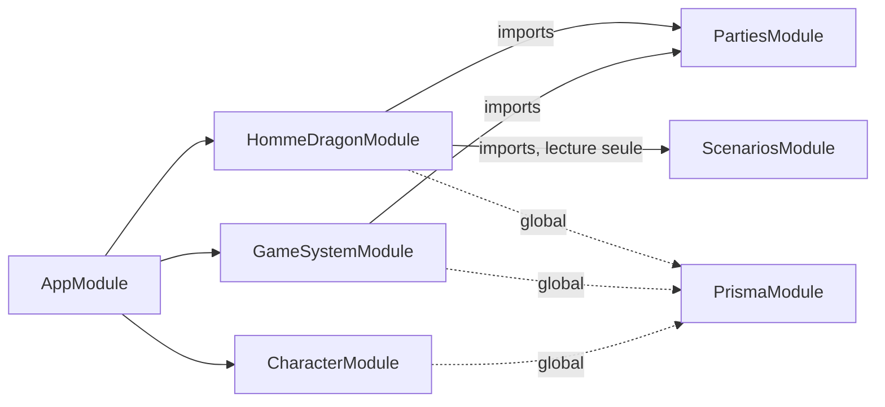
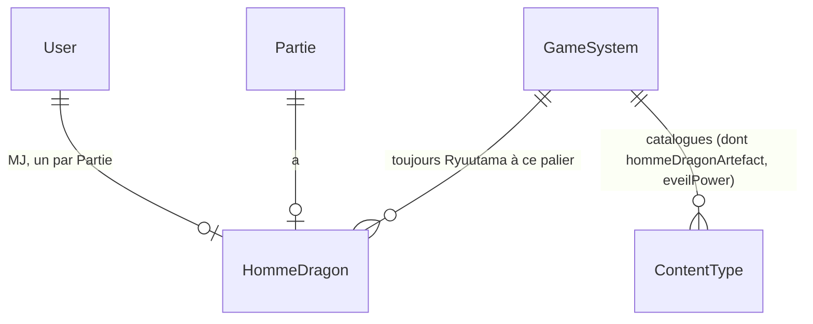

# Architecture Spine — Palier 5 : Homme Dragon (Ryuutama) & fiches de référence annexes

## Design Paradigm

**NestJS Modular + Angular Signals (brownfield).** Les invariants des Paliers 1 à 4 s'appliquent intégralement (cf. Inherited Invariants). Ce palier n'introduit **aucun nouveau paradigme** : il étend le mécanisme déjà établi de fiche pilotée par schéma (`sheetData`/`derived` + `packages/game-rules` + `GameSystem`/`ContentType`/`ContentEntry`) à une deuxième forme de fiche — le personnage du MJ, spécifique à Ryuutama — et ajoute un service de fichiers de référence statiques. Aucun registre de plugin générique par système n'existe encore (différé, cf. Deferred) ; ce palier suit fidèlement le pattern déjà en place (`if gameSystemId !== RYUUTAMA_ID`) plutôt que de le construire par anticipation.

## Inherited Invariants

| Inherited | From parent | Binds here |
| --- | --- | --- |
| P1-AD-1 | Palier 1 | `PrismaService` global — `HommeDragonModule` ne le réimporte jamais |
| P1-AD-2 | Palier 1 | Mutations exclusivement en couche Service — `HommeDragonController`/`GameSystemController` n'écrivent jamais Prisma directement |
| P1-AD-3 / P4-AD-9 | Palier 1 / Palier 4 | `PartiesService.getOwned`/`getViewable` seul point de vérité d'appartenance/rôle MJ — lecture = tout membre, écriture = MJ, jamais de nouveau guard NestJS |
| P1-AD-4 | Palier 1 | `import type` pour tout type de `@master-jdr/shared` côté `apps/api` |
| P1-AD-5 | Palier 1 | Angular : `@if`/`@for`, jamais `*ngIf`/`*ngFor` |
| P3 (Palier 2/3) | Palier 2/3 | `GameSystem`/`ContentType`/`ContentEntry` = mécanisme générique de catalogue data-driven, seedé depuis `game-systems/ryuutama/data/*.json` au bootstrap ; réutilisé tel quel ici (AD-4) |
| P3-AD-9 | Palier 3 | Verrouillage optimiste `updatedAt` pour toute entité à écriture concurrente MJ+joueur — référence de comparaison pour AD-2 ci-dessous, qui en diverge explicitement |
| P4-AD-3 | Palier 4 | `Scenario` : MJ seul écrivain, pas de verrouillage optimiste — même raisonnement repris pour `HommeDragon` (AD-2) |
| P4-AD-8 | Palier 4 | Pattern d'upload/service de fichier déjà établi (`ScenariosController` `documents/:id`, `StreamableFile`) — réutilisé pour AD-5 |

## Invariants & Rules

### AD-1 — `HommeDragonModule` : nouveau module dédié, jamais fondu dans `CharacterModule`

- **Binds:** fiche du personnage MJ (Ryuutama)
- **Prevents:** un discriminant `role: PC|HOMME_DRAGON` sur `Character` qui obligerait tout code consommant `Character` (roster, export PDF joueur, distribution XP, `LevelUpWizard`, `CharacterSnapshot`, journal) à filtrer explicitement pour ne jamais mélanger les deux formes de fiche — risque de régression sur du code PJ déjà très testé, pour une fiche à la forme structurellement différente (pas d'attributs PV/PE/Condition/Initiative/Encombrement, pas de classe/espèce)
- **Rule:** `apps/api/src/homme-dragon/` — module, service, controller nommés d'après le concept Ryuutama directement (pas de nom générique prématuré, cf. Consistency Conventions). Réutilise `GameSystem`/`ContentType`/`ContentEntry` et le principe `sheetData`/`derived` piloté par schéma + `packages/game-rules`, dans sa propre table (`HommeDragon`, un par `[userId, partieId, gameSystemId]` — même forme de contrainte unique que `Character`). L'export PDF (`homme-dragon.pdf.service.ts`) charge le template déjà présent `apps/api/game-systems/ryuutama/assets/Ryuutama_fiche_homme-dragon_big_edit.pdf`. `[ADOPTED]`

### AD-2 — `HommeDragon` : pas de verrouillage optimiste, MJ seul écrivain

- **Binds:** `HommeDragonService.update`
- **Prevents:** sur-ingénierie d'un mécanisme de concurrence pour un profil d'écriture qui ne le justifie pas (contrairement à `Character`, où MJ et joueur écrivent concurremment, P3-AD-9)
- **Rule:** seul le MJ écrit sa propre fiche Homme Dragon — aucune écriture joueur. `HommeDragonService.update()` fait un `prisma.hommeDragon.update()` simple, sans comparaison `updatedAt`. Même divergence assumée que P4-AD-3 (`Scenario`) — ne pas généraliser P3-AD-9 ici.

### AD-3 — Niveau, PS, historique, voyageurs protégés : calculés à la requête, **jamais persistés**

- **Binds:** `HommeDragonService.get` (niveau, PS, historique, voyageurs protégés)
- **Prevents:** un compteur manuel ou un champ `level` stocké qui dupliquerait `Scenario.status` (source de désynchronisation) ; une mécanique de dépense/rechargement de PS gérée par l'appli (hors scope — le suivi en jeu reste à table, comme PV/PE du PJ aujourd'hui) ; un champ « historique » ou « voyageurs protégés » saisi manuellement qui divergerait de `Scenario`/`Membership` ; **toute colonne `derived` sur le modèle `HommeDragon`** — une colonne, même qualifiée de « cache », laisserait un implémenteur l'écrire à chaque lecture (mutant silencieusement `updatedAt`, contredisant AD-2) pendant qu'un autre ne la persisterait jamais, les deux étant également conformes à un texte de règle ambigu
- **Rule:** le modèle Prisma `HommeDragon` **n'a pas de colonne `derived`** (cf. Structural Seed) — niveau et PS n'existent que dans la réponse HTTP, recalculés par `HommeDragonService.get()` à chaque requête, jamais en base. Le niveau est fonction du nombre de `Scenario` `PASSE` de la Partie (seuils : 1 → niv 2, 3 → niv 3, 7 → niv 4, 12 → niv 5). `packages/game-rules/ryuutama` expose une table de seuils dédiée (distincte de `LEVEL_TABLE` du PJ) et une fonction pure `computeHommeDragonDerived(level)` qui produit `{ PS }` (3 aux niveaux 1-2, 5 aux niveaux 3-4, 10 au niveau 5) — pure, ne lève jamais, cohérent avec `compute-derived.ts` du PJ. Franchir un seuil de niveau ouvre un choix MJ (pouvoir d'éveil, cf. AD-4) à l'ouverture de la fiche — même esprit que `LevelUpWizard`, déclenché par ce compte plutôt que par XP. L'historique (titre + date + participants) et les voyageurs protégés (membres de la Partie) sont assemblés à la volée par `HommeDragonService`, qui dépend de `ScenariosService`/`PartiesService` en lecture seule (`HommeDragonModule` importe `ScenariosModule` — pattern cross-module symétrique à P4-AD-11 mais inversé).

### AD-4 — Catalogues Homme Dragon (artefacts, pouvoirs d'éveil) : `ContentType`/`ContentEntry`, jamais codés en dur

- **Binds:** sélection d'artefact et de pouvoir d'éveil, validation de `sheetData.artefact.key`
- **Prevents:** un troisième mécanisme de catalogue à maintenir en parallèle de `ContentType`/`ContentEntry` déjà utilisé pour classes/types/catégories d'armes du PJ ; deux entrées de catalogue au format différent parce que le seedeur et le consommateur (PDF/frontend) ont chacun inventé leur propre jeu de champs ; une clé d'artefact invalide/orpheline acceptée silencieusement en écriture
- **Rule:** deux nouveaux `ContentType` (`hommeDragonArtefact`, `eveilPower`), scope `BASE`, seedés depuis `game-systems/ryuutama/data/homme-dragon-artefacts.json` et `eveil-powers.json` au bootstrap (`GameSystemService.seedRyuutama()`), lus via `GameSystemService.getContent()`. Chaque entrée suit le même format minimal que les catalogues PJ existants (`classes.json`) : `{ key: string, label: string, ...champs propres au type }` — pour `hommeDragonArtefact` au minimum `{ key, label, race: RaceKey }` (une entrée par artefact, 12 au total, filtrée côté MJ par la race déjà choisie) ; pour `eveilPower` au minimum `{ key, label, levelUnlocked: 2|3|4|5 }`. L'artefact sélectionné (+ nom et inscription personnalisés, texte libre) est stocké dans `HommeDragon.sheetData`. **Validation :** `packages/game-rules/ryuutama` expose une fonction pure `validateHommeDragon(sheetData, catalogEntries): { valid: boolean, errors: string[] }` (même signature/convention que `validate()` du PJ — ne lève jamais, `HommeDragonService` est seul responsable de transformer un résultat invalide en `BadRequestException`) qui vérifie que `sheetData.artefact.key` référence bien une entrée `hommeDragonArtefact` de la race choisie ; c'est le seul point de validation référentielle, jamais dupliqué côté frontend au-delà d'un affichage des options valides. Le changement d'artefact reste toujours possible techniquement (règle « jamais en cours de scénario » = convention de table, non imposée par l'appli — cohérent avec P4-AD-3).

### AD-5 — Fichiers de référence Ryuutama : servis tels quels, jamais remplis dynamiquement à ce palier

- **Binds:** journal, carte, événements, monde, monstre, ville, provisions, objectif (×3 : chasse/quête/voyage), œuf de bataille, structure — soit la totalité des fichiers de `apps/api/game-systems/ryuutama/assets/` hors `Ryuutama_fiche_de_voyageur_big_edit.pdf` (fiche PJ, déjà existante), `Ryuutama_fiche_homme-dragon_big_edit.pdf` (AD-1), `Ryuutama-fiche_equipement_edit.pdf`/`Ryuutama_fiche_de_notes_edit.pdf` (AD-6)
- **Prevents:** un mécanisme de remplissage dynamique construit prématurément pour des fiches dont le contenu réel n'est pas encore spécifié (seul « monstre » a des valeurs calculées identifiées ; les autres restent des documents structurés dont le détail par champ est différé, cf. Deferred) ; une divergence d'accès non documentée entre fiches « membre » et « MJ » ; un fichier de `assets/` oublié parce qu'il n'apparaît nulle part dans la table de correspondance
- **Rule:** `GameSystemModule` importe `PartiesModule` et expose `GET /parties/:id/game-systems/:systemId/assets/:key` (réponse `StreamableFile` et convention de garde d'accès identiques à P4-AD-8, mais **source du fichier différente** : pas de ligne DB/nom de fichier stocké comme pour un document uploadé — le fichier est fixe, embarqué au build, chargé par clé via la même technique de lecture que `RyuutamaPdfService.loadTemplate()`). `GameSystemService` porte une table de correspondance exhaustive `key → { file, access }` — clé = slug kebab-case du nom de fichier sans le suffixe `_edit`/l'extension (ex. `journal`, `carte`, `evenements`, `monde`, `monstre`, `ville`, `provisions`, `objectif-chasse`, `objectif-quete`, `objectif-voyage`, `oeuf-de-bataille`, `structure`) — où `access` = `member` (`journal`, `carte` — `parties.getViewable`) ou `mj` (tous les autres — `parties.getOwned`). Toute route qui recevrait une `key` absente de cette table renvoie `404 NotFoundException`, jamais un fallback silencieux. Ces PDF (dont certains ont des champs de formulaire fillable, suffixe `_edit`) sont servis **tels quels** — aucune donnée n'est injectée dedans à ce palier, malgré la capacité technique du format. `[ADOPTED]` Réversibilité : aucune donnée en base, aucun autre module dépendant — une extraction ultérieure en module dédié (si le périmètre grossit) reste un déplacement mécanique, jamais une migration.

### AD-6 — Export PDF Équipement/Notes : nouvelle capacité sur `CharacterModule`, aucun nouveau modèle

- **Binds:** export PDF équipement, export PDF notes (personnage joueur)
- **Prevents:** la création d'un modèle de données dédié pour des données déjà stockées (`Character.sheetData.equipment`, `CharacterNote`) — dupliquerait une source de vérité déjà en place
- **Rule:** deux nouvelles capacités d'export sur `CharacterModule` existant (même pattern que `RyuutamaPdfService` déjà en place pour la fiche PJ complète) : chacune charge son propre template fillable (`Ryuutama-fiche_equipement_edit.pdf`, `Ryuutama_fiche_de_notes_edit.pdf`) et sa propre fonction de mapping dans `packages/game-rules/ryuutama` (`mapEquipmentToPdfFields`, `mapNotesToPdfFields`), lisant respectivement `Character.sheetData.equipment` et `CharacterNote[]` déjà en base — aucune nouvelle table.



## Consistency Conventions

| Concern | Convention |
| --- | --- |
| Naming (module) | Concept Ryuutama nommé directement (`homme-dragon`, pas un nom générique de type `guardian`/`npc`) — cohérent avec `RyuutamaPdfService` déjà explicite, tant qu'aucun registre de plugin multi-système n'existe (cf. Deferred) |
| Accès | Lecture = `parties.getViewable` ; écriture MJ = `parties.getOwned` ; jamais un guard NestJS dédié (hérité, Palier 4). `HommeDragon` n'a aucun besoin d'anti-spoil de type P4-AD-6 : `historique` ne référence que des `Scenario` déjà `PASSE` par construction (AD-3), jamais un scénario futur/en cours — contrairement à `Scenario`/`Announcement`, aucune donnée exposée ici ne révèle du contenu non joué |
| Fiches calculées | Toute valeur dérivable d'une autre source de vérité (niveau, PS, historique, voyageurs protégés) est **calculée à la lecture**, jamais stockée — cohérent avec le principe déjà appliqué à `derived` sur `Character` |
| Catalogues | Tout catalogue de choix fixes (artefacts, pouvoirs d'éveil, classes, types...) = `ContentType`/`ContentEntry` seedé, jamais codé en dur dans un service |
| Fichiers | Un module = un dossier `apps/api/src/<module>/` avec `<module>.module.ts`, `<module>.service.ts`, `<module>.controller.ts` — pattern déjà uniforme |

## Stack

Aucun ajout — réutilise la stack existante (NestJS 11, Prisma 7, Angular 22, Postgres 17, `pdf-lib` déjà en place pour l'export PDF Ryuutama).

## Structural Seed

### Modèle de données (ajouts)

```prisma
model HommeDragon {
  id           String     @id @default(uuid())
  userId       String                              // toujours le MJ de la Partie
  user         User       @relation(fields: [userId], references: [id], onDelete: Cascade)
  partieId     String
  partie       Partie     @relation(fields: [partieId], references: [id], onDelete: Cascade)
  gameSystemId String                               // toujours RYUUTAMA_ID à ce palier
  gameSystem   GameSystem @relation(fields: [gameSystemId], references: [id])
  sheetData    Json                                 // race, avatar (texte libre), artefact+nom+inscription,
                                                      // nom, apparence, caractère, vocation, demeure, mondes protégés
  // PAS de colonne `derived` (AD-3) : niveau/PS/historique/voyageurs protégés sont calculés à
  // chaque requête par HommeDragonService, jamais persistés — aucune colonne à tenir synchronisée.
  createdAt    DateTime   @default(now())
  updatedAt    DateTime   @updatedAt

  @@unique([userId, partieId, gameSystemId])
  @@index([partieId])
  @@index([userId])
}
```

*(Rétrocompatibilité `User`/`Partie`/`GameSystem` : ajouter les relations inverses `hommeDragons` — mécanique, pas un choix.)*

**Aucun ajout de modèle pour :** export PDF équipement/notes (AD-6, réutilise `Character`/`CharacterNote` existants) ; fichiers de référence statiques (AD-5, aucune donnée en base, juste un mapping clé→fichier en code).

### ERD (relations)



### Source tree (ajouts)

```text
apps/api/src/
  homme-dragon/
    homme-dragon.module.ts        # imports: [PartiesModule, ScenariosModule (lecture seule)], exports: [HommeDragonService]
    homme-dragon.service.ts       # AD-1 à AD-4 ; niveau/PS/historique calculés à la lecture
    homme-dragon.controller.ts    # /parties/:id/homme-dragon
    homme-dragon.service.spec.ts
    homme-dragon.controller.spec.ts
    homme-dragon.pdf.service.ts   # export PDF, réutilise le pattern RyuutamaPdfService
  characters/
    character.service.ts          # + 2 méthodes d'export PDF (équipement, notes), AD-6
  game-systems/
    game-system.module.ts         # + import PartiesModule (AD-5)
    game-system.service.ts        # + table clé->fichier->accès (AD-5)
    game-system.controller.ts     # + GET /parties/:id/game-systems/:systemId/assets/:key

apps/api/game-systems/ryuutama/
  data/
    homme-dragon-artefacts.json   # AD-4, nouveau ContentType 'hommeDragonArtefact'
    eveil-powers.json             # AD-4, nouveau ContentType 'eveilPower'

packages/game-rules/src/ryuutama/
  homme-dragon-derived.ts         # computeHommeDragonDerived(level) -> { PS }, seuils de niveau (AD-3)
  homme-dragon-pdf-field-map.ts   # mapping sheetData/derived -> champs PDF (AD-1)
  equipment-pdf-field-map.ts      # AD-6
  notes-pdf-field-map.ts          # AD-6

apps/web/src/app/features/homme-dragon/
  homme-dragon-sheet/homme-dragon-sheet.ts   # fiche + bouton export PDF
apps/web/src/app/core/homme-dragon/
  homme-dragon.service.ts
```

### Types partagés (`packages/shared`)

```typescript
export interface HommeDragonDto {
  id, partieId, userId, gameSystemId,
  sheetData: {
    race: 'DRAGON_VERT' | 'DRAGON_BLEU' | 'DRAGON_ROUGE' | 'DRAGON_NOIR',
    avatar: string,              // texte libre, 3e forme
    artefact: { key: string, nom?: string, inscription?: string },
    nom: string, apparence: string, caractere: string, vocation: string, demeure: string,
    mondesProteges: string,      // préremplis au titre Partie/one-shot à la création, éditable ensuite
  },
  derived: { level: number, PS: number },          // calculés à la lecture (AD-3)
  voyageursProteges: { userId, pseudo }[],          // calculé à la lecture, dérivé des membres de la Partie
  historique: { scenarioTitle: string, date: string, participants: string[] }[],  // calculé à la lecture (AD-3)
  createdAt, updatedAt,
}
```

## Deferred

| Sujet | Raison du report |
| --- | --- |
| Remplissage dynamique des fiches Monde/Monstre/Ville/Objectifs/Œuf de bataille/Structure | Contenu par champ non spécifié à cette altitude (seul « monstre » a des valeurs calculées identifiées) — servies telles quelles pour l'instant (AD-5), à reconsidérer si un besoin concret émerge |
| Registre de plugin générique par système de jeu | Déjà différé dans le code existant (`GameSystemService.getSchema()`) au palier Conte de Minuit/Draconis (Palier 6/7/11) — ce palier suit le pattern codé en dur établi, ne construit pas le registre par anticipation |
| Ajout des classes et textes manquants au contenu Ryuutama seedé | Pur travail de contenu (nouvelles entrées JSON), aucune décision structurelle — traité directement en story, pas dans cette spine |
| Mécanisme de fiche annexe multi-instance dynamique (ex. plusieurs villes avec données structurées propres) | Aucun besoin concret identifié à ce palier — toutes les fiches annexes hors Homme Dragon sont des documents statiques téléchargés tels quels (AD-5) ; à concevoir seulement si un besoin réel émerge (ex. une fiche ville éditable par le MJ avec champs propres) |
| Historisation des changements d'artefact | Non demandé — seul l'artefact courant est conservé, aucun historique des changements passés |
| « Journal de Partie » éditable en ligne (entité distincte du journal personnel `CharacterNote`, Épic 6) | `docs/backlog.md` évoquait cette idée avant précision concrète avec l'utilisateur (2026-07-15) — le besoin réel actuel est un simple PDF vierge téléchargeable (AD-5), pas une nouvelle entité. Un vrai journal de Partie éditable reste une idée future possible, à concevoir seulement si un besoin concret émerge |
| Catalogue d'équipement partagé/campagne (au-delà de l'inventaire individuel du joueur) | Même situation — `docs/backlog.md` évoquait un catalogue MJ-curated distinct de l'inventaire du PJ ; le besoin réel actuel (confirmé utilisateur) est un export PDF de l'inventaire individuel du PJ (AD-6), pas un catalogue partagé. Idée future possible, non retenue à ce palier |
| Environnement/déploiement | Aucun changement pour ce palier (pas de nouveau service externe, pas de nouvelle variable d'environnement) — reste porté par le Palier 7 |
