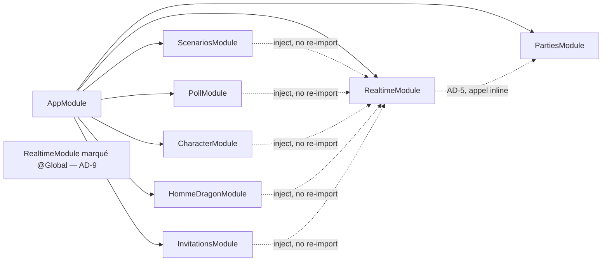

# Architecture Spine — Palier 7 : Synchronisation client/serveur en temps quasi réel (SSE)

## Design Paradigm

**NestJS Modular + Angular Signals (brownfield), avec un bus d'événements interne pour le push SSE.** Ce palier introduit un seul élément structurellement nouveau — un bus d'événements interne scopé par clé de topic (`partie:{id}` / `user:{id}`), exposé côté client via `@Sse()` (RxJS `Observable`, natif NestJS, aucune dépendance additionnelle) et consommé côté navigateur via `EventSource` (API Web native). Ce bus ne remplace pas le paradigme signal-driven déjà en place côté Angular — il l'étend : un événement reçu déclenche `notifyChanged()` sur les services de domaine existants (`ScenariosService`, etc.), qui continuent d'exposer leur signal `changed` exactement comme avant. Aucun nouveau paradigme de gestion d'état frontend, aucune nouvelle couche de contrôleur/service backend au-delà d'un module dédié au bus.

## Inherited Invariants

| Inherited | From parent | Binds here |
| --- | --- | --- |
| P1-AD-1 | Palier 1 | `PrismaService` global — le nouveau module de ce palier ne le réimporte pas (il n'a d'ailleurs aucun besoin de Prisma, cf. AD-1) |
| P1-AD-2 | Palier 1 | Mutations exclusivement en couche Service — l'émission d'événement (AD-2) se fait depuis les services de domaine existants, jamais depuis un controller |
| P1-AD-3 | Palier 1 | `PartiesService.getOwned`/`getViewable` seul point de vérité d'appartenance/rôle — appliqué à l'endpoint SSE (AD-5) |
| P1-AD-5 | Palier 1 | Angular : `@if`/`@for`, jamais `*ngIf`/`*ngFor` — s'applique à toute modification de template dans ce palier |
| PRD Palier 6 §4.1 FR-5 | Palier 6 | Un champ en cours de saisie n'est jamais écrasé par un rechargement externe, sauf si le serveur a modifié précisément ce champ — décision produit (pas une AD d'architecture formelle du Palier 6, qui l'a explicitement laissée à la story). Ce palier doit néanmoins la respecter : cf. AD-10, le refetch générique déclenché par `notifyChanged()` ne doit jamais la violer sur `ScenarioEditor` |

## Invariants & Rules

### AD-1 — Bus d'événements interne : service partagé + RxJS `Subject`, pas de nouvelle dépendance

**Binds :** FR-1, FR-2, FR-14
**Prevents :** l'ajout d'une dépendance (`@nestjs/event-emitter`) pour un besoin qui ne comporte qu'un seul type d'événement (« quelque chose a changé sur ce topic ») ; la coexistence de deux mécanismes de notification différents dans le projet
**Rule :** `[ADOPTED]` `RealtimeEventsService` (nouveau, cf. AD-9) expose une méthode `emit(topic: string)` et une méthode `subscribe(topic: string): Observable<MessageEvent>` construites sur un unique `Subject<{ topic: string }>` interne, filtré par égalité de `topic` (opérateur RxJS `filter`). RxJS est déjà une dépendance transitive de NestJS — aucun ajout de package.

### AD-2 — Déclenchement de l'émission : appel explicite en fin de méthode de mutation

**Binds :** FR-1 (toutes les méthodes de mutation à travers `ScenariosService`, `PollService`, `CharacterService`, `HommeDragonService`, `InvitationsService`, `AnnouncementsService`)
**Prevents :** un mélange où certaines mutations notifient via un intercepteur automatique et d'autres manuellement — un seul chemin traçable ; un intercepteur qui devrait deviner le `topic` depuis la route, fragile dès qu'une route ne suit pas la convention
**Rule :** Chaque méthode de mutation concernée appelle explicitement `this.realtimeEvents.emit(topic)` **après la résolution complète de l'écriture** — jamais à l'intérieur du callback d'un `prisma.$transaction(...)`. Revue adversariale (2026-07-18) : émettre depuis l'intérieur du callback de transaction notifierait les clients avant que l'écriture soit réellement commitée, recréant exactement la race de refetch-obsolète que ce palier doit éliminer. Concrètement : `const result = await this.prisma.$transaction(...); this.realtimeEvents.emit(topic); return result;` — jamais `emit()` à l'intérieur du callback passé à `$transaction`. S'applique à toutes les méthodes utilisant `$transaction` (confirmé présentes dans `poll.service.ts`, `scenarios.service.ts`, `character.service.ts`, `homme-dragon.service.ts`, `invite-links.service.ts`). Aucun décorateur, aucun intercepteur NestJS ne déclenche l'émission automatiquement. Cohérent avec FR-15 du PRD (vérification humaine/agent documentée à chaque nouvel ajout, pas de garde automatisée).

### AD-3 — Câblage frontend : `RealtimeService` appelle `notifyChanged()` sur les services de domaine existants

**Binds :** FR-4 à FR-13
**Prevents :** un signal partagé unique auquel chaque composant listé en §4.2 du PRD devrait s'abonner en plus de son signal local — deux mécanismes de refetch à maintenir en synchro dans les mêmes composants
**Rule :** `RealtimeService` (frontend, cf. AD-9) possède la connexion `EventSource` active pour un topic donné et un unique **tableau de correspondance interne** `topic-prefix → services à notifier`, câblé une fois dans `RealtimeService` lui-même. **API publique fixe et unique :** `connect(topic: string): void` / `disconnect(topic: string): void` — aucune variante n'accepte une liste de services en paramètre (revue adversariale 2026-07-18 : deux stories implémentant `connect(topic)` avec table interne fixe vs `connect(topic, services[])` avec liste passée par l'appelant produiraient deux composants incompatibles selon lequel des deux gagne). Un composant appelle uniquement `connect`/`disconnect` avec un topic ; il ne choisit jamais quels services sont notifiés. Les composants déjà câblés sur leur signal `changed` local (`effect()` + `untracked()`, pattern existant de `ScenariosService`) ne changent pas.

### AD-4 — Contrat public `notifyChanged()`, indépendant du mécanisme réactif interne de chaque service

**Binds :** tout service de domaine ou service partagé consommé par `RealtimeService` (`ScenariosService`, `CharacterService`, `HommeDragonService`, `PollService`/`OpenPollsService`, `InvitationsService`, `AnnouncementsService`, `ModeService`)
**Prevents :** un couplage où `RealtimeService` connaîtrait et manipulerait directement la représentation interne de chaque service (`signal<number>` writable, ou tout autre mécanisme) ; une Rule qui ne s'applique en pratique qu'à un seul des trois cas réels du code existant
**Rule :** Le seul invariant transverse est le **contrat public** : chaque service concerné expose `notifyChanged(): void`, jamais son mécanisme interne. `RealtimeService` n'appelle jamais autre chose que cette méthode. Vérifié brownfield (2026-07-18) : le code existant présente **trois cas distincts**, chacun implémente `notifyChanged()` différemment en interne, ce qui est attendu et correct — l'AD ne fixe pas la forme interne :
1. **`ScenariosService`** a déjà `_changed` (`signal<number>` privé) : `notifyChanged()` fait `this._changed.update(v => v + 1)`.
2. **`CharacterService`/`HommeDragonService`** (frontend) sont aujourd'hui de purs wrappers HTTP, **sans aucun signal `changed`** — ce palier y **introduit** ce signal pour la première fois (nouvelle infrastructure réactive, pas une extension d'existant) : même forme que (1) une fois ajoutée.
3. **`OpenPollsService`/`ModeService`** (FR-14) sont déjà réactifs via un `effect()` interne sur `playerParties()`, sans compteur `_changed` : `notifyChanged()` y déclenche directement la même logique de rafraîchissement que cet `effect()` (ex. relance manuelle de la fonction de chargement qu'il appelle), sans qu'un `_changed` équivalent soit requis.

### AD-5 — Sécurité de l'endpoint SSE : réutilisation exclusive de `getViewable`/`getOwned`

**Binds :** FR-2
**Prevents :** un deuxième mécanisme d'autorisation à maintenir en parallèle du reste de l'API
**Rule :** `GET /parties/:id/events` (et l'équivalent scopé utilisateur, cf. AD-7) applique le même contrôle d'appartenance que les routes REST existantes — `PartiesService.getViewable(partieId, userId)` avant d'ouvrir le flux SSE. Pas de nouveau guard NestJS dédié. **L'auth reposant sur un cookie de session** (`express-session`, cf. `main.ts`), `RealtimeService` instancie systématiquement `new EventSource(url, { withCredentials: true })` — nécessaire en dev (`ng serve` cross-origin vers l'API) et sans effet néfaste en prod (same-origin derrière Cloudflare Tunnel). Angle mort relevé en revue (2026-07-18) : sans cette option explicite, la connexion échouerait silencieusement en dev faute de cookie de session transmis.

### AD-6 — Multiplicité des connexions : une par instance de composant routé, pas de déduplication

**Binds :** FR-2
**Prevents :** une couche de partage/déduplication de connexions (registre global de connexions actives par topic) pour un problème de performance non observé à l'échelle hobby actuelle
**Rule :** `[ADOPTED]` Chaque composant routé listé en §4.2 du PRD ouvre sa propre connexion `EventSource` au montage et la ferme à la destruction (`DestroyRef`). Deux composants simultanément ouverts sur le même topic (ex. deux onglets sur la même Partie) maintiennent chacun leur propre connexion, sans partage. Accepté comme risque de simplicité (cf. PRD Non-Goals, aucune préoccupation de montée en charge horizontale) — Deferred si le volume réel le justifie un jour.

### AD-7 — Clé de topic généralisée : résout FR-11 sans dupliquer le mécanisme

**Binds :** FR-11
**Prevents :** un deuxième service parallèle (`UserEventsService`) dupliquant la logique de connexion/reconnexion SSE pour le seul cas des invitations
**Rule :** Le bus (AD-1) et l'endpoint SSE (AD-5) sont paramétrés par une clé de topic opaque, pas verrouillés sur « Partie ». Deux formes de topic coexistent : `partie:{partieId}` (FR-4 à FR-10, FR-12 à FR-14) et `user:{userId}` (FR-11, invitations reçues). `GET /users/me/events` (endpoint distinct de `GET /parties/:id/events`, même service `RealtimeEventsService` en interne) applique un contrôle d'identité simple (utilisateur authentifié = lui-même, pas de vérification d'appartenance à une Partie). **Construction du topic :** deux fonctions utilitaires partagées, `partieTopic(id: string)`/`userTopic(id: string)`, exportées une seule fois (`RealtimeEventsService` côté backend, `RealtimeService` côté frontend) — aucun composant n'interpole `partie:${id}`/`user:${id}` lui-même. Revue adversariale (2026-07-18) : deux composants construisant la chaîne indépendamment risqueraient une divergence de format ou un `partie:undefined` selon le timing de montage/résolution du paramètre de route.

### AD-8 — Reconnexion : comportement natif du navigateur, refetch complet à chaque `open`

**Binds :** FR-3
**Prevents :** une logique de reconnexion/backoff custom dupliquant ce que le navigateur fait déjà nativement ; un chemin de code distinct pour « première connexion » vs « reconnexion après coupure »
**Rule :** `[ADOPTED]` Aucun wrapper de reconnexion (ex. `reconnecting-eventsource`) — `EventSource` reconnecte nativement après coupure (~3s par défaut, configurable via la ligne SSE `retry:` si besoin d'ajustement, cf. MDN). Le serveur doit toujours répondre avec un `Content-Type: text/event-stream` et un statut HTTP parmi `200/204/301/307` pour que la reconnexion native s'enclenche (sinon le navigateur abandonne — point de vigilance pour tout middleware/proxy entre le client et NestJS). Sur l'événement `open` de l'`EventSource` (qui se déclenche aussi bien à la connexion initiale qu'à chaque reconnexion réussie), `RealtimeService` appelle `notifyChanged()` sur tous les services de domaine mappés à ce topic — un seul chemin de code couvre à la fois le rattrapage post-coupure et le chargement initial.

### AD-9 — Un seul module NestJS dédié, marqué `@Global()`

**Binds :** tous les FR
**Prevents :** la ré-importation de `RealtimeModule` dans les ~7 modules consommateurs (`ScenariosModule`, `PollModule`, `CharacterModule`, `HommeDragonModule`, `InvitationsModule`, un futur `AnnouncementsModule`/`ScenarioDraftsModule` implicite) — bruit d'imports pour un service transverse sans état propre à un domaine
**Rule :** `[ADOPTED]` Nouveau `RealtimeModule` (`apps/api/src/realtime/`), unique nouveau module de ce palier, marqué `@Global()` et exportant `RealtimeEventsService` — tout autre module l'injecte sans le réimporter. Côté frontend, `RealtimeService` vit dans `apps/web/src/app/core/realtime/` (même dossier `core/` que `ScenariosService`), fourni en `root`.



### AD-10 — Le refetch générique ne doit jamais écraser un brouillon en cours de saisie

**Binds :** FR-8
**Prevents :** `notifyChanged()` déclenchant un refetch complet et aveugle sur `ScenarioEditor` pendant que l'utilisateur tape, ce qui violerait directement la décision Palier 6 (PRD §4.1 FR-5, cf. Inherited Invariants) — écraser `descriptionDraft` par la valeur serveur rechargée à chaque événement SSE reçu
**Rule :** `ScenarioEditor.notifyChanged()` (ou son équivalent côté `ScenariosService`) applique la règle déjà actée au Palier 6, pas un refetch aveugle : la saisie en cours est conservée sauf si le serveur a modifié précisément le champ en cours de frappe. Ce n'est pas une nouvelle décision de comportement (déjà tranchée au Palier 6) — c'est la garantie explicite que le mécanisme générique de ce palier ne la contourne pas silencieusement pour ce composant en particulier.

## Consistency Conventions

| Concern | Convention |
| --- | --- |
| Naming (topic, services) | Clé de topic = `partie:{partieId}` ou `user:{userId}` (AD-7) — jamais un préfixe de type de ressource (`scenario:`, `poll:`...). Backend : `RealtimeEventsService`/`RealtimeModule`. Frontend : `RealtimeService` (`apps/web/src/app/core/realtime/`) |
| État & cross-cutting (SSE) | Toute connexion `EventSource` ouverte au montage d'un composant routé est fermée via `DestroyRef` (AD-6). Reconnexion = comportement natif du navigateur, jamais de logique de retry custom (AD-8) |
| Encapsulation | Un service consommé par `RealtimeService` expose `notifyChanged(): void` en public ; son mécanisme réactif interne (signal `_changed`, `effect()` existant, ou autre) reste privé et n'est jamais manipulé de l'extérieur (AD-4) — convention à appliquer à tout nouveau service ayant un besoin de rafraîchissement déclenché de l'extérieur, pas seulement ceux de ce palier |
| Construction de topic | Toujours via `partieTopic(id)`/`userTopic(id)` (AD-7) — jamais d'interpolation de chaîne `partie:${id}` ad hoc dans un composant |
| Auth/sécurité | Toute route SSE réutilise `getViewable`/`getOwned` ou l'identité de l'utilisateur authentifié — jamais de nouveau guard NestJS dédié (AD-5, AD-7) |
| Émission | Appel explicite `this.realtimeEvents.emit(topic)` en fin de méthode de mutation — jamais d'intercepteur/décorateur automatique (AD-2). Convention documentée pour l'avenir : FR-15 du PRD (rappel humain/agent à chaque nouvelle mutation touchant une Partie) |

## Stack

Aucun ajout de dépendance — réutilise la stack existante.

| Name | Version |
| --- | --- |
| `@nestjs/common` `@Sse()` decorator | Lockfile actuel du projet : `11.1.27`. **À monter vers `>=11.1.28`** (sortie 2026-07-08) avant l'implémentation — corrige le teardown de l'Observable SSE producteur à la déconnexion client en présence d'un interceptor (PR #17239), directement pertinent pour AD-6 |
| `EventSource` (Web API) | natif navigateur — aucun package (`reconnecting-eventsource` ou équivalent explicitement écarté, cf. AD-8) |
| `rxjs` | déjà une dépendance directe du projet (`apps/api/package.json`), pas seulement transitive de NestJS |

Sources : [docs.nestjs.com — Server-Sent Events](https://docs.nestjs.com/techniques/server-sent-events), [MDN — Using server-sent events](https://developer.mozilla.org/en-US/docs/Web/API/Server-sent_events/Using_server-sent_events), [nestjs/nest release v11.1.28](https://github.com/nestjs/nest/releases/tag/v11.1.28). Point de vigilance connu : [nestjs/nest#12670](https://github.com/nestjs/nest/issues/12670) signale des limitations dans l'implémentation SSE native de NestJS — à vérifier lors de l'implémentation (cf. Deferred).

## Structural Seed

### Source tree (nouveau module + fichiers modifiés)

```text
apps/api/src/
  realtime/                     # nouveau module (AD-9)
    realtime.module.ts          # @Global(), exports RealtimeEventsService
    realtime-events.service.ts  # AD-1 : emit(topic)/subscribe(topic)
    realtime.controller.ts      # GET /parties/:id/events, GET /users/me/events (AD-5, AD-7)
  scenarios/
    scenarios.service.ts        # + emit(topic) en fin de mutation (AD-2)
  poll/
    poll.service.ts             # + emit(topic) en fin de mutation (AD-2)
  characters/
    character.service.ts        # + emit(topic) en fin de mutation (AD-2)
  homme-dragon/
    homme-dragon.service.ts     # + emit(topic) en fin de mutation (AD-2)
  invitations/
    invite-links.service.ts     # + emit(topic:user) en fin de mutation (AD-2, AD-7)

apps/web/src/app/core/
  realtime/
    realtime.service.ts         # nouveau (AD-3, AD-9) : connexion EventSource, mapping topic -> notifyChanged()
  scenarios/scenarios.service.ts        # + méthode publique notifyChanged() (AD-4)
  characters/character.service.ts       # + notifyChanged()
  homme-dragon/homme-dragon.service.ts  # + notifyChanged()
  polls/open-polls.service.ts           # + notifyChanged() (FR-14)
  mode/mode.service.ts                  # + notifyChanged() (FR-14)

apps/web/src/app/features/
  parties/partie-detail/partie-detail.ts        # ouvre/ferme RealtimeService (topic partie:{id}), retire le patch visibilitychange (FR-4)
  scenarios/scenario-timeline/scenario-timeline.ts  # ouvre/ferme RealtimeService, en plus de la réactivité partieId existante (FR-5)
  scenarios/seance-list/seance-list.ts           # ouvre/ferme RealtimeService (FR-6)
  parties/calendar-view/calendar-view.ts         # ouvre/ferme RealtimeService (FR-7) — nom de fichier réel à vérifier à l'implémentation
  scenarios/scenario-editor/scenario-editor.ts   # + écoute pendant l'ouverture du dialogue, respecte AD-10 (FR-8)
  scenarios/scenario-read-dialog/scenario-read-dialog.ts  # idem (FR-8)
  characters/character-sheet/character-sheet.ts  # ouvre/ferme RealtimeService (FR-9)
  homme-dragon/homme-dragon-sheet/homme-dragon-sheet.ts  # ouvre/ferme RealtimeService (FR-10)
  dashboard/dashboard.ts                         # ouvre/ferme RealtimeService (topic user:{id}, FR-11)
  scenarios/scenario-drafts/scenario-drafts.ts    # ouvre/ferme RealtimeService (FR-12) — appelle notifyChanged() du service scénarios réel consommé par ce composant
  scenarios/scenario-one-shot-tab/scenario-one-shot-tab.ts  # idem (FR-12)
  announcements/announcement-form/announcement-form.ts     # ouvre/ferme RealtimeService (FR-13)
```

## Capability → Architecture Map

| Capability / FR | Lives in | Governed by |
| --- | --- | --- |
| FR-1 (émission scopée) | `RealtimeModule` (nouveau) | AD-1, AD-2 |
| FR-2 (connexion client) | `RealtimeService` (frontend), `RealtimeModule.realtime.controller.ts` | AD-5, AD-6, AD-9 |
| FR-3 (reconnexion silencieuse + rattrapage) | `RealtimeService` | AD-8 |
| FR-4 à FR-13 (câblage des composants/services) | Composants listés dans Structural Seed | AD-3, AD-4 |
| FR-8 (`ScenarioEditor`/`ScenarioReadDialog`, non-écrasement du brouillon) | `scenario-editor.ts`, `scenario-read-dialog.ts` | AD-10 (en plus de AD-3, AD-4) |
| FR-11 (Dashboard/invitations, topic utilisateur) | `RealtimeModule`, `InvitationsModule`, `dashboard.ts` | AD-7 |
| FR-14 (services partagés `OpenPollsService`/`ModeService`) | `apps/web/src/app/core/polls/`, `core/mode/` | AD-3, AD-4 |
| FR-15 (convention documentée pour l'avenir) | `CLAUDE.md`/`docs/checklist.md` (hors code) | Pas de décision d'architecture — mécanique documentaire, cf. PRD |

## Deferred

| Sujet | Raison du report |
| --- | --- |
| Tuning du reverse proxy / Cloudflare Tunnel pour connexions SSE longues (buffering, idle timeout) | Aucune config de proxy committée à ce jour (Deferred au moment du déploiement réel — cf. PRD Open Question 2 sur le volume de connexions) |
| Limitations connues de l'implémentation SSE native de NestJS ([nestjs/nest#12670](https://github.com/nestjs/nest/issues/12670)) | À vérifier concrètement à l'implémentation ; pas de contournement préventif tant que le comportement exact impactant ce projet n'est pas confirmé |
| Mécanisme exact de canal pour FR-11 au-delà de la clé de topic (ex. faut-il fermer la connexion `user:{id}` quand le Dashboard n'est pas affiché) | Détail d'implémentation laissé à la story, pas un risque de divergence architecturale (AD-6 couvre déjà le principe général) |
| Comportement de `RealtimeService` si un composant ouvre plusieurs topics simultanément (ex. `ScenarioEditor` dans une Partie tout en ayant le Dashboard ouvert dans le même onglet) | Cas non rencontré par les 10 composants actuels (chacun n'écoute qu'un topic) — à traiter si un futur composant en a besoin |
