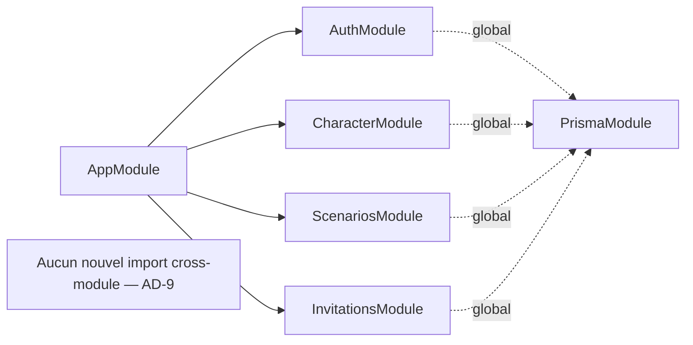

# Architecture Spine — Palier 6 : Dette technique accumulée

## Design Paradigm

**NestJS Modular + Angular Signals (brownfield).** Ce palier n'introduit aucun nouveau module NestJS — toutes les modifications sont localisées à l'intérieur de modules déjà en place (`AuthModule`, `CharacterModule`, `ScenariosModule`). Le principe directeur de ce palier n'est pas un nouveau paradigme mais une règle d'arbitrage systématique, tranchée en coaching et applicable à chaque décision structurelle rencontrée : **modéliser en relationnel ce qui est stable/partagé/interrogé, garder en JSON ce qui est spécifique à un système de jeu et toujours chargé comme un bloc** (cf. AD-1) — cf. `.memlog.md` pour le raisonnement complet, appliqué ici à l'inventaire équipement, cohérent avec le choix déjà fait pour `sheetData`/`ContentEntry.data` avant ce palier.

## Inherited Invariants

| Inherited | From parent | Binds here |
| --- | --- | --- |
| P1-AD-1 | Palier 1 | `PrismaService` global — aucun nouveau module de ce palier ne le réimporte |
| P1-AD-2 | Palier 1 | Mutations exclusivement en couche Service — aucune écriture Prisma directe dans un controller pour les nouvelles méthodes (`AuthService`, `CharacterService`, `ScenariosService`) |
| P1-AD-3 | Palier 1 | `PartiesService.getOwned`/`getViewable` seul point de vérité d'appartenance/rôle — aucun nouveau guard NestJS introduit par ce palier |
| P1-AD-5 | Palier 1 | Angular : `@if`/`@for`, jamais `*ngIf`/`*ngFor` — s'applique à toute modification de template dans ce palier |

## Invariants & Rules

### AD-1 — Inventaire équipement : reste un champ JSON dans `Character.sheetData`, jamais relationnel

**Binds :** FR-6, FR-7, FR-8, FR-9
**Prevents :** une migration relationnelle prématurée (`InventoryItem` en table Prisma) pour un besoin de requête qui n'existe pas ; une divergence future où un système de jeu suivant (Draconis, Conte de Minuit) hériterait d'un modèle d'inventaire pensé pour Ryuutama alors que sa propre forme d'équipement peut être radicalement différente
**Rule :** `[ADOPTED]` La forme enrichie de l'inventaire (objets généraux avec nom/poids/prix optionnel/effet optionnel, sections `contenants` et `animaux` distinctes) reste un sous-objet de `Character.sheetData` (colonne `Json`, aucune migration de schéma Prisma). Seuls changent : la forme TypeScript (`RyuutamaSheetData.equipment`, `packages/game-rules`), sa validation (`validate()`). **La transformation des données existantes se fait en migration ponctuelle (script exécuté une fois au déploiement de ce palier, itérant tous les `Character` Ryuutama et réécrivant leur `sheetData.equipment`), jamais en lazy transform à la lecture** — un transform-on-read laisserait deux formes coexister indéfiniment en base (anciens personnages jamais rouverts) et forcerait chaque point de lecture (fiche, export PDF, validation) à connaître les deux formes, alors qu'une migration ponctuelle garantit qu'après son exécution, un seul format existe en base, plus simple pour tout le code aval. Poids par défaut `0` pour les anciennes entrées `group` (déjà tranché), prix/effet vides. Décision actée après mise à plat explicite du principe JSON-vs-relationnel avec l'utilisateur (cf. `.memlog.md`) : JSON se justifie ici par (1) la spécificité au système de jeu, (2) le chargement/la sauvegarde toujours en bloc complet (jamais de requête cross-personnage), (3) l'absence de toute entité qui référencerait un objet d'inventaire individuellement. Réversible plus tard sans perte de données si un besoin de requête relationnelle émerge (migration = script de transformation, pas un verrou).

### AD-2 — Export PDF équipement : mapping étendu, mêmes limites physiques déjà en place

**Binds :** FR-9
**Prevents :** une réécriture de `mapEquipmentToPdfFields()` qui casserait le mapping déjà en production des 21 emplacements d'inventaire général (Blocs A/B du template, Story 11.1)
**Rule :** `mapEquipmentToPdfFields()` (`packages/game-rules/src/ryuutama/equipment-pdf-field-map.ts`) est étendue, pas réécrite : les colonnes `Prix`/`Effets` déjà présentes dans le template mais non mappées sont branchées sur les nouveaux champs `equipment.individual[].price`/`.effect` ; deux nouvelles fonctions de mapping (ou extensions de la même fonction) couvrent les blocs « Contenant » (3 lignes) et « Animal » (3 lignes) du template, avec troncature silencieuse au-delà — même convention que la troncature déjà acceptée en revue de code à 21 objets (Story 11.1), pas une nouvelle décision.

### AD-3 — Invalidation de session au reset de mot de passe : table d'index inverse

**Binds :** FR-11
**Prevents :** une requête JSON non indexée sur `Session.sess` (fragile, dépend du format de sérialisation interne de `passport`) ; une invalidation "molle" par versioning qui laisserait des sessions serveur valides après un reset
**Rule :** Nouveau modèle Prisma `UserSession` (`id`, `userId` FK→`User` `onDelete: Cascade`, `sid` référençant `Session.sid`, `createdAt`) — la ligne est créée à un seul point d'entrée précis : dans le callback de la route `POST /auth/login` (`AuthController`), juste après l'appel réussi à `req.login()` — jamais dans une stratégie Passport ni dans un guard, pour rester à un seul endroit auditable. Supprimée symétriquement dans le callback de `POST /auth/logout` (`req.logout()`), avant sa résolution. `AuthService.resetPassword()` supprime, dans la même opération que le changement de `passwordHash` : toutes les lignes `UserSession` de l'utilisateur **et** les lignes `Session` correspondantes (jointure sur `sid`) — les deux tables doivent rester synchronisées, une session supprimée d'un côté sans l'autre serait soit un fantôme soit une session non révoquée. Vit dans `AuthModule` existant, aucun nouveau module.

### AD-4 — Protection du token de réinitialisation : hachage, réutilise argon2

**Binds :** FR-10
**Prevents :** une lecture de la table `PasswordResetToken` qui révélerait un token exploitable ; l'introduction d'un deuxième algorithme de hachage dans le projet (divergence avec `User.passwordHash`, déjà `argon2`)
**Rule :** `[ADOPTED]` Le champ `PasswordResetToken.token` (actuellement stocké en clair, `String @unique`) devient `tokenHash` — haché via `argon2` au moment de la génération, comparé via `argon2.verify()` à la réception. Même bibliothèque, même service (`AuthService`) que le hachage des mots de passe — aucune nouvelle dépendance.

### AD-5 — Purge des tokens expirés : job planifié, réutilise `@nestjs/schedule`

**Binds :** FR-14
**Prevents :** un nouveau mécanisme de planification alors qu'un existe déjà et fonctionne en production (`NotificationsService.sendDueReminders`, `@Cron(CronExpression.EVERY_HOUR)`)
**Rule :** `[ADOPTED]` Nouvelle méthode `@Cron`-décorée dans `AuthService` (ou un service dédié si `AuthService` devient trop chargé — détail d'implémentation), qui supprime les `PasswordResetToken` dont `expiresAt` est dépassé. Même bibliothèque (`@nestjs/schedule`, déjà une dépendance du projet), pas de nouvelle infra de planification.

### AD-6 — Détection de fichier renforcée : réutilise `pdf-lib`, pas de nouvelle dépendance

**Binds :** FR-15
**Prevents :** l'ajout d'une bibliothèque de validation de fichiers dédiée alors que le projet a déjà tout l'outillage nécessaire pour valider structurellement un PDF
**Rule :** `[ADOPTED]` `detectDocumentMime()` (`apps/api/src/scenarios/document-mime.util.ts`) reste la première passe (signature magique, rapide) ; pour un fichier détecté PDF, une validation structurelle additionnelle via `PDFDocument.load()` (pdf-lib, déjà une dépendance du projet pour tous les exports PDF existants) dans un `try/catch` rejette un fichier qui passe la signature magique sans être un PDF structurellement valide. L'heuristique `text/plain` (absence de byte NUL) n'est pas renforcée au-delà — aucun outillage équivalent disponible sans nouvelle dépendance, risque déjà jugé faible en contexte hobby (cf. PRD §4.4 FR-15).

### AD-7 — Idempotence des mutations sensibles : garde UI uniquement, pas de clé d'idempotence serveur

**Binds :** FR-22
**Prevents :** l'introduction d'une infrastructure d'idempotence (header client, déduplication serveur avec cache court) pour un risque jamais observé en usage réel
**Rule :** `[ADOPTED]` FR-22 est satisfaite par la garde anti-double-clic déjà posée en FR-1 (signal `pending` local, cf. AD-8) — le cas résiduel d'un vrai retry réseau (hors double-clic) reste un risque accepté, cohérent avec les autres non-atomicités déjà acceptées dans ce projet (`deferred-work.md`, ex. `PollService.create()`/`choose()`). Aucun nouveau mécanisme serveur.

### AD-8 — Pattern anti-double-clic : signal `pending` local par composant, pas de directive partagée

**Binds :** FR-1
**Prevents :** l'introduction d'une abstraction Angular partagée (directive/service générique) pour un besoin couvert par un pattern déjà répliqué avec succès 3 fois dans le projet
**Rule :** `[ADOPTED]` Chaque composant concerné (`ScenarioEditor`, `ScenarioReadDialog`) ajoute son propre signal booléen `pending` (nommage libre, cohérent avec l'existant — ex. `markCourantPending`) suivant exactement le modèle déjà en place dans `SeanceList.pollActionPending` : mis à `true` avant l'appel, `false` dans un `finally`, CTA désactivé tant qu'il vaut `true`. Pas de nouveau fichier, pas de nouvelle abstraction — dupliquer ce pattern à 3 endroits supplémentaires reste moins coûteux qu'en généraliser un pour ~5 usages au total dans le projet.

### AD-9 — Aucun nouveau module NestJS pour ce palier

**Binds :** tous les FR
**Prevents :** la création d'un `TechDebtModule` ou équivalent qui n'aurait aucune cohérence de domaine — chaque correctif appartient au module qui possède déjà la donnée/le comportement concerné
**Rule :** Toutes les modifications de ce palier sont des ajouts/modifications à l'intérieur de modules déjà existants : `AuthModule` (AD-3, AD-4, AD-5), `CharacterModule` (AD-1, AD-2, AD-6 upload EXIF), `ScenariosModule` (AD-6 documents, FR-18/19/20/21/23), `InvitationsModule` implicite (FR-24). Aucun nouvel import cross-module au-delà de ce qui existe déjà.



## Consistency Conventions

| Concern | Convention |
| --- | --- |
| Naming (entités) | `UserSession` (nouveau modèle) ; `PasswordResetToken.token` renommé `tokenHash` (AD-4) — reflète le changement de nature du champ, pas juste son contenu |
| Sécurité | Tout token à usage unique stocké en base est désormais haché (`argon2`), jamais en clair — s'applique à `PasswordResetToken` (AD-4) ; `InviteLink.token` reste en clair, hors scope de ce palier (non demandé par le PRD, cohérent avec la décision déjà actée de ne pas le retraiter) |
| État & gardes UI | Toute action de mutation déclenchée par un CTA porte un signal `pending` local qui désactive le CTA pendant l'appel (AD-8) — convention à appliquer à toute nouvelle mutation future, pas seulement celles de ce palier |
| Pagination | `skip`/`take` Prisma (offset/limit) pour toute liste non bornée — pas de curseur, cohérent avec le volume de données de ce projet |
| Fichiers | Un module = un dossier `apps/api/src/<module>/`, pattern déjà uniforme — aucun nouveau dossier de module créé par ce palier |

## Stack

Aucun ajout de framework — réutilise la stack existante (NestJS 11, Prisma 7, Angular 22, Postgres 17, `argon2`, `@nestjs/schedule`, `pdf-lib`, déjà toutes des dépendances du projet). Un seul ajout de dépendance :

| Name | Version |
| --- | --- |
| `sharp` (nettoyage EXIF, AD non numérotée — cf. PRD §4.4 FR-16, détail d'implémentation) | à vérifier dernière version stable au moment de l'implémentation |

## Structural Seed

### Modèle de données (ajouts/modifications)

```prisma
model UserSession {
  id        String   @id @default(uuid())
  userId    String
  user      User     @relation(fields: [userId], references: [id], onDelete: Cascade)
  sid       String   // référence logique vers Session.sid — pas de FK Prisma stricte,
                      // Session est gérée par connect-pg-simple (table externe au modèle applicatif)
  createdAt DateTime @default(now())

  @@index([userId])
}
```

```prisma
model PasswordResetToken {
  id        String    @id @default(uuid())
  userId    String
  user      User      @relation(fields: [userId], references: [id], onDelete: Cascade)
  tokenHash String    @unique   // renommé depuis `token` (AD-4) — haché argon2, jamais en clair
  expiresAt DateTime
  usedAt    DateTime?
  createdAt DateTime  @default(now())

  @@index([userId])
}
```

*(Rétrocompatibilité `User` : ajouter la relation inverse `sessions UserSession[]` — mécanique, pas un choix.)*

```prisma
model InviteLink {
  // ... champs existants inchangés ...
  @@index([partieId, targetEmail])   // FR-24, AD implicite — dédoublonnage indexé
}
```

*(Aucun ajout de modèle pour l'inventaire équipement (AD-1) — reste dans `Character.sheetData: Json`, déjà en place.)*

### Forme TypeScript étendue (`packages/game-rules/src/ryuutama/types.ts`)

```typescript
interface EquipmentItem {
  name: string;
  weight: number;
  price?: string;   // texte libre (ex. "3 po") — cohérent avec l'absence de type monétaire structuré dans le modèle
  effect?: string;
}

interface RyuutamaSheetData {
  // ... champs existants ...
  equipment: {
    individual: EquipmentItem[];   // fusionne l'ancien individual + group (AD-1)
    contenants: (Omit<EquipmentItem, 'name'> & { name: string })[];  // poids obligatoire
    animaux: Omit<EquipmentItem, 'weight'>[];  // jamais de poids (FR-8)
  };
}
```

### Source tree (fichiers modifiés, aucun nouveau module)

```text
apps/api/src/
  auth/
    auth.service.ts        # + hachage tokenHash (AD-4), + purge @Cron (AD-5), + gestion UserSession (AD-3)
    auth.module.ts         # inchangé (pas de nouveau provider externe)
  characters/
    character.service.ts   # + nettoyage EXIF à l'upload portrait (sharp), + migration equipment (AD-1)
  scenarios/
    document-mime.util.ts  # + validation structurelle pdf-lib (AD-6)
    scenarios.service.ts   # + garde findUniqueOrThrow (FR-23), + orderBy inscriptions (FR-20),
                            # + pagination findAllForPartie (FR-18), + garde statut séance (FR-21)
    scenarios.controller.ts # + en-tête X-Content-Type-Options sur downloadDocument (FR-17)
  invitations/
    invite-links.service.ts # aucun changement de code — l'index FR-24 est déclaratif (schema.prisma)

packages/game-rules/src/ryuutama/
  types.ts                     # EquipmentItem enrichi, contenants/animaux (AD-1)
  equipment-pdf-field-map.ts   # + mapping Prix/Effets/Contenant/Animal (AD-2)
  validate-*.ts                # validation étendue pour la nouvelle forme d'équipement

apps/web/src/app/features/scenarios/
  scenario-editor/scenario-editor.ts       # + signal pending (AD-8), reset erreurs (FR-2), draft (FR-5)
  scenario-read-dialog/scenario-read-dialog.ts  # + signal pending (AD-8), reset erreurs (FR-2)
  scenario-timeline/scenario-timeline.ts   # + garde démontage (FR-3), réactivité partieId (FR-3)
  scenario-detail/scenario-detail.ts       # + indicateur de chargement (FR-4)

apps/web/src/app/features/characters/character-sheet/inventory-tab/
  inventory-tab.ts/.html   # UI unifiée (AD-1) : objets généraux + sections contenants/animaux
```

## Capability → Architecture Map

| Capability / FR | Lives in | Governed by |
| --- | --- | --- |
| FR-1 (garde anti-double-clic) | Composants `apps/web/.../scenarios/` | AD-8 |
| FR-2 à FR-5 (reset erreurs, staleness, chargement, brouillon concurrent) | Mêmes composants | Correctifs locaux, aucune décision d'architecture requise — pas de risque de divergence entre implémentations indépendantes |
| FR-6 à FR-9 (inventaire équipement + export PDF) | `CharacterModule`, `packages/game-rules` | AD-1, AD-2 |
| FR-10, FR-11 (token, invalidation session) | `AuthModule` | AD-4, AD-3 |
| FR-12, FR-13 (e-mail confirmation, rate-limit) | `AuthModule`, `EmailModule` existant | Extensions directes de l'infra déjà en place, aucune décision structurelle |
| FR-14 (purge tokens) | `AuthModule` | AD-5 |
| FR-15 (détection PDF) | `ScenariosModule` | AD-6 |
| FR-16, FR-17 (EXIF, en-tête sécurité) | `CharacterModule`, `ScenariosModule` | Seed (Stack/Source tree), pas de décision structurelle |
| FR-18 à FR-24 (robustesse/perf) | `ScenariosModule`, `InvitationsModule` | AD-7 (FR-22), Consistency Conventions (pagination, FR-18) ; FR-19/20/23/24 = seed déclaratif ; FR-21 = laissé à la story (Deferred) |

## Deferred

| Sujet | Raison du report |
| --- | --- |
| Migration relationnelle de l'inventaire équipement | Explicitement écartée pour ce palier (AD-1) — à reconsidérer seulement si un besoin réel de requête cross-personnage émerge, jamais préventivement |
| Dette de type-safety généralisée (`toDto()` en `any`) | Hors scope de ce palier (PRD §4.5 Out of Scope) — traitée au fil de l'eau |
| Mécanisme de clé d'idempotence serveur | Écarté pour ce palier (AD-7) — à reconsidérer si un vrai cas de duplication par retry réseau est un jour observé en usage réel |
| `InviteLink.token` en clair | Hors scope explicite (Consistency Conventions) — pas demandé par le PRD, cohérence avec la décision de ne pas retraiter ce point |
| Comportement exact de FR-5 (brouillon en édition concurrente) et FR-21 (garde de statut par méthode) | Laissés à la story (PRD Open Questions 1 et 2) — impact trop mineur/spécifique pour figer une règle d'architecture globale |
