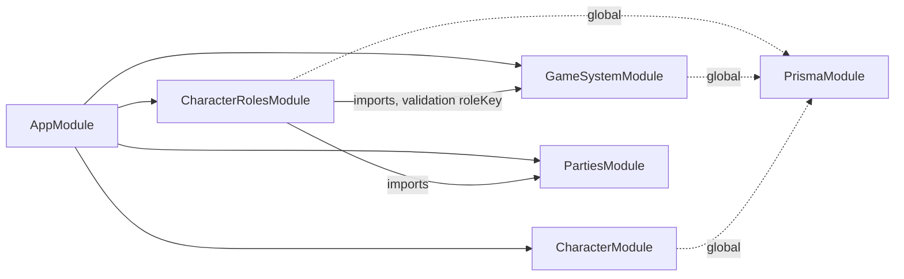
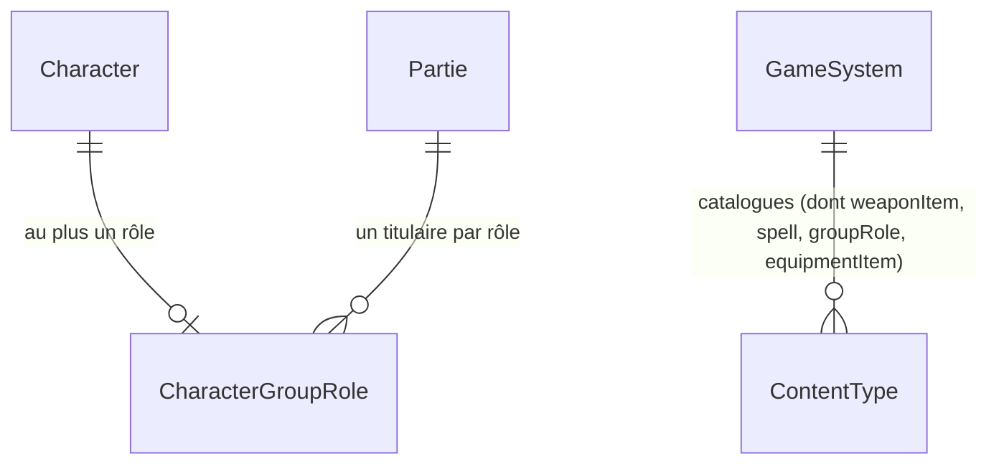

# Architecture Spine — Palier 8 : Refonte complète des classes et textes Ryuutama

## Design Paradigm

**NestJS Modular + Angular Signals (brownfield).** Les invariants des Paliers 1, 5, 6 et 7 s'appliquent intégralement (cf. Inherited Invariants). Ce palier n'introduit **aucun nouveau paradigme** : il étend le mécanisme déjà établi de catalogue data-driven (`GameSystem`/`ContentType`/`ContentEntry`, seedé au bootstrap) à quatre nouveaux types de contenu (arme précise, sort, rôle de groupe, objet achetable), et introduit **une seule** nouvelle relation Prisma — `CharacterGroupRole` — la seule donnée de ce palier qui soit stable, partagée entre MJ et joueurs, et interrogée au sens de l'arbitrage JSON-vs-relationnel du Palier 6 (AD-1 ci-dessous en hérite directement). Tout le reste (catégorie d'arme dérivée, prix de catalogue) suit le principe déjà établi « dérivé à la lecture, jamais persisté en double » (Homme Dragon, Palier 5).

## Inherited Invariants

| Inherited | From parent | Binds here |
| --- | --- | --- |
| P1-AD-1 | Palier 1 | `PrismaService` global — aucun nouveau module de ce palier ne le réimporte |
| P1-AD-2 | Palier 1 | Mutations exclusivement en couche Service — `CharacterController`/le nouveau controller de rôles n'écrivent jamais Prisma directement |
| P1-AD-3 | Palier 1 | `PartiesService.getOwned`/`getViewable` seul point de vérité d'appartenance/rôle — appliqué à l'assignation de rôle de groupe (AD-6) |
| P1-AD-4 | Palier 1 | `import type` pour tout type de `@master-jdr/shared` côté `apps/api` — appliqué à `CharacterGroupRoleDto` et à toute nouvelle DTO de ce palier |
| P1-AD-5 | Palier 1 | Angular : `@if`/`@for`, jamais `*ngIf`/`*ngFor` |
| P5-AD-4 | Palier 5 | Tout catalogue de choix fixes = `ContentType`/`ContentEntry` seedé depuis `game-systems/ryuutama/data/*.json`, jamais codé en dur — appliqué aux 4 nouveaux catalogues de ce palier (AD-1) |
| P6-AD-1 | Palier 6 | Arbitrage JSON-vs-relationnel : relationnel pour ce qui est stable/partagé/interrogé, JSON pour ce qui est spécifique au personnage et toujours chargé en bloc — directement engagé par AD-2 (arme, reste JSON) vs AD-5 (rôle de groupe, devient relationnel) |
| P7-AD-4 | Palier 7 | Contrat public `notifyChanged(): void` pour tout service dont l'état doit déclencher un refetch temps réel — appliqué à l'assignation de rôle (AD-8) |

## Invariants & Rules

### AD-1 — Quatre nouveaux catalogues de contenu : `ContentType`/`ContentEntry`, jamais codés en dur

- **Binds:** FR-8 (arme précise), FR-11 (sort), FR-12 (rôle de groupe), FR-10 (objet achetable)
- **Prevents:** un cinquième mécanisme de catalogue inventé pour un seul de ces contenus, alors que `GameSystemService.seedRyuutama()`/`CONTENT_TYPES` gèrent déjà classes/types/armes/artefacts/pouvoirs d'éveil de façon générique
- **Rule:** `[ADOPTED]` Quatre entrées ajoutées à `CONTENT_TYPES` (`game-system.service.ts`) : `weaponItem` (fichier `weapon-items.json`), `spell` (`spells.json`), `groupRole` (`group-roles.json`), `equipmentItem` (`equipment-items.json`). Même format minimal que les catalogues existants (`{ key, label, ...champs propres }`), scope `BASE`, lus via `GameSystemService.getContent()` — jamais un nouveau mécanisme de lecture. **`groupRole` : exactement 4 entrées (FR-12).** Comme la contrainte « exactement 3 talents par classe » déjà en place (`classes.json`), c'est une discipline d'auteur du contenu (vérifiée en revue de la story, documentée dans le futur `README.md` de `game-systems/ryuutama/data/`), pas une validation runtime — aucun code ne rejette une 5ᵉ entrée, cohérent avec le fait que `seedRyuutama()` fait confiance au contenu JSON qu'il charge (aucune des autres entrées de catalogue n'a de garde de comptage non plus).

### AD-2 — Choix d'arme : `weaponId` référence une arme précise, catégorie dérivée à la lecture

- **Binds:** FR-8
- **Prevents:** une double source de vérité (`weaponId` **et** `weaponCategoryId` stockés tous les deux, pouvant diverger si l'un est édité sans l'autre) ; un calcul de formule de touche/dégâts qui lirait directement une catégorie choisie par le joueur au lieu de la dériver de l'arme réellement choisie ; deux vues de catalogue construites indépendamment (une pour la validation, une pour la résolution) qui divergeraient si l'une des deux oublie une entrée
- **Rule:** `RyuutamaSheetData.weaponCategoryId` est remplacé par `weaponId: string` (référence une entrée `weaponItem`, dont chaque entrée porte `{ key, label, categoryId }`). Toutes les vues dérivent de la **même** liste `GameSystemService.getContent('weaponItem')` — jamais deux constructions indépendantes : `RyuutamaCatalog.validWeaponItems: string[]` (les clés, pour `validate()`, même forme que `validClasses`/`validTypes` existants) et la résolution de catégorie (`resolveWeaponCategory(weaponId, entries: { key, categoryId }[]): string`, nouvelle fonction pure de `packages/game-rules`) lisent toutes les deux ce même tableau d'entrées complet — `validWeaponItems` n'est qu'une projection (`entries.map(e => e.key)`), jamais reconstruite séparément. La catégorie — et donc `touchFormula`/`damageFormula`/`encumbrance` — est résolue à la lecture, jamais stockée séparément (même principe que le niveau/PS de l'Homme Dragon, Palier 5 AD-3). **Consommateurs existants à mettre à jour** (vérifiés brownfield, absents d'un simple renommage sinon) : `packages/game-rules/ryuutama/pdf-field-map.ts` (`weaponPdfOption(data.weaponCategoryId)` → `data.weaponId` + résolution), `apps/web/.../character-sheet/character-sheet.ts` (lecture directe de `sheetData()['weaponCategoryId']`), `GameSystemService.getSchema()` (clé d'étape codée en dur `weaponCategoryId` → `weaponId`), `character-wizard.ts` (`SUPPORTED_STEP_KEYS`/`FIELD_TO_STEP_KEY`, même renommage).
- **Tie-break (mode MJ) :** `validate(data, 'mj', catalog)` reste permissif par convention déjà établie (Épic 6.6 — ne bloque jamais une édition MJ) ; si une fiche porte transitoirement à la fois `weaponId` et `customWeapon` (état MJ non strict), la résolution à la lecture privilégie **toujours** `weaponId` en premier, jamais l'inverse — un seul chemin de résolution déterministe, cohérent quel que soit l'implémenteur.

### AD-3 — Arme personnalisée : inline dans `sheetData`, jamais un `ContentEntry` partagé

- **Binds:** FR-9
- **Prevents:** l'utilisation prématurée de `ContentEntry.scope` `MJ`/`PARTIE` (déjà défini dans le schéma Prisma mais volontairement inexploité jusqu'au Palier 14, homebrew) pour un besoin qui est en réalité strictement local à un seul personnage, jamais partagé ni interrogé entre personnages
- **Rule:** Une arme créée librement est stockée `{ customWeapon: { name: string, categoryId: string } }` dans `RyuutamaSheetData`, sibling de `weaponId` — **exactement un des deux est renseigné, jamais les deux, jamais aucun** (`validate()` l'impose). `categoryId` référence directement une `weaponCategory` existante (hérite ses formules). Aucun `ContentEntry` créé côté serveur — cohérent avec P6-AD-1 (donnée spécifique à un personnage, jamais interrogée cross-personnage).

### AD-4 — Budget d'équipement de départ : prix de catalogue numérique, distinct du prix affiché en texte libre

- **Binds:** FR-10
- **Prevents:** la réutilisation du champ `InventoryItem.price?: string` existant (texte libre assumé, ex. `"3 po"`, jamais un type monétaire structuré — décision déjà actée, `packages/game-rules/ryuutama/types.ts`) comme base de calcul d'un budget — un total ne peut pas s'additionner de manière fiable sur du texte libre ; un objet catalogué comme animal qui porterait malgré tout un poids, contredisant silencieusement l'invariant structurel `Animal = Omit<InventoryItem, 'weight'>` déjà en place (Épic 14)
- **Rule:** Chaque entrée `equipmentItem` (AD-1) porte un champ numérique `priceGold: number` (Po) et un champ `nature: 'individual' | 'contenant' | 'animal'` déterminant dans quelle section (`equipment.individual`/`contenants`/`animaux`) l'objet acheté atterrit une fois converti en `InventoryItem`/`Contenant`/`Animal`. Une entrée `nature: 'animal'` ne porte jamais de poids catalogue (cohérent avec l'absence structurelle du champ `weight` sur `Animal`). La validation du budget (max 1000 Po au total) se fait côté serveur, une seule fois, à la création du personnage (`CharacterService.create()`) — somme des `priceGold` des `equipmentItem` choisis. **Portée explicitement limitée à la création :** une édition ultérieure de `sheetData.equipment` par le MJ (mécanisme `sheet-field` existant, Story 6.6) n'est **jamais** re-vérifiée contre ce budget — cohérent avec le principe déjà établi que l'édition MJ reste sans contrainte (`validate(data, 'mj', catalog)` toujours permissif). Un objet acheté est ensuite inséré tel quel dans la section correspondante sous la forme `InventoryItem`/`Contenant`/`Animal` existante (`id` généré serveur, `addedBy: 'player'`, `price` formaté en texte à l'affichage) — aucun nouveau modèle d'inventaire, cohérent avec Épic 14/P6-AD-1.

### AD-5 — Rôle de groupe assigné : nouveau modèle relationnel `CharacterGroupRole`, jamais JSON

- **Binds:** FR-13
- **Prevents:** stocker le rôle assigné dans `Character.sheetData` (JSON) — cette donnée est stable, partagée (visible par tout membre de la Partie, cf. AD-6), et interrogée (« un rôle donné a-t-il déjà un titulaire dans cette Partie ? » — une contrainte d'unicité fiable en JSON nécessiterait une relecture manuelle de tous les personnages de la Partie à chaque assignation, avec risque de course, alors qu'une contrainte Prisma l'impose atomiquement)
- **Rule:** `[ADOPTED]` Nouveau modèle Prisma `CharacterGroupRole { id, characterId, partieId, roleKey, assignedAt }` avec **deux** contraintes d'unicité, toutes deux définitivement adoptées (aucune n'est conditionnelle) : `@@unique([partieId, roleKey])` (un seul titulaire par rôle par Partie) et `@@unique([partieId, characterId])` (un personnage ne porte jamais deux rôles à la fois — nécessaire pour que le badge FR-14 reste un badge unique par personnage, cf. AD-7). Nommé `CharacterGroupRole` (pas `Role`/`PartieRole`) pour éviter toute confusion avec `GlobalRole` (enum `User.role`, ADMIN/USER) déjà présent dans le schéma. Seule la **politique de réassignation** (que fait le MJ pour donner un rôle déjà tenu à quelqu'un d'autre) reste ouverte, cf. AD-6 et Deferred — la forme du modèle, elle, est fixée.

### AD-6 — Assignation de rôle : nouveau module dédié, MJ seul écrivain, conflit explicite jamais silencieux

- **Binds:** FR-13
- **Prevents:** l'ajout de cette capacité dans `CharacterModule` déjà volumineux, pour une action dont l'initiateur (le MJ) et la portée (toute la Partie) diffèrent de la plupart des écritures de `CharacterModule` (aujourd'hui propriétaire-ou-MJ sur un personnage donné, jamais une contrainte cross-personnage à l'échelle de la Partie) ; une assignation qui planterait avec une erreur Prisma `P2002` non gérée dans une implémentation et évincerait silencieusement l'ancien titulaire dans une autre — deux comportements également « conformes » à un texte de règle qui ne trancherait pas explicitement ; une assignation à un personnage n'appartenant pas à la Partie ciblée
- **Rule:** Nouveau module `apps/api/src/character-roles/` (`CharacterRolesModule`, `CharacterRolesService`, `CharacterRolesController`), suivant le pattern déjà uniforme (un dossier par capacité, cf. `XpDistributionsModule`/`AnnouncementsModule`/`HommeDragonModule`). Écriture (assigner/retirer un rôle) = MJ uniquement (`PartiesService.getOwned`) ; lecture = tout membre (`PartiesService.getViewable`) — aucun nouveau guard NestJS, réutilise P1-AD-3. `CharacterRolesService.assign()` vérifie explicitement que le `characterId` ciblé appartient bien au `partieId` avant toute écriture (jamais une confiance implicite dans l'appelant). **Assigner un `roleKey` déjà tenu par un autre personnage échoue explicitement** (`ConflictException`, jamais une éviction silencieuse de l'ancien titulaire) — le MJ doit d'abord retirer explicitement l'ancien titulaire. Ce n'est pas encore la politique de réassignation complète voulue par l'utilisateur (Open Question 4 du PRD, cf. Deferred) : c'est le plancher minimal qui empêche deux implémentations de diverger (crash non géré vs éviction silencieuse) en attendant cette décision produit. Endpoints : `POST /parties/:id/characters/:characterId/role` (assigner), `DELETE /parties/:id/characters/:characterId/role` (retirer), **et** `GET /parties/:id/character-roles` (liste complète des assignations de la Partie — nécessaire pour peupler `RosterRow.assignedRoleLabel`, AD-7, sans un aller-retour par personnage).

### AD-7 — Badge de rôle sur l'avatar : extension de `RosterRow`, priorité au badge de montée de niveau

- **Binds:** FR-14
- **Prevents:** un second système de badge parallèle à celui déjà en place (`hasPendingLevelUp`) pour le même emplacement visuel — deux mécanismes de badge sur le même roster, risque de superposition visuelle non gérée
- **Rule:** `RosterRow` (`roster-row.util.ts`) gagne un champ `assignedRoleLabel: string | null`, résolu depuis `CharacterGroupRole` + le catalogue `groupRole` (AD-1). Le template du roster affiche `assignedRoleLabel` uniquement si `!hasPendingLevelUp` — priorité déjà actée avec l'utilisateur, réutilise l'emplacement visuel existant, jamais un second badge simultané.

### AD-8 — Rôle de groupe : câblé sur le contrat `notifyChanged()`/`emit()` existant, des deux côtés

- **Binds:** FR-14
- **Prevents:** un badge de rôle qui reste périmé tant que la page n'est pas rechargée — régression par rapport au reste du roster, déjà temps réel depuis le Palier 7/`PartieDetail` (topic `partie:{id}`) ; un backend qui n'émettrait jamais l'événement temps réel parce qu'aucune AD ne l'exige explicitement, alors que chaque service de mutation existant le fait déjà (P7-AD-2) — le silence sur ce point est exactement le genre d'angle mort que deux implémentations « conformes » peuvent chacune manquer
- **Rule:** **Backend :** `CharacterRolesService.assign()`/`unassign()` appelle `this.realtimeEvents.emit(partieTopic(partieId))` en toute fin de méthode, après résolution complète de l'écriture — même discipline que P7-AD-2 (jamais depuis l'intérieur d'une transaction). **Frontend :** `CharacterService` expose déjà `notifyChanged()` (Palier 7) ; aucune nouvelle entrée `RealtimeService.handlers` n'est nécessaire (le préfixe `partie:` couvre déjà ce cas via `CharacterService`, déjà câblé) — mais le composant affichant le roster (`PartieDetail`) doit relire les rôles assignés (`GET /parties/:id/character-roles`, AD-6) sur ce même signal `changed`, pas seulement les personnages eux-mêmes.

### AD-9 — Texte explicatif par étape de l'assistant : seedé par système de jeu, jamais codé en dur ni dans `tones.ts`

- **Binds:** FR-3
- **`[REVISED]` 2026-07-26, pendant la Story 23.3** — version originale (« codé en dur, jamais seedé ») invalidée par l'implémentation : le texte réel du *Guide du Voyageur* (7 des 8 étapes, transcrit de `docs/assistant.md`) est un paragraphe long et spécifique à Ryuutama, pas une courte copy d'interface. Une première implémentation l'a codé en dur dans `apps/web/src/app/core/theme/tones.ts` (le registre de flaveur *système-agnostique* de l'app) — retour utilisateur en revue de code : ce fichier doit rester neutre vis-à-vis du système de jeu (l'app prévoit plusieurs systèmes/wizards, Palier 11/12), et du contenu Ryuutama-spécifique n'y a pas sa place, même si ce n'est « qu'un texte ».
- **Prevents:** un texte de règles spécifique à un système de jeu codé en dur dans un fichier frontend censé rester générique tous-systèmes (`tones.ts`) — casserait dès le premier système supplémentaire (Palier 11/12, Conte de Minuit/Draconis) ; une double source de vérité si un futur système redéfinit ce même texte différemment.
- **Rule:** `[ADOPTED]` Le texte d'introduction par étape suit le mécanisme `ContentType`/`ContentEntry` déjà établi (AD-1, P5-AD-4) — nouveau `ContentType` `wizardStepIntro` (`wizard-step-intros.json`, une entrée par étape hors `portrait`, `{ key, label, text }`), lu par `CharacterWizard` via `content()?.['wizardStepIntro']` exactement comme `classes`/`types`/etc. **Exception : l'étape Portrait** n'a aucun texte dans le livre (fonctionnalité propre à cette app, pas au système de jeu) — elle reste seule à vivre dans `tones.ts` (`character.step_portrait_intro`, déclinée par thème), puisqu'elle sera identique pour tous les futurs systèmes de jeu.

### AD-10 — Talent enrichi : forme exacte, `attributes`/`difficulty` restent frères de `effect`

- **Binds:** FR-6
- **Prevents:** une forme ambiguë où deux implémentations imbriqueraient différemment `attributes`/`difficulty` (l'un sous `effect`, l'autre à plat) — cassant `validate()`/tout code lisant `talent.attributes` aujourd'hui
- **Rule:** `{ name: string, description: string, effect: { description: string, conditions: string }, attributes: string[], difficulty: string }` — `attributes` et `difficulty` restent des champs frères de `effect` (inchangés dans leur chemin de lecture), seul `effect` passe de `string` à objet `{ description, conditions }`.



## Consistency Conventions

| Concern | Convention |
| --- | --- |
| Naming (nouveaux `ContentType`) | `weaponItem`, `spell`, `groupRole`, `equipmentItem` — camelCase, singulier, cohérent avec `hommeDragonArtefact`/`eveilPower` (Palier 5) |
| Naming (modèle rôle) | `CharacterGroupRole` — jamais `Role`/`PartieRole` (collision avec `GlobalRole`, enum `User.role` déjà existant) |
| Catalogues | Tout catalogue de choix fixes = `ContentType`/`ContentEntry` seedé (AD-1) ; jamais codé en dur dans un service (hérité P5-AD-4) |
| Valeurs dérivées | Toute valeur calculable depuis une autre source de vérité (catégorie d'arme depuis `weaponId`, prix affiché depuis `priceGold`) est dérivée à la lecture, jamais stockée en double (AD-2, cohérent Homme Dragon Palier 5 AD-3) |
| JSON vs relationnel | Spécifique à un personnage, jamais interrogé cross-personnage → JSON (`sheetData`, arme personnalisée AD-3) ; partagé/interrogé à l'échelle de la Partie → relationnel (`CharacterGroupRole`, AD-5) — arbitrage hérité P6-AD-1 |
| Modules | Un dossier `apps/api/src/<module>/` par capacité, jamais fondu dans un module existant volumineux pour une portée d'écriture différente (AD-6, cohérent `XpDistributionsModule`/`AnnouncementsModule`) |
| Temps réel | Tout nouveau `notifyChanged()` réutilise le contrat existant (P7-AD-4) — aucune nouvelle entrée `RealtimeService.handlers` si un service déjà câblé peut porter la notification (AD-8) |

## Stack

Aucun ajout de dépendance — réutilise la stack existante (NestJS 11, Prisma 7, Angular 22, Postgres 17).

## Structural Seed

### Modèle de données (ajout)

```prisma
model CharacterGroupRole {
  id          String   @id @default(uuid())
  characterId String
  character   Character @relation(fields: [characterId], references: [id], onDelete: Cascade)
  partieId    String
  partie      Partie   @relation(fields: [partieId], references: [id], onDelete: Cascade)
  roleKey     String                              // référence ContentEntry (groupRole), jamais une FK stricte (cf. Homme Dragon AD-4, même pattern)
  assignedAt  DateTime @default(now())

  @@unique([partieId, roleKey])                    // un seul titulaire par rôle par Partie (AD-5)
  @@unique([partieId, characterId])                // un personnage ne porte qu'un rôle à la fois (AD-5, adopté)
}
```

*(Rétrocompatibilité `Character`/`Partie` : ajouter les relations inverses `groupRoles`/`characterGroupRoles` — mécanique, pas un choix.)*

**Aucun ajout de modèle pour :** arme précise/personnalisée (AD-2/AD-3, reste dans `Character.sheetData: Json`) ; objets achetables (AD-4, catalogue en `ContentEntry`, résultat dans `equipment.individual` existant) ; sorts (catalogue en `ContentEntry` uniquement, aucune donnée de personnage ce palier).

### ERD (relations)



### Source tree (ajouts / modifications)

```text
apps/api/src/
  character-roles/                    # nouveau module (AD-6)
    character-roles.module.ts         # imports: [PartiesModule, GameSystemModule (validation roleKey, story 27.2)]
    character-roles.service.ts        # assigner/retirer/lister, contrainte unicité + emit() (AD-5, AD-6, AD-8)
    character-roles.controller.ts     # POST/DELETE /parties/:id/characters/:characterId/role, GET /parties/:id/character-roles
  characters/
    character.service.ts              # + validation weaponId/customWeapon exclusif (AD-2/AD-3), budget équipement création uniquement (AD-4)
  game-systems/
    game-system.service.ts            # + 4 entrées CONTENT_TYPES (AD-1)

apps/api/game-systems/ryuutama/data/
  weapon-items.json                   # nouveau, AD-1 — { key, label, categoryId }
  spells.json                         # nouveau, AD-1
  group-roles.json                    # nouveau, AD-1 — exactement 4 entrées (discipline d'auteur, pas de garde runtime)
  equipment-items.json                # nouveau, AD-1 — priceGold numérique + nature individual|contenant|animal (AD-4)
  wizard-step-intros.json             # nouveau, AD-9 révisée — { key, label, text }, 7 entrées (hors portrait, cf. AD-9)

packages/game-rules/src/ryuutama/
  validate.ts                         # + validWeaponItems: string[] (projection du catalogue weaponItem), exclusivité weaponId/customWeapon
  types.ts                            # RyuutamaSheetData : weaponCategoryId -> weaponId + customWeapon?
  weapon-resolve.ts                   # nouveau : resolveWeaponCategory(weaponId, entries) -> categoryId ; weaponId prioritaire sur customWeapon si les deux sont présents (AD-2)
  pdf-field-map.ts                    # weaponPdfOption() lit désormais weaponId (résolu via resolveWeaponCategory), plus weaponCategoryId (AD-2)

apps/web/src/app/
  features/parties/roster-row.util.ts             # + assignedRoleLabel, alimenté par GET /parties/:id/character-roles (AD-7)
  features/characters/character-sheet/character-sheet.ts  # lecture sheetData()['weaponCategoryId'] -> ['weaponId'] (AD-2)
  features/characters/character-wizard/
    character-wizard.ts                           # SUPPORTED_STEP_KEYS/FIELD_TO_STEP_KEY : weaponCategoryId -> weaponId (AD-2)
    steps/weapon-step/weapon-step.ts              # choix arme précise (AD-2), création libre (AD-3)
    steps/equipment-step/equipment-step.ts         # choix pique-nique vs achat (AD-4)
  core/character-roles/character-roles.service.ts  # nouveau, notifyChanged() (AD-8)

apps/api/src/game-systems/game-system.service.ts
  getSchema()                                     # clé d'étape codée en dur weaponCategoryId -> weaponId (AD-2, AD-9)
```

## Capability → Architecture Map

| Capability / FR | Lives in | Governed by |
| --- | --- | --- |
| FR-1 (description classe/type/arme + `ClassStep`/`TypeStep`/`WeaponStep` étendus) | `game-systems/ryuutama/data/*.json` (existants, enrichis) ; composants `*-step.ts` | P5-AD-4, AD-9 |
| FR-2 (description des sous-éléments) | `game-systems/ryuutama/data/*.json` (existants, enrichis) | P5-AD-4 |
| FR-3 (texte explicatif par étape) | `wizard-step-intros.json` (7 étapes) ; `tones.ts` (étape Portrait seule) ; `character-wizard.ts`/`.html` | AD-9 (révisée) |
| FR-4, FR-5 (classes complètes, occupations/actions) | `classes.json` | P5-AD-4 (pur contenu, aucune AD dédiée) |
| FR-6 (talents enrichis, effet structuré) | `classes.json` | AD-10 (forme du talent) |
| FR-7 (3 profils d'attributs) | `attribute-patterns.json` | P5-AD-4 (pur contenu, aucune AD dédiée) |
| FR-8 (arme précise → catégorie) | `weapon-items.json`, `packages/game-rules/weapon-resolve.ts`, `pdf-field-map.ts`, `character-sheet.ts`, `getSchema()`, `character-wizard.ts` | AD-1, AD-2 |
| FR-9 (arme personnalisée) | `RyuutamaSheetData.customWeapon` | AD-3 |
| FR-10 (achat d'équipement, budget) | `equipment-items.json`, `CharacterService.create()` | AD-1, AD-4 |
| FR-11 (catalogue de sorts) | `spells.json` | AD-1 |
| FR-12 (catalogue de rôles) | `group-roles.json` | AD-1 |
| FR-13 (assignation de rôle par le MJ) | `CharacterRolesModule` | AD-5, AD-6 |
| FR-14 (badge de rôle) | `roster-row.util.ts` | AD-7, AD-8 |
| FR-15 (rappel de complétude) | Hors code (process) | Pas de décision d'architecture, cf. PRD |

## Deferred

| Sujet | Raison du report |
| --- | --- |
| Politique complète de réassignation d'un rôle déjà attribué (le MJ peut-il transférer en une seule action, ou doit-il toujours retirer puis réassigner ?) | Open Question 4 du PRD — non tranché. AD-6 fixe un plancher minimal (échec explicite, jamais d'éviction silencieuse) pour que l'architecture reste cohérente en attendant cette décision produit, laissée à la story `CharacterRolesService` |
| Mécanique d'apprentissage/lancement de sort | Open Question 2 du PRD — catalogue seul ce palier (AD-1), mécanique hors scope |
| Registre de plugin générique par système de jeu (`getSchema()` toujours codé en dur, AD-9) | Déjà différé au palier Conte de Minuit/Draconis (Palier 11/12) — ce palier suit le pattern déjà établi, ne construit pas de registre par anticipation |
| Exploitation de `ContentEntry.scope` `MJ`/`PARTIE` pour du contenu homebrew partagé | Palier 14 dédié — l'arme personnalisée (AD-3) reste volontairement inline/non partagée pour ne pas anticiper cette architecture |
| UI multi-listes d'objets/règles d'équipement (plusieurs catalogues saisis, un seul câblé) | Palier 9 (refonte UI) — hors scope de cette spine, cf. PRD §5 |
| Refonte visuelle générale de l'assistant de création / `ScenarioTimeline` | Palier 9 (refonte UI) — non-goal explicite du PRD (§5), aucune AD de cette spine n'y touche |
| Environnement/déploiement | Aucun changement pour ce palier (pas de nouveau service externe, pas de nouvelle variable d'environnement) — reste porté par le Palier 7 |
