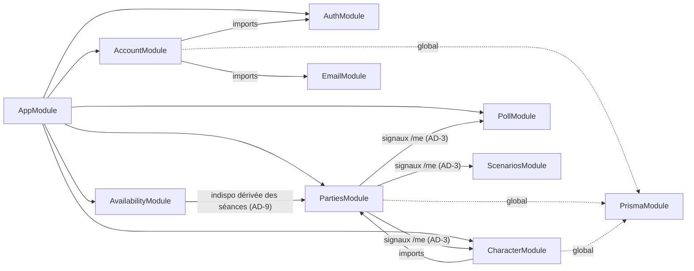
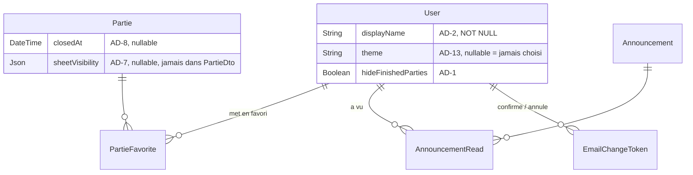
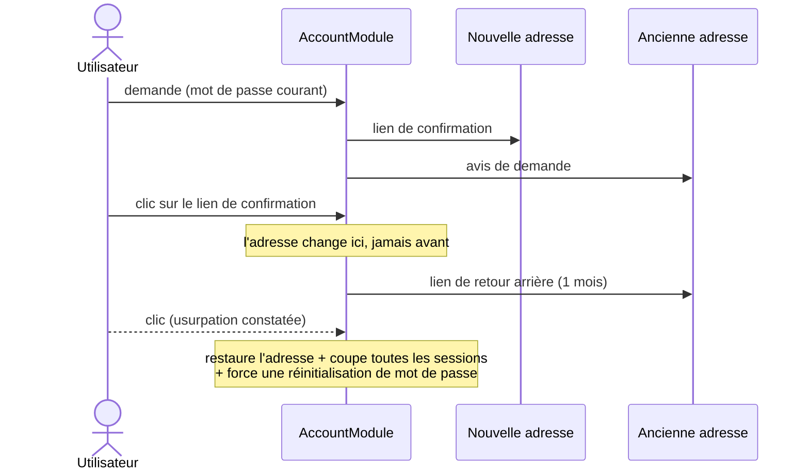

# Architecture Spine — Palier 9 : Refonte UI & lisibilité de l'état

## Design Paradigm

**NestJS Modular + Angular Signals (brownfield).** Les invariants des Paliers 1, 5, 6, 7 et 8 s'appliquent intégralement (cf. Inherited Invariants). Aucun nouveau paradigme.

Ce palier est le premier depuis le Palier 1 dont le centre de gravité est le **front**, avec treize dérogations serveur bornées. Sa ligne directrice architecturale tient en trois mouvements :

1. **L'état personnel gagne un domicile.** L'application n'avait aucun endroit où poser une donnée attachée au compte plutôt qu'à une partie. Une famille de routes `/me` et un module `account` l'ouvrent (AD-1, AD-4).
2. **Ce qui était calculé par accumulation d'appels devient une lecture serveur unique.** Les signaux d'état de la liste des parties se calculent en un appel, jamais par partie (AD-3) — le fan-out a déjà coûté deux bugs de production.
3. **Ce qui doit rester cohérent sur dix écrans passe par un point unique.** Un composant d'identité pour l'affichage (AD-12), `toDto()` pour le filtrage de fiche (AD-7), l'agrégation de créneaux existante pour les indisponibilités (AD-9), un seul utilitaire d'upload d'image (AD-17).

**Révision du 2026-08-05.** Le run d'UX a produit quatre exigences neuves et trois dérogations serveur ; `AD-16` à `AD-20` les traitent, et la règle d'`AD-1` a été étendue en place. Deux principes déjà posés se rejouent ailleurs : *un appel, pas N* passe de la liste des parties au calendrier personnel (AD-18), et *dérivé à la lecture, jamais persisté* s'applique à la bannière générative (AD-19).

## Inherited Invariants

| Inherited | From parent | Binds here |
| --- | --- | --- |
| P1-AD-1 | Palier 1 | `PrismaService` global — `AccountModule` ne le réimporte pas |
| P1-AD-2 | Palier 1 | Mutations exclusivement en couche Service — aucun contrôleur `/me` n'écrit Prisma directement |
| P1-AD-3 | Palier 1 | `PartiesService.getOwned`/`getViewable` seul point de vérité d'appartenance/rôle — gouverne la clôture (AD-8), la config de visibilité (AD-7) et les signaux (AD-3) |
| P1-AD-4 | Palier 1 | `import type` pour tout type de `@master-jdr/shared` côté `apps/api` |
| P1-AD-5 | Palier 1 | Angular : `@if`/`@for` et signals, jamais `*ngIf`/`*ngFor` |
| P5-AD-4 | Palier 5 | Tout catalogue de choix fixes = `ContentType`/`ContentEntry` seedé — l'aide contextuelle (FR-19/FR-20) lit ce catalogue, ne crée aucun mécanisme de contenu |
| P6-AD-1 | Palier 6 | Arbitrage JSON-vs-relationnel — engagé par AD-1 (favoris/lectures : relationnel) et AD-7 (config de visibilité : JSON) |
| P7-AD-2 | Palier 7 | `realtimeEvents.emit(topic)` en fin de mutation, jamais depuis l'intérieur d'une transaction |
| P7-AD-4 | Palier 7 | Contrat public `notifyChanged(): void` pour tout service front dont l'état doit se rafraîchir — appliqué par AD-14 |
| P8-AD-6 | Palier 8 | Un dossier `apps/api/src/<module>/` par capacité — fonde `AccountModule` (AD-4) |
| P8-AD-9 | Palier 8 | `tones.ts` reste neutre vis-à-vis du système de jeu : aucun texte de règle Ryuutama n'y entre — contraint FR-19/FR-20 et la découpe FR-43 (AD-13) |

## Invariants & Rules

### AD-1 — État attaché au compte : colonnes typées sur `User` + deux modèles relationnels

- **Binds:** FR-2, FR-3, FR-4, FR-11, FR-13 · D-1, D-3
- **Prevents:** quatre stories inventant quatre stockages (table clé/valeur générique, blob JSON, `localStorage`, colonne ad hoc) pour quatre préférences introduites séparément ; une colonne `displayName` NOT NULL que la migration remplit mais que `AuthService.register()` ne renseigne pas — toute inscription ultérieure violerait alors la contrainte
- **Rule:** Les préférences scalaires sont des **colonnes typées sur `User`** : `displayName String` (NOT NULL), `theme String?` (nullable — `null` signifie *jamais choisi*, cf. AD-13 ; volontairement pas un enum Prisma, ajouter un thème ne doit pas exiger une migration), `hideFinishedParties Boolean @default(false)`. Les états multi-valués sont **relationnels** : `PartieFavorite(userId, partieId)` et `AnnouncementRead(userId, announcementId)`, chacun avec sa contrainte d'unicité. S'y ajoutent, depuis la révision du 2026-08-05, **quatre** scalaires — `partiesViewMode`, `partiesSort`, `charactersViewMode`, `charactersSort` (CAP-18). **Une paire par liste, jamais une paire partagée** : les deux listes trient sur des vocabulaires disjoints — urgence, date, nom, type, statut pour les parties ; niveau, partie, nom pour les personnages. Une paire unique rendrait la moitié des valeurs invalides sur l'une des deux. Chacun de ces quatre champs est validé contre une **union fermée déclarée dans `@master-jdr/shared`**, jamais une chaîne libre — même discipline qu'AD-13 pour `theme`. La valeur `urgence` du tri des parties vient du run d'UX et étend la liste de CAP-4. Aucune table clé/valeur générique, aucune colonne `preferences Json` : toute nouvelle préférence de compte suit l'une de ces deux formes, jamais une troisième — **y compris une préférence qui est un ensemble de valeurs, qui relève du relationnel** (AD-16). **Deux points d'écriture obligatoires pour `displayName` :** la migration l'initialise au `pseudo` pour les comptes existants, **et** `AuthService.register()` le renseigne à la création — les deux, jamais l'un seul. **`hideFinishedParties` est une préférence d'affichage** : elle est appliquée par le front à la liste déjà chargée, jamais par un filtre serveur supplémentaire ; elle vit sur le compte pour suivre l'utilisateur d'un appareil à l'autre, pas pour être interrogée en base.

### AD-2 — Identité utilisateur dans les DTO : `pseudo` **et** `displayName`, toujours les deux

- **Binds:** FR-4, FR-4b, FR-14, FR-15, FR-30 · D-2, D-8
- **Prevents:** dix écrans écrivant dix replis `displayName ?? pseudo` légèrement différents, dont un qui affichera `null` ; un DTO ne portant que le nom affiché, rendant FR-4b (lever une homonymie par le pseudo) impossible sans aller-retour serveur supplémentaire ; l'exposition d'e-mails par la recherche d'utilisateurs, que FR-30 exclut
- **Rule:** Tout DTO exposant une identité utilisateur (`PartieMemberDto`, `CharacterDto.ownerPseudo`, participants, auteurs d'annonce, lignes de distribution d'XP, membres d'un créneau…) porte **les deux champs**, `pseudo` et `displayName`. `displayName` est NOT NULL en base : aucun repli n'est écrit côté front. L'écran choisit lequel afficher — nom affiché dans les écrans de jeu, pseudo là où l'on désigne un identifiant. **Le DTO de recherche d'utilisateurs (FR-30) ne porte que le `pseudo`** — ni nom affiché, ni e-mail ; cela corrige un écart existant, `UserSearchResultDto` renvoyant l'e-mail aujourd'hui. **Aucun e-mail d'un autre utilisateur ne transite vers un joueur :** `PartieMemberDto.email` n'est renseigné que lorsque le demandeur est le **MJ** de la partie (qui invite et gère les membres) ; il est omis pour tout autre membre. Motif : `InviteLink` accepte un nombre d'usages illimité, donc un membre n'est pas nécessairement quelqu'un que le MJ a choisi individuellement. L'invitation par e-mail exact reste inchangée.

### AD-3 — Signaux d'état de la liste : un appel unique, jamais un appel par partie

- **Binds:** FR-12, FR-10, FR-3, FR-44 · Q-11
- **Prevents:** le fan-out réseau proportionnel au nombre de parties, cause documentée de deux bugs de production (rafales de `429`, listes vidées silencieusement — la protection anti-course écrite alors est **active** dans `mode.service.ts` et documentée en commentaire : elle est à conserver, pas à réécrire) ; un double calcul pour un utilisateur à la fois MJ et joueur si les signaux étaient greffés sur les deux listes par rôle ; deux stories renvoyant deux formes de signaux également conformes — booléens libres d'un côté, codes de l'autre — dont les écrans ne pourraient plus faire une signalétique cohérente ; un signal « prochaine séance » recalculé alors qu'il est déjà persisté
- **Rule:** `GET /me/party-signals` renvoie une **carte `partieId` → `PartySignalsDto`** couvrant toutes les parties de l'utilisateur, en un appel, calculée serveur par requêtes groupées (`groupBy`/`findMany` par lot sur l'ensemble des `partieId`) — **jamais une requête par partie, ni côté serveur ni côté client.** Les endpoints `GET /parties?role=mj|player` gardent leur contrat actuel inchangé (décision produit actée : le front appelle l'une, l'autre, ou les deux).
  **Contrat de forme, contraignant :** `PartySignalsDto = { role: 'mj' | 'player', status: PartieStatus, signals: PartySignalCode[] }`. `PartySignalCode` est une **union fermée** déclarée dans `@master-jdr/shared` — un code par signal de FR-12, jamais un booléen libre ni une chaîne construite à la volée ; une partie sans signal porte un tableau **vide**, jamais une entrée absente de la carte. `role` et `status` sont **calculés serveur** et présents dans ce DTO : aucun écran ne les recalcule (le rôle reste dérivé de `mjId === userId`, jamais persisté ; le statut vient d'AD-8). **Le signal « prochaine séance » lit `Partie.nextSessionDate`/`nextSessionSlot`, déjà persistés — il n'est jamais recalculé depuis les séances.** **Une partie clôturée (AD-8) ne porte aucun signal d'action** : seuls subsistent les signaux de fin (compte-rendu ou rapport manquant).

### AD-4 — Famille de routes `/me` : convention de routage, pas un module fourre-tout

- **Binds:** FR-1, FR-2, FR-3, FR-4, FR-5, FR-6, FR-11, FR-12, FR-13, FR-16 · D-1, D-2, D-3, D-10
- **Prevents:** un module `account` qui absorberait progressivement toute lecture scopée à l'utilisateur — y compris l'agrégation de parties et de personnages — et se mettrait à dupliquer la logique d'appartenance de `PartiesService` ou de lecture de `CharacterService` ; à l'inverse, la réimplémentation d'argon2 ou de la coupure de sessions dans un second service que `AuthService`
- **Rule:** `/me` est une **convention de routage**, jamais une frontière de module. Le nouveau module `apps/api/src/account/` porte **uniquement l'état de compte** (profil, préférences, favoris, annonces vues) — AD-1. Les autres routes `/me` vivent dans le module propriétaire de la donnée : `GET /me/party-signals` dans `PartiesModule` (AD-3), `GET /me/characters` dans `CharacterModule` (D-10, restreint aux personnages de l'appelant). Toute vérification de mot de passe (argon2) et toute coupure de session restent **déléguées à `AuthService`**, déjà seul propriétaire de ces mécanismes et de l'index `UserSession` — jamais réimplémentées ailleurs. La coupure de sessions étant aujourd'hui **inlinée** dans la transaction de `AuthService.resetPassword()`, elle est **extraite en méthode réutilisable** `revokeSessions(userId, exceptSid?)` avant d'être appelée depuis `AccountService` (AD-6) — extraction, jamais duplication.

### AD-5 — Changement d'e-mail : double canal, avec retour arrière d'un mois

- **Binds:** FR-5 · D-2, Q-3
- **Prevents:** une adresse mal saisie qui coupe définitivement la seule voie de récupération du compte, sans que personne ne s'en aperçoive avant d'en avoir besoin ; une prise de contrôle de compte irréversible pour le propriétaire légitime ; un retour arrière qui restaurerait l'adresse en laissant l'usurpateur connecté et son mot de passe valide
- **Rule:** Le changement d'e-mail exige le **mot de passe courant**, puis suit deux canaux. **Nouvelle adresse :** un lien de confirmation ; le changement ne prend effet qu'au clic. **Ancienne adresse :** un avis au moment de la demande, puis à la prise d'effet un second message portant un **lien de retour arrière valide un mois**. L'activation de ce lien **restaure l'ancienne adresse, coupe toutes les sessions actives et force une réinitialisation de mot de passe** avant toute reconnexion — le scénario qui justifie ce lien implique que le mot de passe était connu de l'usurpateur. Les deux jetons suivent exactement le pattern `PasswordResetToken` déjà en place (`tokenHash` unique, `expiresAt`, `usedAt`, usage unique) ; la réinitialisation forcée réutilise le flux `PasswordResetToken` existant plutôt qu'un nouvel indicateur sur `User`.

### AD-6 — Changement de mot de passe en session : coupe les autres sessions, garde la courante

- **Binds:** FR-6 · D-2, Q-4
- **Prevents:** deux chemins de changement de mot de passe (par e-mail oublié, et en session) dont l'écart de comportement ne serait écrit nulle part, laissant chaque implémenteur supposer que l'autre chemin fait pareil ; une seconde implémentation de la coupure de sessions à côté de celle d'`AuthService`
- **Rule:** Un changement de mot de passe en session exige et vérifie le mot de passe courant, puis **coupe toutes les autres sessions actives et conserve la session courante** (`revokeSessions(userId, exceptSid = req.sessionID)`, AD-4). **Écart assumé et explicite :** `AuthService.resetPassword()` (réinitialisation par e-mail) coupe **toutes** les sessions sans exception, et continue de le faire — les deux situations diffèrent, l'une répare peut-être une compromission, l'autre est initiée par quelqu'un qui vient de prouver qu'il connaît le mot de passe courant. Cet écart n'est pas un oubli à « corriger » dans un sens ou dans l'autre.

### AD-7 — Visibilité de fiche : filtrage dans `toDto()`, unité déclarée par le schéma du système

- **Binds:** FR-22, FR-23 · D-4, Q-12
- **Prevents:** un filtrage posé dans le contrôleur de lecture, qui laisserait fuiter la fiche complète par les trois exports PDF — ceux-ci appellent `findOne()` et permettent aujourd'hui déjà à un joueur d'exporter la fiche entière d'un coéquipier ; une liste de champs verrouillables codée en dur dans l'écran de configuration, à réécrire à chaque nouveau système de jeu (Paliers 11-12) et dont tout champ ajouté plus tard s'échapperait par défaut ; deux stories représentant différemment un champ masqué (clé omise contre clé à `null`), qui imposeraient au type partagé deux mutations incompatibles et feraient écrire « null » dans le PDF ; un masquage de `sheetData` que `derived` (PV, PS, valeurs calculées) trahirait aussitôt ; une lecture de `sheetSchema.fields` comme « sous-champs verrouillables » alors que cette propriété existe déjà et signifie l'inverse
- **Rule:** Le verrouillage est une **préférence de jeu (anti-spoil), pas un modèle de sécurité** : rien n'est verrouillé par défaut, et les notes restent régies par leur mécanisme existant, inchangé. Cinq contraintes de forme.
  **(1) Point d'application unique.** Le filtrage s'applique dans `toDto()` (`character.service.ts`), point de sérialisation traversé par `findOne`, `findByPartie` et les trois exports PDF — un champ verrouillé ne transite jamais dans une réponse d'API, et aucun chemin de lecture ne peut le contourner. Le filtre ne s'applique jamais au propriétaire de la fiche ni au MJ. `toDto()` étant une **fonction libre, synchrone et sans accès Prisma**, le masque lui est **passé en paramètre** par l'appelant qui l'a déjà résolu — jamais lu depuis l'intérieur de `toDto()`. Le changement de signature se propage à tous ses appels (~14) : c'est un coût assumé, pas un oubli.
  **(2) Unité déclarée par le schéma, sous un nom neuf.** Chaque clé de `sheetSchema` (`getSchema()`) est verrouillable en bloc ; une clé de type objet peut **en plus** déclarer ses sous-champs verrouillables individuellement — pour Ryuutama, `narrative` seul (`sex`, `age`, `physicalTraits`, `homeTown`, `motivation`, `name`, `personality`). Cette déclaration se fait par une propriété **dédiée** (`lockable`), **jamais** en réutilisant `fields`, qui existe déjà avec un autre sens (`attributes` déclare `fields: ['AGI','ESP','INT','VIG']`, qui sont ses composantes, pas des verrous). L'écran de configuration se construit depuis `lockable`, jamais depuis une liste écrite à la main.
  **(3) Représentation d'un champ masqué : l'omission.** Une clé verrouillée est **absente** de `sheetData`, jamais présente à `null` ou vide. Le DTO porte en regard `lockedKeys: string[]` — la liste de ce qui a été retiré — pour que l'affichage et le PDF distinguent « masqué par le MJ » de « non renseigné », sans avoir à deviner.
  **(4) `derived` est filtré solidairement.** Toute valeur calculée dérivant d'une clé verrouillée est retirée de `derived` par le même passage, sinon le masquage est trahi par le calcul.
  **(5) Portée.** La configuration est définie **par partie** et s'applique à tous ses personnages.

### AD-8 — Clôture de partie : seule la décision du MJ est persistée

- **Binds:** FR-44, FR-3, FR-10, FR-12 · D-9, Q-10
- **Prevents:** un champ de statut à trois valeurs dont personne ne pilote de façon fiable la transition « à venir → en cours » — soit un clic de plus imposé au MJ, soit un code qui devine et se trompe sur une campagne simplement en pause (raisonnement déjà tenu dans le PRD pour écarter la dérivation automatique de « terminée »)
- **Rule:** `Partie.closedAt DateTime?` — renseigné = terminée, vidé = retour en arrière. C'est le **seul état persisté** ; « en cours » et « pas encore commencée » (aucun scénario ni séance) sont **dérivés à la lecture**. **La dérivation est serveur, à un seul endroit nommé :** la projection de `PartieDto` (AD-15) porte un champ `status: PartieStatus` (union fermée déclarée dans `@master-jdr/shared`), également repris par `PartySignalsDto` (AD-3). Le front ne dérive jamais ce statut — il n'a d'ailleurs pas dans sa liste les compteurs de scénarios et de séances nécessaires. Filtre FR-10, masquage FR-3 et signaux FR-12 lisent tous ce même champ. Même forme que `Scenario.closedAt` déjà en place. Une partie terminée reste consultable : la clôture est un état d'affichage, jamais un archivage ni une suppression.

### AD-9 — Séances d'autres parties : jamais exposées, converties à la lecture en indisponibilité

- **Binds:** FR-32, FR-33, FR-34 · D-6
- **Prevents:** la fuite d'informations d'une partie tierce (nom, scénario, participants) dans le calendrier d'une autre, si celle-ci n'était masquée qu'à l'affichage ; une seconde source de vérité de disponibilité, obtenue en persistant une `AvailabilityDeclaration` dérivée d'une séance — qui divergerait dès que la séance est déplacée ou annulée ; un canal de données parallèle à l'agrégation de créneaux déjà en place
- **Rule:** Dans le calendrier d'une **partie**, aucune séance appartenant à une autre partie n'est jamais exposée en tant que telle. Une séance datée d'une autre partie d'un participant se traduit **à la lecture** en une **indisponibilité de ce participant**. Elle **n'est jamais persistée** en `AvailabilityDeclaration`. Aucun nouveau `SlotStatus` : un participant occupé ailleurs est `UNAVAILABLE`, indistinguable d'une indisponibilité déclarée. La non-fuite est structurelle — ce qui transite est un statut de créneau, jamais une identité de partie.
  **Étage d'injection, contraignant :** l'indisponibilité dérivée est injectée **dans le calcul de statut par membre, en amont de la séparation des deux vues** — `AvailableSlotDto` (vue MJ, statut par membre) et `AggregatedSlotDto` (vue joueur, compteurs sans identité) en découlent tous les deux. Jamais une surcharge appliquée après coup à l'une des deux : les deux vues cesseraient de s'accorder sur le même créneau.
  **Créneau occupé :** `Seance.dateValidee` ne porte pas de créneau ; celui-ci se lit sur le sondage rattaché (`SessionPoll.chosenSlot`) quand il existe, et vaut `FULL_DAY` sinon — jamais une supposition locale à un appelant.
  Dans le **calendrier personnel**, les séances de l'utilisateur s'affichent explicitement et légendées : ce sont ses propres parties. Les créneaux d'un vote en cours (FR-34) n'exigent **aucun changement serveur** : `GET /parties/:id/poll` les renvoie déjà, le calendrier les superpose.

### AD-10 — Retrait d'un vote : suppression de la ligne, jamais une réponse vide

- **Binds:** FR-35 · D-5
- **Prevents:** l'élargissement de `VoteAnswer` à une valeur vide, qui créerait deux représentations de « n'a pas répondu » (aucune ligne, ou une ligne vide) que chaque agrégation traiterait à sa façon
- **Rule:** Retirer sa réponse **supprime la ligne `PollVote`**. `PollVote` étant unique **par option** (`@@unique([optionId, userId])`), le retrait porte sur une option : `DELETE /parties/:id/poll/:pollId/vote/:optionId`, réservé à l'auteur du vote. Ce chemin est distinct du `DELETE /parties/:id/poll/:pollId` existant, qui malgré son verbe ne supprime rien : il appelle `PollService.close()` et fait passer le sondage de `OPEN` à `CLOSED` (`Seance.pollId` pointe dessus). L'absence de ligne signifie déjà « n'a pas répondu » (`SlotStatus` `UNKNOWN` dans l'agrégation). L'enum `VoteAnswer` reste `YES|NO|MAYBE`.

### AD-11 — Suppression de la bascule MJ/Joueur : `ModeService` évidé, jamais réécrit

- **Binds:** FR-7, FR-8, FR-9, FR-10, FR-11
- **Prevents:** la réécriture depuis zéro du câblage temps réel et du compteur anti-course de `ModeService` — écrits en réponse à un bug de production (deux appels concurrents résolvant dans le désordre, un échec réseau transitoire vidant silencieusement toute la liste des parties) et documentés en commentaire dans le fichier ; à l'inverse, un service nommé « mode » qui ne piloterait plus aucun mode, et un état `mode` persisté en `localStorage` que plus rien ne lit
- **Rule:** `ModeService` devient `MyPartiesService` : `mode`/`setMode` et la clé `localStorage` associée disparaissent ; `mjParties`, `playerParties`, le compteur `seq` anti-course et `notifyChanged()` câblé sur le canal SSE `user:{id}` sont **conservés à l'identique**, et la liste unifiée s'ajoute par-dessus. La création de partie reste ouverte à tout utilisateur connecté (FR-9) — seule sa **mise en avant** dépend du fait d'être déjà MJ d'au moins une partie ; aucune restriction d'autorisation n'est ajoutée, aucun rôle MJ global n'est introduit.

### AD-12 — Identité affichée : un composant partagé unique, traitement visuel non fixé ici

- **Binds:** FR-14, FR-15, FR-4b, FR-17
- **Prevents:** dix écrans appliquant à la main deux classes CSS, dont un les oubliera — exactement l'incohérence que FR-14 vient corriger ; une levée d'homonymie (FR-4b) réinventée écran par écran ; un traitement visuel gravé dans la spine avant que la passe d'UI ne l'ait étudié
- **Rule:** Tout affichage d'un nom d'identité — joueur seul, personnage seul, ou les deux conjointement (FR-15) — passe par **un composant d'affichage partagé unique**. Il porte l'ordre d'affichage, le second signal non chromatique exigé par P-1, et le recours au pseudo en cas d'homonymie (FR-4b). **Cette AD fixe le mécanisme, pas l'apparence** : le traitement visuel retenu est explicitement reporté à la passe d'UI (cf. Deferred). L'italique sur le nom de personnage cité dans le PRD est une piste, jamais une règle à ce stade — le composant existe précisément pour que ce choix se fasse en un seul endroit, après coup.

### AD-13 — Thèmes : un fichier par thème, un thème de référence typé, le compte source de vérité

- **Binds:** FR-2, FR-41, FR-42, FR-43 · Q-2
- **Prevents:** une découpe en trois fichiers qui laisserait une clé manquante ne se révéler qu'à l'affichage, en production — le typage actuel `Record<Theme, Record<string, string>>` garantit la présence des trois thèmes mais **pas** celle d'une clé dans chacun ; deux sources de vérité du thème actif (compte et `localStorage`) se contredisant après une connexion sur un second appareil — le symptôme même que FR-2 corrige ; un utilisateur existant perdant silencieusement son thème à sa première connexion après la migration ; une seconde copie de la liste des thèmes écrite côté API pour la validation
- **Rule:** `tones.ts` est découpé en **un fichier par thème**. `grimoire-emeraude` est le **thème de référence** : son objet est la source du type, les deux autres sont typés d'après ses clés — une clé manquante devient une erreur de compilation, et toute nouvelle clé s'ajoute par le thème de référence d'abord. C'est une garantie **ajoutée** par la découpe, pas une garantie préservée. Le registre reste **neutre vis-à-vis du système de jeu** (P8-AD-9) : aucun texte de règle Ryuutama n'y entre, ceux-ci sont lus depuis le catalogue seedé (FR-19/FR-20). La liste des thèmes valides est déclarée **une seule fois**, dans `@master-jdr/shared`, et la validation API s'y réfère — jamais une seconde liste côté serveur.
  **Renommage.** `medieval-steampunk` devient `atelier-cuivre` (CAP-17). La clé étant stockée en clair dans `User.theme`, le renommage **emporte une migration des valeurs persistées**, indissociable de la story qui découpe les fichiers de thème : sans elle, tout compte ayant choisi ce thème le perd silencieusement au premier chargement.
  **Persistance.** Le thème du compte est la seule source de vérité une fois l'utilisateur connecté ; `localStorage` n'est qu'un **cache d'amorçage** — il évite le clignotement avant identification (écrans d'authentification) et est réécrit depuis le compte dès que la session est connue. Jamais l'inverse, **à une exception unique et explicite** : si `User.theme` vaut `null` (*jamais choisi*, AD-1), le thème local est adopté **une seule fois** et poussé vers le compte — c'est ce qui évite qu'un utilisateur existant perde son thème à la première connexion après la migration. Une fois le compte renseigné, le local ne remonte plus jamais. `ThemeToneService` reste le **seul propriétaire** de l'application du thème (classe sur `body`, signal, cache local) ; `AccountService` ne fait que lire et écrire la préférence, il n'applique jamais le thème lui-même.

### AD-14 — Rafraîchissement temps réel : la liste écoute `user:` seul, jamais N canaux de partie

- **Binds:** FR-2, FR-3, FR-11, FR-12, FR-13, FR-23, FR-44
- **Prevents:** un badge d'état de partie ou une fiche filtrée qui restent périmés jusqu'au rechargement de la page — régression par rapport au reste de l'application, temps réel depuis le Palier 7 ; **un abonnement de la liste au préfixe `partie:`**, qui n'aurait que deux issues, toutes deux mauvaises : du code mort (aucune connexion `partie:` n'est ouverte sur un écran de liste, donc les badges resteraient périmés) ou N connexions simultanées — soit le fan-out qu'AD-3 interdit, et précisément le motif dont `ModeService` a été *reculé* vers `user:` après un bug de production ; une diffusion SSE d'un état strictement personnel (favori, préférence) qui n'intéresse aucun autre compte ; un service de mutation qui n'émettrait jamais son événement parce qu'aucune règle ne l'exige explicitement
- **Rule:** Contrainte de départ, vérifiée dans le code : `RealtimeService.connect(topic)` ouvre **un `EventSource` par topic**, et `urlForTopic` ne connaît que `/parties/{id}/events` et `/users/me/events` — un écran ne peut donc écouter plusieurs parties qu'en multipliant les connexions.
  **État strictement personnel** (préférences, favoris, annonce vue — AD-1) : rafraîchi **localement** après l'action, **aucune émission SSE**.
  **Mutation partagée à l'échelle d'une partie** (clôture AD-8, configuration de visibilité AD-7, et toute mutation modifiant un signal de FR-12) : émission `partie:{id}` en fin de méthode, hors transaction, comme toute mutation existante (P7-AD-2) — **et, en plus, `user:{id}` pour chaque membre concerné de la partie**, résolu via `PartiesService`. C'est cette seconde émission qui atteint les écrans de liste.
  **Côté front**, `PartySignalsService` expose `notifyChanged()` (P7-AD-4) et **s'abonne au préfixe `user:` uniquement**, jamais à `partie:` — le canal `user:{id}` est déjà ouvert par l'application pour l'utilisateur courant, aucune connexion supplémentaire n'est créée. Les écrans **déjà connectés à une partie** (détail, fiche) continuent d'utiliser leur canal `partie:{id}` existant : un changement de configuration de visibilité y fait relire les fiches concernées.

### AD-15 — `PartiesService` projette explicitement, ne renvoie plus l'objet Prisma brut

- **Binds:** FR-7, FR-10, FR-12, FR-23, FR-44 · D-4, D-9
- **Prevents:** la fuite immédiate de `Partie.sheetVisibility` (AD-7) vers les joueurs à qui la configuration anti-spoil s'applique — `listForUser`, `getViewable` et `update` renvoient aujourd'hui l'objet Prisma **brut**, `PartieDto` n'étant qu'un contrat déclaratif que rien n'impose ; et, à chaque colonne ajoutée plus tard à `Partie`, la même fuite silencieuse, sans qu'aucune revue ne la voie passer
- **Rule:** `Partie.coverImageUrl` **fait partie de la projection** — une carte de partie ne déclenche jamais une lecture dédiée pour savoir si une image existe, ce qui ramènerait l'appel par partie qu'AD-3 interdit. Toute sortie de `PartiesService` passe par une **fonction de projection explicite** vers `PartieDto` (même rôle que `toDto()` côté personnages), qui énumère les champs renvoyés — jamais un objet Prisma propagé tel quel. `sheetVisibility` n'est **jamais** inclus dans `PartieDto` ; il n'est servi que par la lecture dédiée de l'écran de configuration, réservée au MJ (`getOwned`). La projection porte aussi les champs dérivés d'AD-8 (`status`) et le rôle de l'appelant.

### AD-16 — Préférence multi-valuée : les couches actives du calendrier sont relationnelles

- **Binds:** CAP-19, FR-46
- **Prevents:** une troisième forme de préférence inventée pour un cas qu'AD-1 ne nommait pas explicitement — l'ensemble de valeurs — alors que sa règle le couvre déjà ; une migration de schéma à chaque couche ajoutée, si les six couches étaient six colonnes booléennes
- **Rule:** `UserCalendarLayer(userId, layerKey)` avec contrainte d'unicité : **une ligne par couche active**. C'est l'application directe de la règle d'AD-1 pour le multi-valué — aucun amendement n'est nécessaire. Une colonne tableau typée a été écartée parce qu'elle ouvrirait la troisième forme qu'AD-1 existe pour empêcher.
  **`layerKey` est une union fermée** déclarée dans `@master-jdr/shared` et validée à l'écriture — jamais une chaîne libre, même discipline qu'AD-3 pour `PartySignalCode` et qu'AD-13 pour la liste des thèmes. La couche « disponibilité du groupe », qui n'a de sens que dans une partie, appartient à la même union : c'est la lecture qui l'ignore hors contexte, pas le stockage qui la refuse.
  **« Jamais réglé » et « tout éteint » sont distincts**, comme `theme = null` les distingue dans AD-13 : `User.calendarLayersSetAt DateTime?` — `null` signifie *jamais configuré*, et le jeu par défaut s'applique ; une date signifie *configuré*, et l'absence de ligne vaut alors couche éteinte. Sans ce marqueur, un compte neuf ouvrirait un calendrier vide.

### AD-17 — Upload d'image : un seul utilitaire, jamais deux chemins parallèles

- **Binds:** CAP-20 · D-11
- **Prevents:** des chemins d'upload maintenus en parallèle dont un seul bénéficierait d'un durcissement futur. La validation MIME par octets magiques et le nettoyage EXIF sont des mécanismes de **sécurité** : les dupliquer garantit qu'ils divergeront, et le Palier 16 a montré que ce durcissement arrive par vagues. **Il existe déjà trois chemins** — portraits de personnage, documents de scénario (`scenarios/document-storage.util.ts`), et bientôt les couvertures : le troisième ne doit pas naître par copie du premier
- **Rule:** **Ce qui est extrait** en utilitaire partagé : la validation MIME par octets magiques (`image-mime.util.ts`), le nettoyage EXIF (`sharp().autoOrient()`), les gardes anti-traversée de chemin — aujourd'hui codées en dur pour les portraits (`PORTRAIT_FILENAME_RE`, préfixe fixe), à **paramétrer** par domaine — et l'écriture disque, aujourd'hui enfouie dans `character.service.ts` plutôt que dans `portrait-storage.util.ts`, qui ne fait que lire.
  **Ce qui n'est pas extractible et doit être redéclaré** : le plafond de 5 Mo, porté par des décorateurs de contrôleur (`FileInterceptor.limits`, `MaxFileSizeValidator`, `MulterExceptionFilter`) — la double garde est à rejouer sur le contrôleur de couverture, pas à factoriser.
  **Ce qui reste au personnage** : le verrou optimiste `updatedAt` et l'émission SSE qui entourent l'écriture du portrait ne suivent pas dans l'utilitaire.
  **Consommateurs à mettre à jour, sous peine de casse silencieuse** : `ryuutama-pdf.service.ts` (importe `readPortraitFile`) et `character.service.spec.ts`, dont le `jest.mock('./image-mime.util')` devient inopérant sans bruit si le chemin change.
  L'image de couverture vit dans `PartiesModule` — la Partie la possède — et suit le schéma des portraits acté dans `main.ts` : **jamais servie en statique**, toujours par un endpoint sous garde. Écriture réservée au MJ (`PartiesService.getOwned`), lecture ouverte à tout membre (`getViewable`).

### AD-18 — Calendrier personnel : un endpoint, pas un par couche

- **Binds:** CAP-19 · D-6, D-13
- **Prevents:** autant d'appels réseau que de couches actives au chargement du calendrier, et un nombre qui grandit à chaque couche ajoutée — la même divergence qu'AD-3 prévient pour la liste des parties, réapparaissant sur un autre écran ; deux stories renvoyant deux structures incompatibles, faute d'une forme fixée comme l'est `PartySignalsDto`
- **Rule:** Un **endpoint unique** renvoie, pour une plage de dates donnée, tout ce que les couches savent afficher hors contexte de partie : séances datées toutes parties confondues (D-6), inscriptions ouvertes (D-13), votes en cours. Jamais un endpoint par couche, jamais une itération par partie.
  **Il vit dans `AvailabilityModule`**, propriétaire du calendrier — jamais dans un `CalendarModule` neuf, qui serait exactement le module fourre-tout scopé utilisateur que le *Prevents* d'AD-4 décrit pour l'interdire.
  **Forme fixée** : un objet **indexé par couche** (`{ [layerKey]: Entry[] }`), les clés étant celles de l'union d'AD-16 — jamais une liste plate à trier par le client. Une couche vide est un tableau vide, jamais une clé absente.
  **Portée de la non-fuite :** la clause d'anémie d'AD-9 vaut dans le calendrier **d'une partie**. Dans le calendrier personnel il n'existe pas d'« autre partie » — toutes les séances y sont celles de l'utilisateur, affichées explicitement et légendées, conformément à AD-9.

### AD-19 — Bannière générative : dérivée à l'affichage, jamais persistée

- **Binds:** CAP-20, FR-47
- **Prevents:** une story qui persisterait la graine ou les paramètres tirés « pour garantir la stabilité » de la bannière, alors que le déterminisme de la dérivation la garantit déjà — créant une seconde source de vérité qui divergerait au premier changement de règle de génération, et figeant des bannières sur une version obsolète des règles
- **Rule:** **Un point de dérivation unique** — une seule fonction traduit un identifiant de partie en paramètres de bannière, et tout rendu passe par elle : grande carte, vignette moyenne, monogramme de liste. Deux implémentations produiraient deux bannières pour la même partie selon l'écran ; c'est le vrai risque, avant celui du stockage.
  Ni la graine, ni les paramètres tirés, ni le rendu ne sont stockés : la bannière se recalcule à l'identique à chaque affichage. Cohérent avec « dérivé à la lecture, jamais persisté en double » (Paliers 5 et 8).
  **La graine dérive de l'identifiant de la partie et de lui seul.** Ni le nom, ni la clé de thème n'y entrent — sinon renommer une partie, ou renommer un thème (AD-13), changerait toutes les bannières et ruinerait le déterminisme sur lequel repose le non-stockage. Le thème sélectionne le **style** appliqué aux paramètres tirés ; il n'intervient pas dans le tirage.
  **Priorité fixée :** si `Partie.coverImageUrl` est renseigné, l'image l'emporte dans **tous** les modes d'affichage ; la bannière générée n'est le rendu que lorsqu'il est nul. L'animation du thème n'accompagne que la bannière générée, jamais une image téléversée.
  **Seule l'image de couverture est persistée** (AD-17) — c'est une donnée, pas un dérivé.

### AD-20 — États dépendants du lecteur : résolus côté client, aucun endpoint dédié

- **Binds:** CAP-5, CAP-12 · D-12
- **Prevents:** la construction d'un service serveur de calcul d'état par lecteur pour une information que le client possède déjà **sur les écrans qui la possèdent** ; et, symétriquement, la suppression du filtrage anti-spoil frontend au motif qu'il serait redondant avec un filtrage serveur — qui n'existe pas
- **Rule:** **Portée : les écrans qui détiennent déjà la charge utile** — vue de partie, chronologie, fiche de scénario. Ceux-là résolvent l'état côté client : `PollOptionDto.votes` porte le `userId` **et le `pseudo`** de tous les votants, sans filtrage par lecteur.
  **La liste des parties ne relève pas de cette règle** : AD-3 lui interdisant l'appel par partie, elle ne détient jamais ces charges utiles. Son état « vote en cours » reste un `PartySignalCode` **calculé serveur**, et AD-3 fait foi. Les deux règles ne se recouvrent pas.
  **Rappel de fait, à ne pas inverser :** `ScenariosService.findAllForPartie` ne filtre **aucun** statut — `GET /parties/:id/scenarios` renvoie les scénarios `BROUILLON` à tout membre, l'anti-spoil étant un **rendu frontend** par décision explicite du Palier 4. `listDrafts` est une vue MJ dédiée, pas un filtre. Le compteur de chronologie différent selon le lecteur est donc une **responsabilité du front**, et ce filtrage n'est jamais redondant.
  **Condition de révision :** le jour où l'on voudrait masquer l'identité des autres votants (`userId` et `pseudo`), la charge utile change et cette règle tombe — D-12 change alors d'ampleur.

### AD-21 — Déclaration de disponibilité en masse : une écriture groupée, transactionnelle

- **Binds:** CAP-14, FR-32 · D-14
- **Prevents:** un geste unique de l'utilisateur — glisser du mardi soir au vendredi soir — produisant N appels réseau ; sélectionner une semaine entière en déclencherait vingt-et-un, sous un limiteur de débit toujours actif, et c'est le motif de fan-out qui a déjà coûté deux bugs de production. Prévient aussi un état partiel indécidable : la moitié des créneaux enregistrés, l'autre non, sans que l'écran sache quoi afficher
- **Rule:** `[ADOPTED]` La sélection multiple est envoyée en **un seul appel** portant l'ensemble des créneaux, jamais une itération côté client. L'écriture est **transactionnelle et tout-ou-rien** — même discipline que `AvailabilityService.create()`, qui enveloppe déjà ses écritures dans `$transaction`. Un conflit sur un seul créneau fait échouer l'ensemble avec un message qui le nomme ; l'utilisateur corrige et rejoue son geste, il ne se retrouve jamais avec une semaine à moitié déclarée. La détection de conflits existante (`findConflictsForCreate`) s'applique à chaque créneau du lot avant toute écriture.



## Consistency Conventions

| Concern | Convention |
| --- | --- |
| Routes utilisateur | Tout ce qui est scopé à l'utilisateur courant vit sous `/me` — mais la route n'implique pas le module : la capacité reste chez le propriétaire de la donnée (AD-4) |
| Identité dans les DTO | `pseudo` **et** `displayName`, jamais l'un seul ; unique exception, la recherche d'utilisateurs (pseudo seul, aucun e-mail) — AD-2 |
| Préférences de compte | Colonne typée sur `User` si scalaire, modèle relationnel si multi-valué — jamais de table clé/valeur ni de blob `preferences` (AD-1) |
| Valeurs dérivées | Toute valeur recalculable (rôle sur une partie, « en cours »/« pas encore commencée », indisponibilité issue d'une séance) est dérivée à la lecture, jamais persistée en double — convention établie aux Paliers 5 et 8, réaffirmée par AD-3, AD-8, AD-9. **Exception préexistante assumée :** `Partie.nextSessionDate`/`nextSessionSlot` sont persistés et restent la source du signal « prochaine séance » (AD-3) — on ne recalcule pas à côté d'eux |
| Projection des DTO | Aucun objet Prisma n'est renvoyé brut par un service : chaque sortie passe par une projection explicite qui énumère ses champs (AD-15 pour les parties, `toDto()` pour les personnages) |
| Signalétique d'état | Tout état encodé par la couleur (rôle sur la partie, statut de partie, statut de séance, signal d'action) est doublé d'un second signal non chromatique — icône, libellé ou traitement typographique (P-1). Les états eux-mêmes viennent du serveur sous forme de codes fermés (AD-3, AD-8), jamais de chaînes construites à l'affichage |
| JSON vs relationnel | Configuration écrite d'un bloc depuis un écran unique et jamais interrogée par valeur → JSON (`Partie.sheetVisibility`, AD-7) ; état multi-valué partagé ou interrogé → relationnel (favoris, annonces lues, AD-1) — arbitrage hérité P6-AD-1 |
| Lecture en lot | Toute lecture portant sur une collection de parties ou de personnages se fait par requêtes groupées, jamais par itération d'appels — AD-3, et pattern déjà établi (`PartiesService.resolveParticipants`, `CharacterService.findByPartie`) |
| Filtrage de fiche | Un seul point d'application, `toDto()` — jamais dans un contrôleur, jamais à l'affichage (AD-7) |
| Sécurité des comptes | argon2 et coupure de sessions restent la propriété exclusive d'`AuthService` (AD-4, AD-6) |
| Textes d'interface | Clé de thème dans le fichier du thème de référence d'abord (AD-13) ; un texte officiel du système de jeu n'entre jamais dans le registre de thèmes (P8-AD-9) |
| Affichage d'un nom | Toujours via le composant d'identité partagé (AD-12) |
| Temps réel | État personnel → rafraîchissement local ; mutation partagée → `emit(partie:{id})` en fin de méthode, hors transaction (AD-14, P7-AD-2) |

## Stack

Aucun ajout de dépendance. Réutilise la stack existante, inchangée : Node 24 LTS, pnpm 11.8, NestJS 11, Prisma 7, Angular 22, PostgreSQL 17, argon2, Helmet, `@nestjs/throttler`, `class-validator`.

## Structural Seed

### Modèle de données (ajouts)

```prisma
model User {
  // … champs existants
  displayName        String     // AD-1 — NOT NULL : migration (comptes existants) ET register() (nouveaux)
  partiesViewMode     String    @default("medium")   // AD-1 — une paire PAR LISTE, jamais partagée (CAP-18)
  partiesSort         String    @default("urgence")  // AD-1 — union fermée dans @master-jdr/shared
  charactersViewMode  String    @default("medium")   // AD-1
  charactersSort      String    @default("partie")   // AD-1 — vocabulaire disjoint de celui des parties
  calendarLayersSetAt DateTime?                      // AD-16 — null = jamais configuré, le défaut s'applique
  theme              String?    // AD-1/AD-13 — null = jamais choisi, le thème local est alors adopté une fois
  hideFinishedParties Boolean   @default(false)                // AD-1 — préférence d'affichage, appliquée côté front

  favorites         PartieFavorite[]
  announcementReads AnnouncementRead[]
  emailChangeTokens EmailChangeToken[]
  calendarLayers    UserCalendarLayer[]
}

/// AD-16 — une ligne par couche ACTIVE ; l'absence de ligne vaut couche éteinte.
/// Forme relationnelle imposée par AD-1 pour toute préférence multi-valuée.
model UserCalendarLayer {
  id       String @id @default(uuid())
  userId   String
  user     User   @relation(fields: [userId], references: [id], onDelete: Cascade)
  layerKey String

  @@unique([userId, layerKey])
}

model Partie {
  // … champs existants
  coverImageUrl   String?       // AD-17 — image de couverture téléversée ; null = bannière générée (AD-19)
  closedAt        DateTime?     // AD-8 — seul état persisté ; le reste est dérivé
  sheetVisibility Json?         // AD-7 — config écrite d'un bloc depuis l'écran MJ, jamais interrogée par valeur
                                //        JAMAIS incluse dans PartieDto (AD-15) : lecture MJ dédiée uniquement

  favorites PartieFavorite[]
}

model PartieFavorite {
  id       String   @id @default(uuid())
  userId   String
  user     User     @relation(fields: [userId], references: [id], onDelete: Cascade)
  partieId String
  partie   Partie   @relation(fields: [partieId], references: [id], onDelete: Cascade)
  createdAt DateTime @default(now())

  @@unique([userId, partieId])
}

model AnnouncementRead {
  id             String       @id @default(uuid())
  userId         String
  user           User         @relation(fields: [userId], references: [id], onDelete: Cascade)
  announcementId String
  announcement   Announcement @relation(fields: [announcementId], references: [id], onDelete: Cascade)
  readAt         DateTime     @default(now())

  @@unique([userId, announcementId])
}

enum EmailChangeTokenKind {
  CONFIRM   // envoyé à la nouvelle adresse, courte durée
  REVERT    // envoyé à l'ancienne adresse à la prise d'effet, 1 mois
}

/// AD-5 — même pattern que PasswordResetToken : hash stocké, usage unique, expiration.
model EmailChangeToken {
  id            String               @id @default(uuid())
  userId        String
  user          User                 @relation(fields: [userId], references: [id], onDelete: Cascade)
  kind          EmailChangeTokenKind
  tokenHash     String               @unique
  newEmail      String               // adresse demandée (CONFIRM) / adresse à défaire (REVERT)
  previousEmail String               // adresse à restaurer (REVERT)
  expiresAt     DateTime
  usedAt        DateTime?
  createdAt     DateTime             @default(now())

  @@index([userId])
}
```

*(Relations inverses sur `Announcement` : mécanique, pas un choix.)*

**Aucun ajout de modèle pour :** la bannière générative (AD-19, dérivée à l'affichage, rien n'est stocké) ; les états dépendants du lecteur (AD-20, résolus côté client) ; la configuration de visibilité (AD-7, JSON sur `Partie`) ; l'état « en cours »/« pas encore commencée » (AD-8, dérivé) ; les indisponibilités issues de séances (AD-9, dérivées) ; le retrait de vote (AD-10, suppression de ligne).

### ERD (ajouts)



### Changement d'e-mail (AD-5)



### Source tree (ajouts / modifications)

```text
apps/api/src/
  account/                          # nouveau module (AD-4) — état de compte UNIQUEMENT
    account.module.ts               # imports: [AuthModule, EmailModule]
    account.controller.ts           # GET /me · PATCH /me/display-name · PATCH /me/preferences
                                    # PATCH /me/password · PUT|DELETE /me/favorites/:partieId
                                    # POST /me/announcements/:id/read
    account.service.ts              # AD-1, AD-6 (délègue argon2/sessions à AuthService)
    email-change.service.ts         # AD-5 — POST /me/email-change{,/confirm,/revert}
  auth/
    auth.service.ts                 # extraction de revokeSessions(userId, exceptSid?) (AD-4, AD-6)
  common/
    image-upload.util.ts            # nouveau, AD-17 — EXTRAIT du code de portrait : validation MIME,
                                    # plafond 5 Mo, nettoyage EXIF, stockage disque. Utilisé par les
                                    # portraits ET les couvertures ; le refactor du portrait n'est pas optionnel
  parties/
    party-signals.service.ts        # nouveau, AD-3 — carte partieId -> PartySignalsDto, requêtes groupées
    party-cover.controller.ts       # nouveau, AD-17 — dépôt/retrait de l'image de couverture (MJ seul)
  availability/
    me-calendar.controller.ts       # nouveau, AD-18 — un endpoint, toutes les couches, une plage de dates
                                    # HÉBERGÉ ICI, jamais dans un CalendarModule neuf (AD-4)
    parties.controller.ts           # + GET /me/party-signals (AD-3, AD-4)
    parties.service.ts              # + closedAt (AD-8) + status dérivé + projection explicite (AD-15)
                                    # + emit user:{id} par membre sur mutation de signal (AD-14)
  characters/
    character.service.ts            # toDto() : masque passé en paramètre, ~14 appels à mettre à jour
                                    # filtrage sheetData + derived + lockedKeys[] (AD-7)
                                    # + GET /me/characters (D-10)
  users/
    users.service.ts                # recherche partielle sur le pseudo, sans e-mail (AD-2, D-8)
  poll/
    poll.controller.ts              # + DELETE /parties/:id/poll/:pollId/vote/:optionId (AD-10)
  availability/
    *.service.ts                    # indisponibilité dérivée des séances datées (AD-9)
  game-systems/
    game-system.service.ts          # getSchema() déclare les unités verrouillables (AD-7)

apps/web/src/app/
  core/
    account/account.service.ts      # préférences, favoris, annonces vues (AD-1, AD-14)
    parties/my-parties.service.ts   # ex mode.service.ts, évidé de la bascule (AD-11)
    parties/party-signals.service.ts# notifyChanged() sur le préfixe 'user:' SEUL (AD-3, AD-14)
    calendar/calendar-layers.service.ts  # couches actives, défaut lu du compte (AD-16)
    parties/party-banner.util.ts         # POINT DE DÉRIVATION UNIQUE de la bannière (AD-19), rien de persisté
    theme/tones/
      grimoire-emeraude.ts          # thème de référence — source du type (AD-13)
      foret-ancienne.ts
      atelier-cuivre.ts             # ex medieval-steampunk.ts — renommé par AD-13, migration comprise
      index.ts                      # THEMES, THEME_NAMES, TONE_MAP recomposés
    theme/theme-tone.service.ts     # localStorage = cache d'amorçage, compte = vérité (AD-13)
  shared/identity/                  # composant d'affichage d'identité partagé (AD-12)
  features/
    account/                        # écran Compte (FR-1)
    characters/my-characters/       # vue « mes personnages » (FR-16)
    parties/sheet-visibility/       # écran de configuration MJ (FR-23)
  core/mode/                        # supprimé (AD-11)
```

## Capability → Architecture Map

| Capability / FR | Lives in | Governed by |
| --- | --- | --- |
| FR-1 (écran de compte) | `features/account/`, `AccountModule` | AD-4 |
| FR-2 (thème persisté) | `User.theme`, `ThemeToneService` | AD-1, AD-13 |
| FR-3 (masquer les parties terminées) | `User.hideFinishedParties`, dérivation d'état | AD-1, AD-8 |
| FR-4, FR-4b (nom affiché, homonymie) | `User.displayName`, DTO d'identité, composant d'identité | AD-1, AD-2, AD-12 |
| FR-5 (changement d'e-mail) | `email-change.service.ts`, `EmailChangeToken` | AD-5 |
| FR-6 (changement de mot de passe) | `AccountService` → `AuthService` | AD-4, AD-6 |
| FR-7 → FR-11 (navigation, liste, filtres, favoris) | `MyPartiesService`, `PartieFavorite`, projection `PartieDto` | AD-1, AD-11, AD-15 |
| FR-12 (signalétique d'état) | `PartySignalsService`, `GET /me/party-signals` | AD-3, AD-8, AD-14, AD-15 |
| FR-13 (annonce non vue) | `AnnouncementRead` | AD-1, AD-14 |
| FR-14, FR-15, FR-17 (identité, affichage conjoint, pastille) | `shared/identity/` | AD-2, AD-12 |
| FR-16 (mes personnages) | `GET /me/characters`, `CharacterModule` | AD-4 |
| FR-18, FR-21, FR-24 → FR-29, FR-31, FR-32, FR-36, FR-40 (refontes d'écran) | Composants front concernés | Aucune AD dédiée — travail d'UI, gouverné par les conventions |
| FR-19, FR-20 (aide contextuelle) | `GameSystemService.getContent()` (catalogue seedé au Palier 8) | P5-AD-4, P8-AD-9 |
| FR-22, FR-23 (consultation, cadenas) | `toDto()`, `Partie.sheetVisibility`, `getSchema().lockable` | AD-7, AD-15 |
| FR-30 (autocomplétion) | `UsersService`, DTO de recherche | AD-2 |
| FR-33, FR-34 (séances et votes au calendrier) | Agrégation de créneaux existante | AD-9 |
| FR-35 (retrait de vote) | `DELETE …/poll/:pollId/vote` | AD-10 |
| FR-37 → FR-39 (écrans d'authentification) | `features/auth/` | Aucune AD dédiée — front pur, aucun changement serveur |
| FR-41, FR-42, FR-43 (thèmes et textes) | `core/theme/tones/` | AD-13 |
| FR-44 (clôture) | `Partie.closedAt` | AD-8 |
| FR-45 (modes d'affichage) | Quatre scalaires de préférence sur `User`, barre de contrôles | AD-1 |
| FR-46 (couches du calendrier) | `UserCalendarLayer`, endpoint `/me` de calendrier dans `AvailabilityModule` | AD-16, AD-18 |
| FR-47 (identité visuelle d'une partie) | `party-banner.util.ts`, `Partie.coverImageUrl` | AD-17, AD-19 |
| FR-48 (navigation à quatre destinations) | Shell Angular | Aucune AD dédiée — front pur, aucun invariant de divergence |

## Deferred

| Sujet | Raison du report |
| --- | --- |
| ~~Q-13 — souffles et éveils (FR-26)~~ | **Close le 2026-08-05, plus différée.** Le constat de vérification initial était incomplet : le mécanisme existe bien de bout en bout, mais les six souffles seedés sont les **communs** ; ceux propres à chaque race de dragon (vert, bleu, rouge, noir) n'existent nulle part. FR-26 = les seeder sur le mécanisme du catalogue d'artefacts, puis présenter ceux dont le dragon dispose. Aucun suivi de consommation. **D-7 requalifiée « Faible — actée »**, aucun endpoint nouveau |
| Traitement visuel de la convention joueur/personnage (FR-14) | Reporté à la passe d'UI à la demande explicite de l'utilisateur — l'italique du PRD n'est qu'un exemple. AD-12 fixe le mécanisme précisément pour que ce choix se fasse ensuite en un seul endroit |
| Q-1 — périmètre de la refonte création/édition de partie | Question à reposer à l'utilisateur au démarrage du chantier concerné (demande explicite du PRD) |
| Q-5 — forme du regroupement des exports (FR-18) | Conception de l'écran ; aucune incidence de structure |
| Q-6 — sort de la vue semaine (FR-36) | Conception du calendrier ; suppression, remplacement ou justification n'engagent aucune AD |
| Q-8 — forme de la bascule parties ↔ personnages (FR-16) | Conception de l'écran ; l'endpoint (D-10) est fixé, sa présentation non |
| Q-9 — forme de consultation des textes descriptifs (FR-20) | À comparer entre plusieurs approches à la conception de la fiche ; la source des textes est déjà fixée (catalogue seedé) |
| Q-14 — garde-fous de l'autocomplétion (longueur minimale, plafond de résultats) | Conception de l'écran d'invitation ; le contrat du DTO (pseudo seul) est déjà fixé par AD-2 |
| Registre de plugin générique par système de jeu (`getSchema()` reste codé en dur) | Déjà différé aux Paliers 11-12 ; AD-7 s'appuie sur la déclaration du schéma sans construire ce registre par anticipation |
| Contenu homebrew MJ/partie (`ContentEntry.scope`) | Palier 14 dédié |
| Suivi en jeu, onboarding guidé, conformité d'accessibilité formelle, inscription libre, refonte de la DA | Hors périmètre explicite du PRD §6 |
| Portée de l'image de couverture par mode d'affichage, et sort de l'animation (Q-15 du SPEC) | Tranché par AD-19 pour la priorité ; reste la question produit du recadrage par mode |
| Plafond de badges d'état par carte et priorité entre signaux concurrents (Q-17 du SPEC) | Décision de conception d'écran, sans divergence structurelle |
| Dimensions et poids des images de couverture au rendu (N × 5 Mo en grande vignette sur mobile) | Contrainte de performance, pas d'invariant de cohérence — à traiter à la story |
| Calcul serveur des états dépendants du lecteur (AD-20) | Inutile tant que les charges utiles actuelles portent l'information. **Condition de révision nommée :** le jour où l'on voudrait masquer l'identité des autres votants — D-12 change alors d'ampleur |
| Politique de rétention des images de couverture remplacées ou supprimées (AD-17) | Même question déjà ouverte pour les portraits ; à traiter une fois, pour les deux, plutôt qu'à moitié ici |
| **Environnement, déploiement et exploitation** | Aucun changement dans ce palier : aucun service externe, aucune nouvelle variable d'environnement, aucune évolution de la topologie Docker Compose. Les deux aménagements de développement en vigueur (`API_BASE` calculé depuis `window.location`, `WEB_ORIGIN` multi-origines) restent la propriété du **Palier 10**, qui les reprendra selon la topologie de production retenue — cette spine n'y touche pas |
