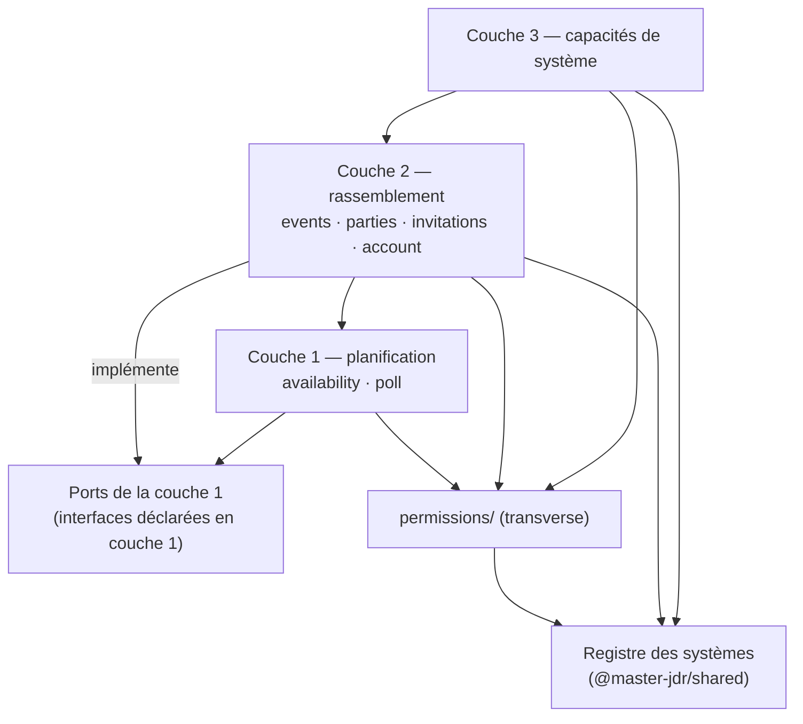
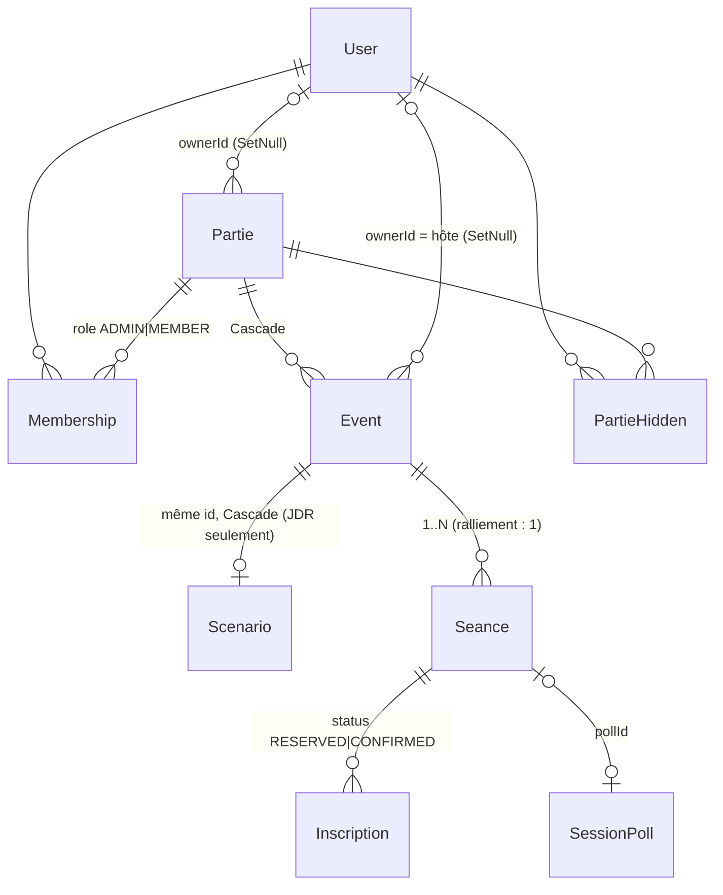

# Architecture Spine — Palier 10 : Soirées entre amis

## Design Paradigm

**NestJS Modular + Angular Signals (brownfield)**, hérité, **organisé en trois couches**, chacune ne dépendant que de celles du dessous, plus un **module transverse de permission**. Les **systèmes** (Ryuutama, Ralliement, plus tard Draconis…) ne sont pas une couche : ce sont des **profils de capacités** déclarés dans un registre (AD-2), qui activent la couche 3 et choisissent la **politique** de droits (AD-6).

| Couche | Rôle | Modules |
| --- | --- | --- |
| **1. Planification** (base) | dispos, calendrier, sondages, créneaux et plages, indisponibilités dérivées | `availability/`, `poll/` ; web : `features/calendar`, `features/poll` |
| **2. Rassemblement** | parties (conteneurs), appartenance et rôles, invitations, **événements** et **séances**, inscriptions et réservations, annulation, départ, masquage | `parties/`, `events/` (nouveau), `invitations/`, `account/` (suppression) |
| **3. Capacités de système** | JDR : scénario (anti-spoil, documents, compte-rendu), personnages, XP, Homme Dragon, rôles de groupe, annonces | `scenarios/`, `characters/`, `xp-distributions/`, `homme-dragon/`, `character-roles/`, `announcements/` |
| **Transverse** | décider d'un droit | `permissions/` (nouveau) — importable par toutes les couches, n'importe que `PrismaService` et le registre |



Flèche = « peut dépendre de ». La couche 1 n'importe **jamais** un module de couche 2 ou 3 : elle déclare des **ports** (interfaces) qu'`events/` implémente et fournit par injection (AD-15). Le `forwardRef` actuel `PollModule → ScenariosModule` disparaît dans la porte.

## Inherited Invariants

| Inherited | From parent | Binds here |
| --- | --- | --- |
| P1-AD-1 | Palier 1 (via Palier 9) | `PrismaService` global : `events/`, `permissions/` ne le réimportent pas |
| P1-AD-2 | Palier 1 | Mutations exclusivement en couche Service, jamais dans un contrôleur |
| P1-AD-3 | Palier 1 | Un seul point de vérité d'appartenance et de rôle — **évolue en AD-6** (`PermissionService`), n'est pas doublé |
| P1-AD-4 | Palier 1 | `import type` pour les types de `@master-jdr/shared` côté API ; registre et unions de valeurs par `import` normal |
| P1-AD-5 | Palier 1 | Angular : signals, `@if` / `@for` |
| P5-AD-4 | Palier 5 | Catalogues de choix fixes = `ContentType` / `ContentEntry` ; le registre des systèmes (AD-2) n'en est pas un |
| P6-AD-1 | Palier 6 | JSON vs relationnel : rôles (AD-7), réservations (AD-8), masquage (AD-10) sont relationnels |
| P7-AD-2 | Palier 7 | `emit(topic)` en fin de mutation, hors transaction |
| P7-AD-4 | Palier 7 | Tout service front rafraîchissable expose `notifyChanged()` |
| P8-AD-6 | Palier 8 | Un dossier `apps/api/src/<module>/` par capacité : fonde `events/` et `permissions/` |
| P8-AD-9 | Palier 8 | `tones.ts` neutre vis-à-vis des règles d'un système |
| P9-AD-1 | Palier 9 | États de compte : colonne typée ou relationnel, jamais clé/valeur |
| P9-AD-2 | Palier 9 | Identité dans un DTO : `pseudo` **et** `displayName` ; e-mail d'un tiers jamais exposé à un participant |
| P9-AD-3 | Palier 9 | `GET /me/party-signals` : un appel, en lot, codes en union fermée — **rôle et codes étendus (AD-6, AD-13)** |
| P9-AD-4 | Palier 9 | `/me` = convention de routage ; argon2 et coupure de sessions restent à `AuthService` (AD-11) |
| P9-AD-8 | Palier 9 | Seules les décisions humaines sont persistées, le statut se dérive — **étendu par AD-9 et AD-18** |
| P9-AD-9 | Palier 9 | Séance d'une autre partie = indisponibilité dérivée, sans identité — **étendu à tout événement (AD-15)** |
| P9-AD-11 | Palier 9 | Création de partie ouverte à tout utilisateur connecté |
| P9-AD-14 | Palier 9 | Liste des parties : canal `user:{id}` seul |
| P9-AD-15 | Palier 9 | Projection explicite vers les DTO, jamais d'objet Prisma brut |
| P9-AD-18 | Palier 9 | Calendrier personnel : un endpoint, dans `AvailabilityModule` — alimenté par le port d'AD-15 |
| P9-AD-20 | Palier 9 | États dépendants du lecteur résolus côté client sur les écrans qui ont la charge utile (« Ma situation ») |
| P9-AD-23 | Palier 9 | Lien Homme Dragon ↔ partie porté par `Partie` : couche 3, inchangé |

## Invariants & Rules

### AD-1 — Trois couches, dépendance vers le bas, ports pour remonter [ADOPTED]

- **Binds:** all
- **Prevents:** un calendrier qui relit des notions de JDR ; une capacité de JDR activée par accident pour un ralliement ; deux équipes qui branchent la couche 1 sur la couche 2 chacune à sa façon (import remontant, `forwardRef`, garde déplacée).
- **Rule:** Le code se range selon le tableau du paradigme. Une couche n'importe jamais un module d'une couche au-dessus ; quand la couche 1 a besoin d'une donnée de la couche 2, elle **déclare un port** (interface + jeton d'injection, dans son propre module) que la couche 2 implémente (AD-15). `permissions/` est transverse et importable par tous. **Chaque table a un module écrivain** (tableau « Écrivains » des conventions) ; aucun module n'écrit, même via `PrismaService` global, une table dont il n'est pas l'écrivain. La couche 3 n'est atteinte que si le système de la partie a la capacité (AD-2), garde posée **à l'entrée de chaque service de couche 3** par `PermissionService`, jamais par un test local du système.

### AD-2 — Registre des systèmes et de leurs capacités [ADOPTED]

- **Binds:** FR-1, FR-15, FR-18
- **Prevents:** un champ « mode » stocké à côté du système ; une liste de systèmes recopiée côté API ; `module: false` qui voudrait dire à la fois « pas de personnage » et « création refusée » ; la matrice de conversion de JDR appliquée au ralliement.
- **Rule:** `GAME_SYSTEMS` (`@master-jdr/shared`) devient le **registre unique**. Par entrée : `family` (`'jdr' | 'ralliement'`), `capabilities` ⊆ `{characters, scenarioLifecycle, xp, hommeDragon, groupRoles, announcements, linearCampaign}`, `kinds` autorisés, `openForCreation`. `ryuutama` : `jdr`, toutes les capacités, les trois `kind`, ouvert ; `draconis` et autres sans module : `jdr`, fermés à la création ; `ralliement` : **aucune** capacité, `kinds = {ONE_SHOT, CAMPAGNE_EPISODIQUE}`, ouvert (pas de ligne en table `GameSystem`, qui ne sert qu'au contenu). Le **mode** se **dérive** de `family`. Seules lectures autorisées : `familyOf`, `hasCapability`, `kindsOf`, `isOpenForCreation` (remplacent `gameSystemHasModule`). Changer de système **entre familles** : refusé. Changer de `kind` : `checkPartieKindTransition` pour la famille `jdr` seulement ; **interdit en ralliement** dans ce palier.

### AD-3 — Événement = base, Scénario = extension par composition à identifiant partagé [ADOPTED]

- **Binds:** FR-2, FR-3, FR-8, FR-16
- **Prevents:** un événement de ralliement contraint de traîner un scénario caché ; deux agrégats parallèles qui dupliqueraient séances, sondages, inscriptions, rappels et signaux ; une migration qui réécrirait toutes les références ; une fuite des scénarios en brouillon par la couche commune.
- **Rule:** `Event` (couche 2, écrivain `events/`) porte : `partieId`, `title`, `description`, `ownerId` (AD-5), `cancelledAt` (AD-9), `createdAt`, et ses `Seance[]`. `Scenario` (couche 3, écrivain `scenarios/`) est une **extension 1 pour 1 dont la clé primaire est l'`id` de son `Event`** ; il garde le statut anti-spoil, son `closedAt`, les durées estimées, `resumeFin`, documents, participants épisodiques, notes, annonces. **Tout événement d'une partie de JDR a sa ligne `Scenario` ; aucun événement de ralliement n'en a.** Création composite : `EventsService.create(…, extend?)` ouvre la transaction, crée l'`Event`, appelle le **rappel d'extension** fourni par `ScenariosService` dans la **même** transaction, puis émet après la validation. Clés étrangères : `Event.partie` Cascade, `Scenario.event` Cascade, `Event.owner` SetNull. Une partie `ONE_SHOT` contient **exactement un** événement (créé avec la partie, vérifié sous verrou de la partie). Les routes `/parties/:id/events` **refusent les parties de JDR** ; tout lecteur d'événements de JDR passe par les routes et l'anti-spoil existants.

### AD-4 — La date d'une séance : une plage continue, une seule source [ADOPTED]

- **Binds:** FR-8, FR-10, FR-11
- **Prevents:** deux formes de date (plage d'un côté, `poll.chosenDate ?? dateValidee` de l'autre) et des lecteurs qui ne s'accordent pas sur un créneau absent ; plusieurs séances « collées » pour une plage ; un ralliement à date fixée sans rappel ni indisponibilité.
- **Rule:** `Seance.startDate`, `startSlot`, `endDate`, `endSlot` sont la **seule source** de la date d'une séance (vides tant qu'elle n'est pas datée). Fixer une date ou choisir une option de sondage **écrit ces colonnes** ; `dateValidee` et la lecture `poll.chosenDate ?? dateValidee` disparaissent dans la porte. `startSlot` vide = **journée sans créneau précisé**, que les dispos lisent `FULL_DAY` (P9-AD-9) et que l'affichage garde « sans créneau » comme aujourd'hui. **Jamais deux séances pour une seule plage continue.** `Event → Seance` reste 1 à N ; la politique (AD-6) limite un événement de ralliement à **une** séance et ce palier n'écrit que des plages **d'un créneau** (`start = end`). Le sondage d'un événement **s'ouvre dès que ses créneaux sont posés**, à la création ou plus tard. Longueur d'une plage soumise au vote, création et affichage des plages longues : Palier 10.4.

### AD-5 — Propriétaire : `ownerId`, le créateur, immuable [ADOPTED]

- **Binds:** FR-3, FR-5, FR-7, FR-8
- **Prevents:** un champ `mjId` vide pour la moitié des parties ; un hôte stocké à part ; une cascade qui supprimerait un groupe dont il reste un admin.
- **Rule:** `Partie.mjId` → **`Partie.ownerId`** (nullable, `onDelete: SetNull`) ; `Event.ownerId` = le créateur de l'événement = **son hôte** (nullable, SetNull). Un propriétaire **ne change jamais**, ne devient vide que par suppression de compte, et s'affiche alors « compte supprimé ». En `jdr`, le propriétaire de la partie **est** le MJ, seul à créer des événements (donc propriétaire de tous). En `ralliement`, il est un fait historique ; les droits viennent des rôles (AD-7). Le contrat web suit : `PartieDto.mjId` / `mjPseudo` / `mjDisplayName` → `ownerId` / `ownerPseudo` / `ownerDisplayName`, code web adapté sans changement visible. `XpDistribution.mjId` (auteur d'une distribution, couche 3) est hors de ce renommage. **Aucune cascade de base sur un propriétaire** : toute suppression liée à un compte passe par AD-11.

### AD-6 — Un service de permission unique ; politique = famille + forme [ADOPTED]

- **Binds:** FR-2, FR-4, FR-5, FR-6, FR-8, FR-9, FR-11, FR-13, FR-16, FR-17
- **Prevents:** treize services qui lisent le propriétaire chacun à sa façon ; une rencontre isolée qui hériterait des règles du groupe ; un vote, une relance et une liste « n'ont pas répondu » qui définissent chacun leurs ayants droit ; un IDOR par un `eventId` d'une autre partie ; un appel par partie pour calculer les rôles de la liste.
- **Rule:** `PermissionService` est **le seul** à décider d'un droit : `assert(userId, action, target)` avec `target = {partieId} | {eventId} | {seanceId}` — pour un événement ou une séance, **la partie est résolue depuis la cible**, jamais lue dans la route ; refus 403, introuvable 404. `action` : union fermée `PermissionAction` (codes `SCREAMING_SNAKE`) dans `@master-jdr/shared`, liste close dans le code. `roleOf(partieId, userId)` et **`rolesOf(userId, partieIds)` en lot** ; rôle renvoyé = `'mj' | 'player' | 'admin' | 'member'`. **Politique** choisie par `family` **et** `kind` : `jdr` = propriétaire seul organise et administre (comportement actuel) ; `ralliement` + `ONE_SHOT` (rencontre isolée) = un seul admin, le propriétaire, qui est l'hôte ; ni « nommer admin » ni « quitter l'office » ; invités acceptés = membres ; `ralliement` + `CAMPAGNE_EPISODIQUE` (groupe) = admins pour la partie, propriétaire de l'événement pour l'événement, tout admin pour annuler, membres pour proposer et s'inscrire. **Ayants droit, une fonction chacun**, dans `events/` et appelées par tous : `eligibleVoters(event)` (groupe : participation « tous » → membres ; places limitées → inscrits `CONFIRMED` ; isolée → membres ; JDR inchangé) et `reminderRecipients(seance)`. Le DTO d'un événement porte les identifiants de ses ayants droit au vote ; le résumé (réponses, meilleur créneau, « n'ont pas encore répondu ») se calcule **côté écran** à partir de cette liste et des votes reçus (P9-AD-20). En ralliement, un vote après `expiresAt` est refusé ; en JDR, comportement inchangé. Hors de ce service et des projections, **aucun code ne lit `ownerId` pour décider d'un droit** — test qui balaie les sources avec une liste d'exceptions nommées (projections, migrations, `permissions/`). Chaque cellule actions × rôles × familles a un **test de refus**. `GET /parties` sans paramètre renvoie toutes les parties avec leur rôle ; `?role=mj|player` garde son contrat.

### AD-7 — Rôle d'appartenance `ADMIN` / `MEMBER`, sous verrou de la partie [ADOPTED]

- **Binds:** FR-3, FR-4, FR-5, FR-6
- **Prevents:** une table d'admins à côté de l'appartenance ; un groupe laissé à zéro admin par deux départs simultanés ; un créateur compté deux fois (propriétaire **et** membre).
- **Rule:** `Membership.role` : `'ADMIN' | 'MEMBER'`, défaut `MEMBER`. À la création d'un ralliement, le créateur reçoit un `Membership` `ADMIN` dans la même transaction. Quitter l'office = passer à `MEMBER` ; si c'est le **dernier** admin, quitter l'office **supprime le groupe**, après une confirmation qui l'annonce. Toute opération qui fait varier le nombre d'admins (nommer, quitter l'office, départ, suppression de compte) prend d'abord **`SELECT … FROM "Partie" WHERE id = … FOR UPDATE`**, puis recompte. « Qui est dans la partie » = **une seule fonction** `membersOf(partie)` : `jdr` → propriétaire + `Membership` ; `ralliement` → `Membership` seuls (le créateur en fait partie) ; elle sert aux comptes, à la troupe, aux listes et aux destinataires. En JDR, rien ne change.

### AD-8 — Inscriptions et places réservées : une table, un verrou, des règles par famille [ADOPTED]

- **Binds:** FR-2, FR-9, FR-10
- **Prevents:** deux tables à additionner sous deux verrous ; une même colonne de capacité et une même route avec deux sens implicites ; une réservation qui expire selon une règle non décidée ; les réservations d'autrui exposées.
- **Rule:** `Inscription.status` : `'RESERVED' | 'CONFIRMED'`, défaut `CONFIRMED`. Une réservation est créée **par l'hôte**, **compte dans la capacité**, **n'expire jamais** ; l'hôte la retire quand il veut. Accepter = `CONFIRMED` ; décliner = suppression de la ligne. Toute écriture d'inscription, de réservation, d'acceptation et de capacité se fait **sous le même verrou**, pris sur la **ligne `Event`** (`FOR UPDATE`) — le même que l'annulation et le choix de date (AD-9). Règles : **JDR** inchangé (épisodique seul, capacité obligatoire, inscriptions figées dès qu'une date existe) ; **ralliement** : inscription possible sur un groupe, capacité vide = « tous les membres » (s'inscrire = confirmer sa venue, sans limite), **inscriptions tardives** possibles après la date fixée. Projection : les lignes `RESERVED` d'autrui ne sont servies **qu'à l'hôte**. Rencontre isolée : l'invitation est l'`Invitation` existante au niveau de la partie ; l'accepter crée le `Membership`.

### AD-9 — Annulation : décision persistée sur l'événement, ralliement seulement [ADOPTED]

- **Binds:** FR-16, FR-12
- **Prevents:** un statut « annulé » stocké en double ; un événement annulé qui accepte encore inscription, réservation ou vote ; un JDR devenu annulable sans l'avoir décidé.
- **Rule:** `Event.cancelledAt DateTime?`, posé par l'hôte ou un admin, **en ralliement uniquement** dans ce palier. Sous le verrou de l'`Event` (AD-8) : l'annulation pose `cancelledAt`, puis `EventsService` ferme le sondage via `PollService` (seul écrivain de `SessionPoll`). Un événement annulé refuse inscription, réservation, vote et choix de date ; ses séances sortent des rappels, des indisponibilités et de `nextSessionDate`. L'e-mail #7 part après validation.

### AD-10 — Masquage par utilisateur : relationnel, filtré côté serveur [ADOPTED]

- **Binds:** FR-17
- **Prevents:** un masquage local qui réapparaît sur un autre appareil ; une partie masquée qui continue d'émettre ; une partie rouverte qui resterait masquée sans moyen de la retrouver.
- **Rule:** `PartieHidden(userId, partieId)`, unique, écrivain `parties/`. Le serveur refuse si le statut (AD-18) n'est ni `TERMINEE` ni `ANNULEE` ; l'écran ne propose pas l'action dans ce cas. Exclusion **côté serveur** de toutes les lectures de cet utilisateur (listes, `party-signals`, calendrier personnel). **Rouvrir une partie** (vider `closedAt`) supprime ses lignes `PartieHidden`. Pas de démasquage volontaire dans ce palier.

### AD-11 — Suppression de compte : une procédure, jamais une cascade [ADOPTED]

- **Binds:** FR-7
- **Prevents:** une cascade qui supprime un groupe dont il reste un admin ; des événements futurs sans hôte ; une seconde vérification de mot de passe hors d'`AuthService`.
- **Rule:** `AccountModule` : `GET /me/deletion-impact` (groupes et rencontres dont on est le seul admin, avec membres et événements ; parties de JDR possédées, avec joueurs) et `DELETE /me` (mot de passe). Mot de passe vérifié et sessions coupées **par `AuthService`**. **Une transaction** : parties de JDR possédées supprimées (comme aujourd'hui) ; pour chaque ralliement, la **procédure de départ** (AD-17) s'applique, ce qui supprime le ralliement s'il n'y reste aucun admin ; puis le compte. Émissions et e-mails après validation. Fichiers des parties supprimées : même règle que la suppression de partie existante.

### AD-12 — Rappels par séance, relance du vote par sondage [ADOPTED]

- **Binds:** FR-11, FR-12
- **Prevents:** deux mécanismes de rappel ; un groupe qui ne rappelle que son premier événement ; un rappel pour un événement annulé ; un doublon après migration ; des relances aux mauvaises personnes.
- **Rule:** `Seance.reminderSentAt` **remplace** `Partie.reminderSentAt` pour toutes les familles : la tâche horaire de `NotificationsService` (garde de non-chevauchement inchangée) envoie la veille le rappel de **chaque séance datée d'un événement non annulé**, à `reminderRecipients(seance)` — en **JDR, mêmes destinataires qu'aujourd'hui** (membres de la partie). `SessionPoll.relanceSentAt` : relance **unique**, un jour avant `expiresAt`, à `eligibleVoters` sans réponse ; prolonger l'échéance la remet à vide. E-mails via `EmailService` ; nouveaux gabarits dans l'union `EmailTemplate`, vocabulaire **neutre** ; gabarit commun bouton + pied « Dés Dispos » pour **tous** les e-mails.

### AD-13 — Signaux de liste et temps réel [ADOPTED]

- **Binds:** FR-12, FR-16, FR-17
- **Prevents:** un ralliement affiché avec « personnage à créer » ; une annulation, une date fixée ou un changement de rôle invisibles dans la liste sans recharger ; un code de signal inventé deux fois.
- **Rule:** `PartySignalsDto` (un appel, en lot) n'émet un code de couche 3 (`PERSONNAGE_A_CREER`, `HOMME_DRAGON_A_CREER`, `AUCUN_SCENARIO_EN_COURS`, `COMPTE_RENDU_NON_REDIGE`, `RAPPORT_FIN_MANQUANT`) **que si** la capacité existe. `PartySignalCode` gagne **`RESERVATION_A_CONFIRMER`** (une inscription `RESERVED` à mon nom ; une invitation de rencontre isolée reste dans la section « invitations » existante) et **`PARTIE_ANNULEE`**. Les parties masquées sont absentes. **Toute mutation qui change un signal, un statut ou un rôle** (annulation, date fixée, inscription, réservation, rôle, départ, suppression) appelle `notifyPartieSignalsChanged(partieId)` après validation, qui émet `user:{id}` pour `membersOf` ; une réservation émet aussi `user:{id}` de la personne visée.

### AD-14 — Routes et écran [ADOPTED]

- **Binds:** FR-2, FR-3, FR-6, FR-8, FR-18
- **Prevents:** un front de JDR à réécrire pour suivre un renommage ; deux services d'événements ; une adresse supposée qui n'existe pas.
- **Rule:** Routes existantes **inchangées** et communes aux deux familles pour ce qui relève de la séance et du sondage : `parties/:id/scenarios` (JDR), `scenarios/:id/*` (JDR), `scenarios/seances/:id/*` (séance : inscription, capacité, infos pratiques, création de sondage), `parties/:id/poll/*` (vote, choix, fermeture). **Nouvelles** : `/parties/:id/events` (ralliement : lister, créer avec sa séance, modifier, annuler) sur `EventsController` → `EventsService` ; `POST …/seances/:id/reservations` et `DELETE …/reservations/:userId` (hôte) ; `PATCH …/inscription/accept` ; `DELETE /parties/:id/members/me` (départ volontaire) ; `PATCH /parties/:id/members/:userId/role` (nommer admin, quitter l'office) ; `GET /me/deletion-impact`, `DELETE /me` ; `PUT/…/hidden` (masquage). Web : **une seule page de partie**, onglets déduits de `family` + `kind` via le registre ; fenêtre de création / détail d'un événement dans `features/events/`, réutilisant `DetailSurface`.

### AD-15 — Le calendrier ne voit que des plages, par des ports [ADOPTED]

- **Binds:** FR-10, FR-11
- **Prevents:** un calendrier qui relit le type de partie, le propriétaire ou le scénario ; des indisponibilités qui ignorent les événements de ralliement ; un créateur rendu « occupé » par l'événement de n'importe quel membre ; une `nextSessionDate` recalculée à plusieurs endroits.
- **Rule:** La couche 1 déclare deux **ports**, implémentés par `events/` : `OccupiedSpansPort` — pour des utilisateurs et une période, les plages des **autres** parties où ils sont **participants**, **sans titre ni identité** (P9-AD-9 étendu à toute famille) ; `OwnEventsPort` — pour le calendrier personnel (P9-AD-18), les plages des parties **du lecteur**, avec titre, hors masquées, sous les règles d'affichage actuelles du JDR. **Participants d'une plage** : JDR inchangé ; ralliement = hôte + inscrits `CONFIRMED` (groupe) ou membres (isolée). Les plages d'événements **annulés** sont exclues. `Partie.nextSessionDate` / `nextSessionSlot` (exception persistée de P9-AD-3) = le **début** de la plus proche plage **à venir**, datée, d'un événement non annulé de la partie (vide s'il n'y en a pas), recalculée par **une seule fonction** d'`EventsService`, appelée après toute écriture de date, d'annulation ou de suppression. `PollService` n'écrit plus `nextSessionDate`.

### AD-16 — Une migration unique, puis une porte à comportement constant [ADOPTED]

- **Binds:** FR-13, FR-14
- **Prevents:** un refactor mêlé aux fonctionnalités ; trois lectures de « recopier chaque scénario » ; un rappel JDR envoyé deux fois après la migration ; un service de permission construit avant le registre dont il dépend.
- **Rule:** Aucune production avant le Palier 11 : **une seule migration**, qui : renomme `Partie.mjId` → `ownerId` (nullable, SetNull) ; crée `Event` **avec `id = Scenario.id`** et y **déplace** `partieId`, `title`, `description`, `createdAt` (le `Scenario` garde le reste) ; `Event.ownerId` = propriétaire de la partie ; renomme `Seance.scenarioId` → `eventId` ; crée `startDate/startSlot/endDate/endSlot` et les remplit depuis `poll.chosenDate/chosenSlot`, sinon `dateValidee` avec créneau vide, `end = start`, puis supprime `dateValidee` ; défauts `Membership.role = MEMBER`, `Inscription.status = CONFIRMED` ; crée `Seance.reminderSentAt` en **reportant** `Partie.reminderSentAt` sur la séance de `nextSessionDate`, puis supprime la colonne de `Partie` ; crée `SessionPoll.relanceSentAt`, `Event.cancelledAt`, `PartieHidden`. Migration via `pnpm exec prisma` dans le conteneur. **Porte, dans l'ordre** : tests de caractérisation JDR → migration + `ownerId` → extraction d'`Event` → plage de séance → **registre des capacités** → `PermissionService` (+ test de non-lecture) → ports de la couche 1 → rôle et état d'inscription → rappels par séance. **Condition de passage :** CI verte ; attentes des tests existants inchangées, **sauf** les tests de `NotificationsService` qui portent sur `Partie.reminderSentAt` (exception listée au PRD, FR-13) ; aucun changement visible du JDR hors des exceptions de FR-13. Aucune story de ralliement avant.

### AD-17 — Départ d'un membre : une procédure unique [ADOPTED]

- **Binds:** FR-6, FR-7
- **Prevents:** un membre retiré qui garde ses inscriptions et ses votes ; des événements futurs sans hôte ; trois chemins (retrait, départ, suppression de compte) qui ne nettoient pas la même chose.
- **Rule:** `PartiesService.leave(partieId, userId, cause)` est le **seul** chemin pour le retrait par un admin, le départ volontaire et la suppression de compte. Sous verrou de la partie (AD-7) : supprime ses inscriptions (`RESERVED` et `CONFIRMED`) aux événements **à venir** et ses votes sur les sondages **ouverts** ; **annule** (AD-9) les événements **à venir** dont il est l'hôte ; vide `ownerId` là où il était propriétaire ; retire son `Membership` ; si c'était le dernier admin d'un ralliement, supprime le ralliement. Le passé est conservé. En JDR, le retrait d'un joueur garde son comportement actuel.

### AD-18 — Statut d'une partie : une fonction par famille et forme [ADOPTED]

- **Binds:** FR-2, FR-16, FR-17
- **Prevents:** une rencontre isolée passée qui ne serait jamais « terminée » (donc jamais masquable) ; un statut recalculé différemment par la liste et la page.
- **Rule:** `PartieStatus` = `'A_VENIR' | 'EN_COURS' | 'TERMINEE' | 'ANNULEE'`, calculé par **une seule fonction** de projection : **JDR** inchangé (`closedAt ? TERMINEE : scénario ? EN_COURS : A_VENIR`) ; **rencontre isolée** : événement annulé → `ANNULEE`, `closedAt` ou fin de plage passée → `TERMINEE`, sinon `A_VENIR` ; **groupe** : `closedAt ? TERMINEE : au moins un événement ? EN_COURS : A_VENIR`. Le front ne dérive jamais ce statut.

## Consistency Conventions

| Concern | Convention |
| --- | --- |
| Noms | `Event`, `Scenario` (extension), `Seance`, `Membership.role`, `Inscription.status`, `PartieHidden`, `ownerId`, `cancelledAt`, `startDate/startSlot/endDate/endSlot`, `reminderSentAt`, `relanceSentAt` ; synonymes interdits (`hostId`, `creatorId`, `mjId` hors `XpDistribution`) |
| Unions fermées partagées | `SystemFamily`, `SystemCapability`, `PermissionAction`, `MembershipRole`, `InscriptionStatus`, `PartieRole`, `PartieStatus`, `PartySignalCode`, `EmailTemplate` — déclarées dans `@master-jdr/shared`, validées à l'écriture |
| Écrivains (une table, un module) | `Partie`, `Membership`, `PartieHidden` → `parties/` ; `Event`, `Seance` (plage, capacité, infos pratiques), `Inscription` → `events/` ; `Seance.compteRendu`, `Scenario`, documents, notes → `scenarios/` ; `SessionPoll`, `PollOption`, `PollVote` → `poll/` ; `Invitation`, `InviteLink` → `invitations/` ; `User` → `account/` et `auth/` (inchangé) |
| Verrous | Partie (`FOR UPDATE`) : admins, départ, suppression, « exactement un » événement ; Événement (`FOR UPDATE`) : inscription, réservation, acceptation, capacité, annulation, choix de date |
| Vocabulaire | Le code dit `Event` / `Seance` / `Partie` ; l'écran traduit par famille, forme et thème ; e-mails neutres |
| Droits | `PermissionService.assert` partout ; 403 / 404 ; messages en français |
| Dérivé vs persisté | Persisté : décisions humaines et l'exception `nextSessionDate` ; dérivé : mode, statut, rôle, situation |
| Temps réel | Mutation d'événement / séance / inscription → `emit(partie:{id})` ; tout changement visible dans la liste → `notifyPartieSignalsChanged` (`user:{id}` de `membersOf`) ; hors transaction |
| Lecture en lot | Rôles, signaux, statuts, impacts : requêtes groupées, jamais une par partie |
| Tests | Matrice actions × rôles × familles, un test de refus par cellule ; caractérisation JDR avant chaque étape de la porte ; test de non-lecture de `ownerId` avec liste d'exceptions |

## Stack

| Name | Version |
| --- | --- |
| Node.js | 24 LTS |
| pnpm | 11.8 |
| TypeScript (API / web) | 5.9.3 / 6.0.3 |
| Angular | 22.1.3 |
| NestJS | 11.2.3 |
| @nestjs/schedule | 6.1.3 |
| Prisma (client + CLI) | 7.10.0 |
| PostgreSQL | 17 |
| RxJS | 7.8.2 |

## Structural Seed

### Données (ajouts et renommages)



### Source tree (ajouts)

```text
packages/shared/src/              # registre (family, capabilities, kinds, openForCreation), unions fermées
apps/api/src/
  permissions/                    # nouveau, transverse — PermissionService, politiques jdr / ralliement-isolé / ralliement-groupe
  events/                         # nouveau — EventsService (Event, Seance, Inscription, nextSessionDate, ayants droit), EventsController, implémentation des ports
  availability/ poll/             # couche 1 — déclarent OccupiedSpansPort / OwnEventsPort, n'importent plus parties/ ni scenarios/
  scenarios/                      # extension JDR, rappel d'extension pour EventsService.create
  parties/                        # + leave(), masquage, rôles, statut (AD-18)
  account/                        # + aperçu et suppression de compte
  notifications/                  # rappels par séance + relance du vote
  email/templates/                # nouveaux gabarits, gabarit commun bouton + pied
apps/web/src/app/
  features/events/                # fenêtre de création / détail d'un événement
  features/parties/partie-detail/ # onglets dérivés de family + kind
```

### Environnements et exploitation

Inchangés : Docker Compose (db, api, web, mailpit) en développement ; aucun service, aucune variable, aucun fournisseur nouveau. Migration Prisma lancée dans le conteneur (`pnpm exec prisma`). Aucune donnée de production avant le Palier 11.

## Capability → Architecture Map

| Capability / Area | Lives in | Governed by |
| --- | --- | --- |
| FR-1 choix du mode, FR-18 création pour tous | registre `@master-jdr/shared`, `parties/`, web `partie-form` | AD-2, AD-14, P9-AD-11 |
| FR-2 rencontre isolée | `parties/`, `events/`, `invitations/` | AD-3, AD-6, AD-8, AD-18 |
| FR-3 à FR-6 groupe, membres, admins, départ | `parties/`, `permissions/` | AD-5, AD-6, AD-7, AD-17 |
| FR-7 suppression de compte | `account/` + `AuthService` | AD-11, AD-17 |
| FR-8, FR-9 proposer, participation | `events/`, `permissions/` | AD-3, AD-4, AD-6, AD-8 |
| FR-10, FR-11 date et sondage | `events/`, `poll/`, `availability/` | AD-4, AD-6, AD-12, AD-15 |
| FR-12 e-mails | `notifications/`, `email/` | AD-12 |
| FR-13 permissions, FR-14 migration | `permissions/`, migrations Prisma | AD-6, AD-16 |
| FR-15 libellés | web `core/theme/tones` | Conventions, P9-AD-13 |
| FR-16 annulation | `events/` | AD-9, AD-18 |
| FR-17 masquage | `parties/`, `PartieHidden` | AD-10, AD-13, AD-18 |

## Deferred

- **Plages longues** (longueur soumise au vote, création, affichage) et **refonte du sondage / mode Destinée** : Palier 10.4.
- **Plusieurs séances par événement de ralliement** : le modèle est 1 à N, seule la politique les limite.
- **Annulation d'un événement de JDR** : non demandée ; AD-9 la réserve au ralliement.
- **Conversion de forme d'un ralliement** (isolée ↔ groupe) : interdite dans ce palier.
- **Démasquage volontaire**, **e-mail aux membres** d'un ralliement supprimé, **suppression de compte par un administrateur**, **transfert de propriété** : non demandés.
- **Préférences de notification** : n'existent pas dans le modèle `User` ; aucune n'est créée.
- **Renommer le préfixe `scenarios/` des routes de séance** : cosmétique.
- **Déploiement de production** : Palier 11.
