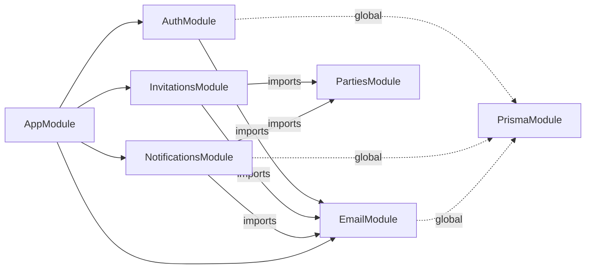
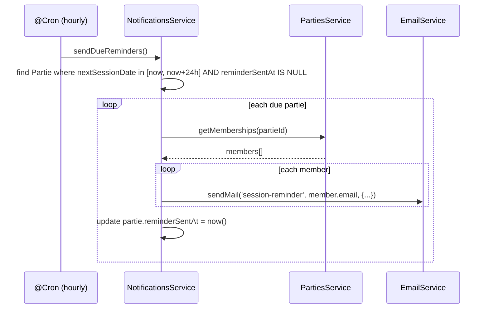
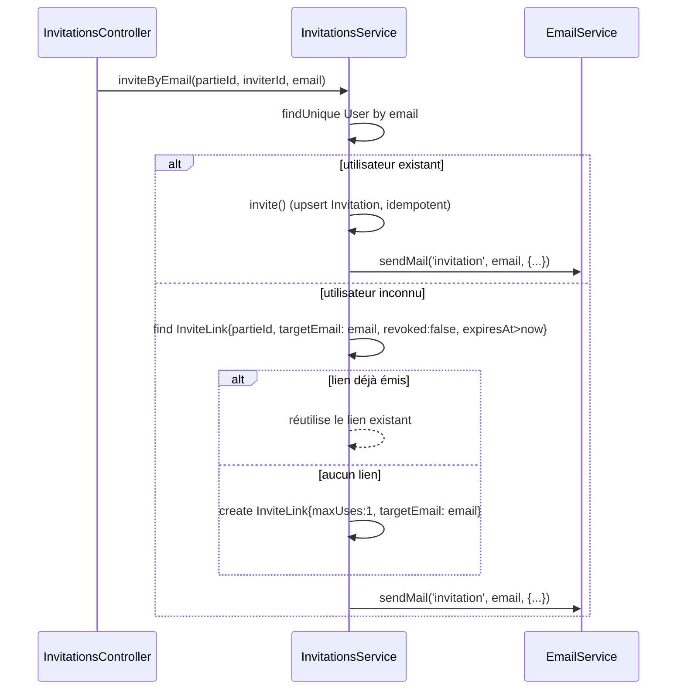

# Architecture Spine — Palier 4 : Infra e-mail & notifications

## Paradigme

**NestJS Modular + Angular Signals (brownfield).** Les invariants des Paliers 1 et 2 s'appliquent intégralement.

## Inherited Invariants (read-only)

| ID | Règle héritée |
|----|--------------|
| P1-AD-1 | `PrismaService` est global — aucun module ne le déclare dans `providers`, jamais réimporté |
| P1-AD-2 | Les mutations passent exclusivement par la couche Service — un controller n'écrit pas en base |
| P1-AD-4 | Angular : `import type` pour tous les types partagés de `@master-jdr/shared` — **aucune valeur runtime** ne doit être importée depuis `@master-jdr/shared` côté `apps/api` (Jest ne transforme pas les workspace deps ; leçon Epic 4 / Story 4.7) |
| P1-AD-5 | Angular : control-flow `@if/@for`, pas de `*ngIf/*ngFor` |
| P2-AD-3 | `PartiesService` reste le seul point de vérité pour l'appartenance/rôle MJ (`getOwned`, memberships) |

## Architecture Decisions

### AD-1 — EmailModule : service générique unique, pas de service par cas d'usage

**Binds :** `apps/api/src/email/`
**Prevents :** trois services d'envoi divergents (formatage, gestion d'erreur, logging incohérents entre invitation/rappel/reset)
**Rule :** `EmailModule` exporte `EmailService.sendMail(template: EmailTemplate, to: string, data: Record<string, unknown>)`. Chaque appelant (`InvitationsService`, `NotificationsService`, `AuthService`) choisit son template et ses données ; `EmailService` ne connaît aucune règle métier, seulement le rendu + l'envoi + le log d'échec (NFR §4.3).

```
apps/api/src/email/
  email.module.ts        # EmailModule.forRootAsync() lit MAIL_* via ConfigModule, exporte EmailService
  email.service.ts        # sendMail(template, to, data) — @nestjs-modules/mailer
  templates/
    invitation.hbs
    session-reminder.hbs
    password-reset.hbs
    layout.hbs             # gabarit neutre partagé (cf. Non-Goals PRD : pas de variation par thème)
  email-template.enum.ts  # 'invitation' | 'session-reminder' | 'password-reset'
```

**Librairies :** `@nestjs-modules/mailer` (v2.3.7, Nodemailer) + moteur `handlebars`.

### AD-2 — Transport SMTP swappable par variables d'environnement uniquement (FR-1)

**Binds :** configuration du transport Nodemailer
**Prevents :** tout code spécifique à un fournisseur (Brevo ou autre) dans le code métier
**Rule :** `EmailModule.forRootAsync` lit `MAIL_HOST`, `MAIL_PORT`, `MAIL_USER`, `MAIL_PASSWORD`, `MAIL_FROM` directement via `process.env` (convention du projet — pas de `@nestjs/config`, cf. `main.ts`/`prisma.service.ts`), une seule fois au bootstrap. Dev/test : `docker-compose.yml` ajoute un service `mailpit` (image `axllent/mailpit` — remplaçant maintenu de MailHog, drop-in : mêmes ports, API HTTP compatible ; MailHog n'a plus de mise à jour depuis 2020), port SMTP `1025`, UI/API HTTP `8025`, `MAIL_HOST=mailpit`. Prod : mêmes clés pointant vers Brevo. Aucun `if (env === 'production')` dans `EmailService`.

```yaml
# docker-compose.yml (ajout)
mailpit:
  image: axllent/mailpit
  ports:
    - "8025:8025"   # UI web + API HTTP (FR-1 : tests interrogent cette API)
    - "1025:1025"   # SMTP
```

### AD-3 — NotificationsModule : propriétaire exclusif du rappel de séance planifié

**Binds :** `apps/api/src/notifications/`
**Prevents :** `PartiesModule` ou `PollModule` portant une logique de planification qui leur est étrangère
**Rule :** `NotificationsModule` importe `PartiesModule` (lecture memberships + `nextSessionDate`) et `EmailModule`. Un seul `@Cron` (toutes les heures, `@nestjs/schedule`) exécute `NotificationsService.sendDueReminders()` :

1. Charge les parties où `nextSessionDate` est dans `[now, now + 24h]` ET `reminderSentAt IS NULL`.
2. Pour chacune, charge les memberships actifs (MJ inclus), envoie un e-mail `session-reminder` par membre via `EmailService`.
3. Marque `reminderSentAt = now()` sur la partie (dédoublonnage FR-4 — un run qui repasse sur la même partie la trouve déjà marquée).

```
apps/api/src/notifications/
  notifications.module.ts   # imports: [PartiesModule, EmailModule]
  notifications.service.ts  # @Cron(EVERY_HOUR) sendDueReminders()
```

**Librairie :** `@nestjs/schedule` (`@Cron`, officiel Nest).

### AD-4 — Dédoublonnage et péremption du rappel via `Partie.reminderSentAt`

**Binds :** schéma `Partie`, service qui modifie `nextSessionDate`
**Prevents :** rappel en double (run récurrent) et rappel envoyé pour une date annulée/changée après programmation (FR-4)
**Rule :** nouveau champ `Partie.reminderSentAt DateTime?`. Toute mutation de `nextSessionDate` (aujourd'hui : `PollService.choseDate` — `poll.service.ts:144` — et une future annulation) **doit** remettre `reminderSentAt = null` dans la même écriture. `NotificationsService` ne regarde que `reminderSentAt IS NULL`, donc un changement de date « dé-arme » automatiquement l'ancien rappel sans logique dédiée de purge.

```prisma
model Partie {
  // ... champs existants ...
  reminderSentAt DateTime? // null = rappel pas encore envoyé pour la date courante (AD-4)
}
```

### AD-5 — Invitation par e-mail : `InvitationsService.inviteByEmail`, distingue utilisateur existant / `InviteLink` ciblé (FR-3)

**Binds :** `InvitationsService` (étendu), schéma `InviteLink`
**Prevents :** duplication de logique dans le controller ; création d'un `InviteLink` en doublon sur ré-invitation de la même adresse
**Rule :** nouvelle méthode `InvitationsService.inviteByEmail(partieId, inviterId, email)` :

1. `prisma.user.findUnique({ where: { email } })` — si trouvé, délègue à `invite()` existant (déjà idempotent via `upsert`) puis `EmailService.sendMail('invitation', ...)`.
2. Si non trouvé : cherche un `InviteLink` existant `{ partieId, targetEmail: email, revoked: false, expiresAt: { gt: now } }`. S'il existe, le renvoie (même token, même e-mail — pas de doublon). Sinon, crée un nouveau `InviteLink` avec `maxUses: 1` et `targetEmail: email`, puis envoie l'e-mail avec le lien.

**InviteLink gagne un champ `targetEmail String?`** — `null` pour un lien ouvert partageable (flow existant, inchangé), renseigné uniquement pour un lien généré via ce flow d'invitation par e-mail. C'est ce qui permet l'étape 2 de retrouver un lien déjà émis pour la même adresse.

```prisma
model InviteLink {
  // ... champs existants ...
  targetEmail String? // FR-3 : ciblage d'un lien généré par invitation-par-email (dédoublonnage)
}
```

```
POST /parties/:id/invitations/by-email   # nouveau, InvitationsController
  body: { email: string }
  -> InvitationsService.inviteByEmail(partieId, inviterId, email)
```

### AD-6 — Mot de passe oublié : `PasswordResetToken` en DB, flow dans `AuthModule`

**Binds :** `AuthModule`, nouveau modèle Prisma `PasswordResetToken`
**Prevents :** jeton non révocable (cas d'un JWT signé sans état DB) ; énumération de comptes (FR-5)
**Rule :**

```prisma
model PasswordResetToken {
  id        String   @id @default(uuid())
  userId    String
  user      User     @relation(fields: [userId], references: [id], onDelete: Cascade)
  token     String   @unique
  expiresAt DateTime // +24h (FR-6)
  usedAt    DateTime?
  createdAt DateTime @default(now())
  @@index([userId])
}
```

- `AuthService.requestPasswordReset(email)` : répond **toujours** `{ ok: true }` (anti-énumération, FR-5), et **seulement si** un `User` existe pour cet e-mail, crée un `PasswordResetToken` (token = `randomBytes(32).toString('base64url')`, comme `InviteLink`) et envoie l'e-mail via `EmailService`.
- `AuthService.resetPassword(token, newPassword)` : cherche un token `{ token, usedAt: null, expiresAt: { gt: now } }` ; sinon `NotFoundException` avec message générique invitant à refaire une demande (FR-6). Si trouvé : met à jour le mot de passe (argon2, mêmes règles que l'inscription), marque `usedAt = now()` (usage unique).
- Rate-limit : `@Throttle()` sur les deux endpoints, réutilisant `@nestjs/throttler` déjà en place (NFR §4.4).

```
POST /auth/forgot-password   { email }        -> AuthService.requestPasswordReset
POST /auth/reset-password    { token, newPassword } -> AuthService.resetPassword
```

### AD-7 — Frontend : deux routes publiques + un champ ajouté au formulaire d'invitation existant

**Binds :** routing Angular, `features/auth/`, composant d'invitation existant
**Prevents :** une page dédiée pour l'invitation par e-mail qui dupliquerait l'UI d'invitation actuelle
**Rule :**

| Route | Composant | Note |
|-------|-----------|------|
| `/forgot-password` | `ForgotPasswordComponent` (nouveau) | formulaire e-mail, message générique après soumission |
| `/reset-password/:token` | `ResetPasswordComponent` (nouveau) | nouveau mot de passe, gère lien expiré/déjà utilisé (message + lien vers `/forgot-password`) |

```
apps/web/src/app/features/auth/
  forgot-password/forgot-password.ts
  reset-password/reset-password.ts
  core/auth/auth.service.ts   # + requestPasswordReset(email), resetPassword(token, password)
```

Le composant d'invitation de partie existant (`features/parties/...`) reçoit un champ e-mail supplémentaire à côté du sélecteur d'utilisateur/génération de lien actuel, branché sur `POST /parties/:id/invitations/by-email` (AD-5) — pas de nouvelle page ni de nouveau layout.

## Shared Types (packages/shared)

```typescript
export type EmailTemplate = 'invitation' | 'session-reminder' | 'password-reset';

export interface InviteByEmailDto { email: string }
export interface RequestPasswordResetDto { email: string }
export interface ResetPasswordDto { token: string; newPassword: string }
```

## Schema Prisma (ajouts)

Migration : `email_notifications_p4`

```prisma
model PasswordResetToken {
  id        String    @id @default(uuid())
  userId    String
  user      User      @relation(fields: [userId], references: [id], onDelete: Cascade)
  token     String    @unique
  expiresAt DateTime
  usedAt    DateTime?
  createdAt DateTime  @default(now())
  @@index([userId])
}

// Ajouts sur modèles existants :
// Partie.reminderSentAt      DateTime?
// InviteLink.targetEmail     String?
```

## Diagramme — Dépendances modules API



## Diagramme — Flux rappel de séance



## Diagramme — Flux invitation par e-mail (FR-3)



## Deferred

| Sujet | Raison du report |
|-------|-----------------|
| Préférences de notification par utilisateur | Hors scope v1 (PRD §5/§6.2) — revoir si des joueurs se plaignent |
| Délai de rappel configurable (24h fixe) | v2 potentielle (PRD §6.2) |
| Envoi ponctuel à la demande du MJ | v2 potentielle (PRD §6.2) |
| Renvoi automatique d'invitation non ouverte après X jours | v2 potentielle (PRD §6.2) |
| Tableau de bord de suivi des e-mails (bounce handling) | Hors scope v1 — log applicatif minimal suffit (PRD §5) |
| Fournisseur SMTP alternatif à Brevo | À revoir si le palier gratuit devient insuffisant |
