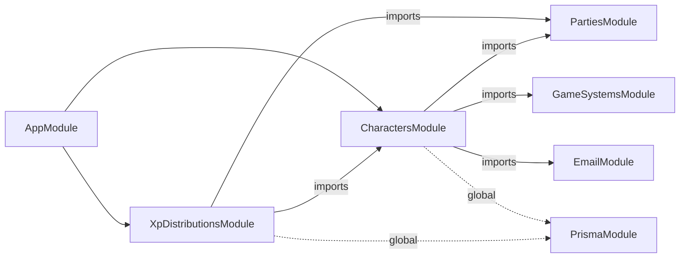
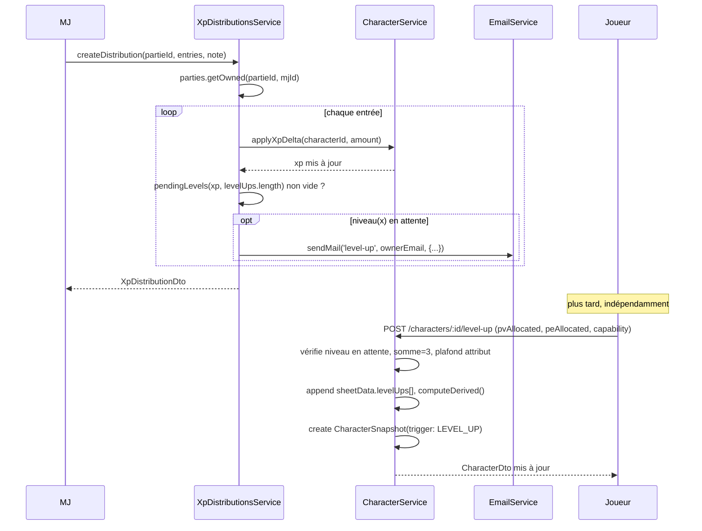

# Architecture Spine — Palier 3 : Évolution du personnage, historique & édition MJ

## Paradigme

**NestJS Modular + Angular Signals (brownfield).** Les invariants des Paliers 1, 2 et 4 s'appliquent intégralement. Ce palier est le premier à introduire une **surface de mutation concurrente réelle** sur `Character` (aujourd'hui strictement en lecture après création, hors portrait) — c'est le fil conducteur des décisions ci-dessous : verrouillage optimiste généralisé, XP comme source de vérité unique et typée, niveau toujours dérivé et jamais stocké.

## Inherited Invariants (read-only)

| ID | Règle héritée |
|----|--------------|
| P1-AD-1 | `PrismaService` est global — aucun module ne le déclare dans `providers`, jamais réimporté |
| P1-AD-2 | Les mutations passent exclusivement par la couche Service — un controller n'écrit pas en base |
| P1-AD-4 | Angular : `import type` pour tous les types partagés de `@master-jdr/shared` — aucune valeur runtime importée depuis `@master-jdr/shared` côté `apps/api` |
| P1-AD-5 | Angular : control-flow `@if/@for`, pas de `*ngIf/*ngFor` |
| P1-AD-3 | `PartiesService` reste le seul point de vérité pour l'appartenance/rôle MJ (`getOwned`, `getViewable`) — *note : cette règle est citée `P2-AD-3` dans la spine Palier 4 (mislabel propagé depuis P2 ; corrigé ici, la règle correspond en réalité à P1-AD-3 telle que listée dans la table héritée de la spine Palier 2)* |
| P4-AD-1 | `EmailModule` générique unique, `EmailService.sendMail(template, to, data)` — pas de service par cas d'usage |

## Architecture Decisions

### AD-1 — XP : colonne dédiée sur `Character`, niveau toujours dérivé, jamais stocké

**Binds :** `Character.xp`, toute lecture/écriture de niveau
**Prevents :** deux features (distribution MJ, édition MJ directe) qui liraient/écriraient l'XP par des chemins incompatibles ; un niveau stocké qui pourrait diverger de l'XP réel
**Rule :** `Character.xp Int @default(0)` est la seule source de vérité. Le niveau n'est jamais persisté — toujours calculé via `levelForXp(xp)` (nouvelle fonction, table de seuils PRD §4.2). Deux écrivains uniquement, avec deux stratégies de concurrence **différentes par construction** (ne jamais les uniformiser) :
- `CharacterService.applyXpDelta(characterId, amount)` (appelé par `XpDistributionsService`, un par entrée de distribution) — écriture **atomique commutative** : `prisma.character.update({ where: { id }, data: { xp: { increment: amount } } })`. Pas de verrou optimiste : l'opération est commutative, deux increments concurrents s'additionnent correctement sans lecture préalable.
- `CharacterService.setXp(characterId, value, expectedUpdatedAt)` (édition MJ directe, AD-6) — écriture **absolue verrouillée**, suit AD-9 (`updateMany` sur `updatedAt`, 409 si conflit) : ici une lecture-puis-écriture est nécessaire car la valeur est un remplacement, pas un delta.

```ts
// packages/game-rules/src/ryuutama/leveling.ts (nouveau)
export const LEVEL_TABLE: { level: number; xp: number; capabilities: CapabilityType[] }[] = [
  { level: 2, xp: 100,   capabilities: ['attribute'] },
  { level: 3, xp: 600,   capabilities: ['landscape'] },
  { level: 4, xp: 1200,  capabilities: ['attribute', 'immunity'] },
  { level: 5, xp: 2000,  capabilities: ['class'] },
  { level: 6, xp: 3000,  capabilities: ['attribute', 'type'] },
  { level: 7, xp: 4200,  capabilities: ['landscape'] },
  { level: 8, xp: 5800,  capabilities: ['attribute'] },
  { level: 9, xp: 7500,  capabilities: ['dragon-protection'] },
  { level: 10, xp: 10000, capabilities: ['attribute', 'legendary-journey'] },
];
export function levelForXp(xp: number): number; // 1 si xp < 100
export function pendingLevels(xp: number, appliedCount: number): number[]; // niveaux franchis non encore appliqués
```

### AD-2 — Gains de niveau dans `sheetData.levelUps[]` — `computeDerived` reste une fonction pure de `sheetData`

**Binds :** `RyuutamaSheetData`, signature de `computeDerived`
**Prevents :** `computeDerived` devant accepter de nouvelles entrées (xp, niveau appliqué) en plus de `sheetData`, ce qui casserait son contrat actuel (consommé tel quel par `validate`, `pdf-field-map.ts`, les tests)
**Rule :** "Montée en attente" = `levelForXp(character.xp) > sheetData.levelUps.length + 1`. `computeDerived` additionne les allocations PV/PE et les +1 encombrement par entrée de `levelUps[]` au calcul de base existant (`VIG×2`, `ESP×2`, `VIG+3`). Cette forme générique (`type` + `params`) résout au passage la Open Question 2 du PRD (§8 — format de stockage des capacités Classe/Type secondaires) : un seul type de capacité paramétrable, pas de champ dédié par type.

```ts
// RyuutamaSheetData (ajout)
levelUps: {
  level: number;
  pvAllocated: number;   // 0-3
  peAllocated: number;   // 0-3, pvAllocated+peAllocated === 3
  capability: { type: CapabilityType; params: Record<string, unknown> };
}[];
```

### AD-3 — Inventaire individuel : `equipment.individual` passe de `string[]` à `InventoryItem[]`

**Binds :** `RyuutamaSheetData.equipment.individual`, `pdf-field-map.ts`
**Prevents :** l'endpoint d'ajout côté joueur et l'édition MJ (AD-6, via `sheet-field`) qui divergeraient sur la forme de l'objet stocké
**Rule :**

```ts
interface InventoryItem { name: string; weight: number; addedBy: 'player' | 'mj'; }
// equipment.individual: InventoryItem[]  (était string[])
```

**`addedBy` n'est jamais lu depuis l'entrée client, sur aucun des deux chemins d'écriture** : `POST /characters/:id/inventory-items` (route joueur, AD-6) force `addedBy: 'player'` côté serveur et **rejette (400)** toute requête dont le body contient un champ `addedBy` ; toute mutation de `equipment.individual` via `PATCH /sheet-field` (route MJ, AD-6) force `addedBy: 'mj'` côté serveur quel que soit le contenu de `value`, sans jamais faire confiance à une valeur transmise par le client. Empêche un joueur de s'auto-attribuer un objet marqué "MJ".

**Migration requise** (des personnages Palier 2 existent déjà en base) : script one-off convertissant chaque entrée `string` existante en `{ name: <string>, weight: 0, addedBy: 'player' }`, exécuté comme **étape bloquante du même déploiement**, avant le redémarrage de l'API — le nouveau code (`pdf-field-map.ts` et tout lecteur d'inventaire) lit `.name` et plante/rend `undefined` sur une entrée encore au format `string`. Pas de fenêtre de transition à double-format : migration puis redémarrage, dans cet ordre, jamais l'inverse.

### AD-4 — Pas de registre `GameSystemPlugin` — XP/niveau vivent directement dans `packages/game-rules/src/ryuutama/`

**Binds :** `CharacterService`, imports directs de `@master-jdr/game-rules`
**Prevents :** construire une abstraction générique (`canSpendXp`/`applyXp` de `spec.md` §5) pour un seul implémenteur réel — généricité spéculative
**Rule :** `leveling.ts` est importé directement par `CharacterService`, exactement comme `validate`/`computeDerived` le sont déjà. Aucune interface `GameSystemPlugin` n'existe en TypeScript aujourd'hui (confirmé par investigation — seulement décrite en prose dans `spec.md`) ; ce palier ne change pas ce fait. Différé jusqu'à l'arrivée réelle d'un 2e système de jeu (cf. Deferred).

### AD-5 — Notes, Historique, Distributions d'XP : modèles Prisma dédiés, pas de tableaux JSON sur `Character`

**Binds :** `CharacterNote`, `CharacterSnapshot`, `XpDistribution`/`XpDistributionEntry`
**Prevents :** données en liste (tri chronologique, mutation par entrée, agrégation cross-personnage pour la vue MJ) réinventées en JSON avec une sémantique de requête incohérente — rompt avec la convention existante où toute donnée-liste (`AvailabilityDeclaration`, `Invitation`, `InviteLink`) est une ligne relationnelle, jamais un tableau sur le parent
**Rule :** cf. bloc Prisma ci-dessous. `XpDistribution` est nécessaire spécifiquement pour l'historique par Partie exigé par l'UX (§2) — impossible à reconstruire proprement à partir d'instantanés de personnage isolés.

### AD-6 — Édition MJ de l'XP structurellement distincte de l'édition MJ d'un champ `sheetData` quelconque

**Binds :** `PATCH /characters/:id/xp` vs `PATCH /characters/:id/sheet-field`
**Prevents :** un endpoint générique unique "patch n'importe quel chemin JSON" qui pourrait inclure `xp` en silence et contourner le flux guidé de montée de niveau — c'est exactement le risque signalé "high" par la revue qualité du PRD (FR-14 vs FR-5/FR-6)
**Rule :** modifier `xp` (distribution ou édition MJ directe) ne grant **jamais** de PV/PE/capacité automatiquement — ça change seulement le nombre comparé à la table de seuils. Appliquer les gains passe toujours par `POST /characters/:id/level-up` (propriétaire uniquement, séquentiel, un appel par niveau). Une édition MJ directe de l'XP crée immédiatement un `CharacterSnapshot(trigger: 'MJ_EDIT')` ; l'application ultérieure de la montée de niveau par le joueur crée un `CharacterSnapshot(trigger: 'LEVEL_UP')` séparé — deux événements réels et distincts, jamais fusionnés.

**`sheet-field` a un denylist strict et contraignant (pas seulement `validate('mj')`, qui lui reste consultatif, AD-7)** : toute requête dont le `path` a pour segment racine `xp` ou `levelUps` est **rejetée (400)**, jamais silencieusement acceptée. Ces deux sous-arbres sont réservés exclusivement à `PATCH /xp` et `POST /level-up` respectivement — c'est la seule façon de garantir que le denylist de AD-6 ne se limite pas à `xp` en pratique (le nom du champ, `levelUps`, aurait pu sinon être atteint via `sheet-field` en contournant intégralement les contraintes du wizard : somme PV+PE=3, plafond d'attribut à 12, capacité cohérente avec la table de niveau).

**`sheet-field` crée aussi un `CharacterSnapshot(trigger: 'MJ_EDIT')` à chaque appel réussi** — cohérent avec PRD FR-12 ("à chaque édition MJ confirmée"), qui ne distingue pas xp des autres champs. Un MJ qui enchaîne plusieurs corrections dans la même session produit un instantané par appel (pas de coalescing en v1) — l'historique reste donc granulaire par champ édité, pas par "session d'édition".

```
PATCH /characters/:id/xp          { value: number }                          # MJ uniquement
PATCH /characters/:id/sheet-field { path: string, value: unknown }           # MJ uniquement, validate('mj'), denylist xp/levelUps
POST  /characters/:id/level-up    { pvAllocated, peAllocated, capability }   # propriétaire uniquement, séquentiel
```

**Notification in-app** : pas de mécanisme de push séparé — `LevelUpBanner` (EXPERIENCE.md) dérive son état côté client de `pendingLevels(xp, levelUps.length)` à chaque chargement de la fiche, pas d'événement temps réel à concevoir. **Notification e-mail** : `CharacterService.setXp` (édition MJ directe) et `CharacterService.applyXpDelta` (distribution) appellent tous deux la **même** vérification `pendingLevels(...)` juste après l'écriture et déclenchent `EmailService.sendMail('level-up', ...)` de façon identique si elle est non vide — un seul point de déclenchement partagé entre les deux chemins d'écriture, pas deux implémentations séparées (cf. AD-1 pour la distinction des deux writers).

**Routes complémentaires (FR-1, FR-9, FR-11, FR-13 — omises par erreur du premier jet, ajoutées après réconciliation) :**

**`entries[].amount` est la seule valeur autoritaire** — `difficulty`/`breaths`/`monsterLevel` (calcul assisté FR-2) sont stockés pour audit/affichage uniquement, le serveur ne les recalcule/revérifie jamais contre `amount` (cohérent avec "jamais bloquant", FR-2).

**`XpDistributionsService.createDistribution` valide `character.partieId === partieId` pour chaque entrée avant toute écriture** — une entrée dont le personnage n'appartient pas à la Partie du MJ appelant rejette la requête entière (400), jamais une application partielle. Sans cette règle, un `characterId` d'une autre Partie (état client périmé, bug) accorderait silencieusement de l'XP hors du contrôle du MJ, sans trace ni erreur.

```
POST /parties/:id/xp-distributions      { entries, difficulty?, breaths?, monsterLevel?, note? }   # MJ uniquement (FR-1/2/3/4)
GET  /parties/:id/xp-distributions      # MJ uniquement (cf. AD-8) — historique permanent, UX §2

POST /characters/:id/inventory-items    { name, weight }        # propriétaire uniquement (FR-9), pas d'instantané (cf. PRD FR-12)
PATCH /characters/:id/inventory-items/:itemId | DELETE          # propriétaire uniquement, même règle

POST /characters/:id/notes              { text }                 # propriétaire uniquement (FR-11), pas d'instantané
PATCH /characters/:id/notes/:noteId/share { shared: boolean }    # propriétaire uniquement, bascule par entrée
GET  /characters/:id/notes              # propriétaire, MJ (toutes), ou tout participant de la Partie (entrées `shared: true` uniquement — troisième pattern d'accès, cf. AD-8)

GET  /characters/:id/history            # propriétaire ou MJ (cf. AD-8) — liste des CharacterSnapshot
```

### AD-7 — `validate(data, 'mj', catalog)` exécute les règles réelles mais ne rejette jamais

**Binds :** `packages/game-rules/src/ryuutama/validate.ts`
**Prevents :** le no-op actuel (aucun signal, MJ peut tout écrire sans avertissement) ou l'inverse — un mode MJ aussi bloquant que `'strict'` (violerait `spec.md` §5 : "indicative pour le MJ, jamais de blocage")
**Rule :** `mode === 'mj'` exécute les mêmes 5 règles que `'strict'`, mais retourne toujours `valid: true` — `errors[]` devient un signal consultatif (le frontend l'affiche comme avertissement non bloquant, jamais un rejet de la requête).

### AD-8 — Contrôle d'accès : réutilisation exclusive de `parties.getOwned`/`getViewable`

**Binds :** tous les nouveaux controllers (`XpDistributionsController`, endpoints `notes`, `history`, `sheet-field`, `xp`, `level-up`, `inventory`)
**Prevents :** un deuxième mécanisme d'autorisation (guard NestJS dédié) coexistant avec la convention inline déjà établie
**Rule :** actions MJ-only (dont `GET /parties/:id/xp-distributions` — vue MJ exclusivement, UX §2) → `this.parties.getOwned(partieId, userId)`. Actions propriétaire-only → même pattern que `getOwnCharacterOrThrow` existant. Lectures MJ-ou-propriétaire → même pattern que `findOne` existant. **Troisième pattern (nouveau ce palier)** : lecture d'une `CharacterNote` marquée `shared: true` → tout participant de la Partie via `parties.getViewable(partieId, userId)`, filtré côté service à `shared: true` si l'appelant n'est ni le propriétaire ni le MJ.

### AD-9 — Verrouillage optimiste généralisé à toute nouvelle mutation de `Character`

**Binds :** montée de niveau, édition MJ (`setXp` et `sheet-field`), ajout d'objet par le joueur
**Prevents :** écritures perdues — la surface de mutation concurrente sur `Character` est bien plus large qu'au Palier 2 (MJ et joueur peuvent éditer en même temps)
**Rule :** même pattern que `updatePortrait` — `prisma.character.updateMany({ where: { id, updatedAt: <valeur lue en début de requête> }, data: {...} })` ; `count === 0` → `ConflictException` (409). **Explicitement exclu de ce pattern** : `applyXpDelta` (distribution d'XP) — écriture atomique commutative (`increment`), pas de comparaison `updatedAt`, cf. AD-1. Ne pas "uniformiser" les deux writers XP sur le même mécanisme de verrouillage : ce serait soit inutile (l'increment n'a rien à comparer), soit une source de faux conflits 409 entre deux distributions concurrentes qui n'ont aucune raison de s'exclure.

### AD-10 — Angular : roster chargé une fois, contenu d'onglets qui ne recharge pas les participants

**Binds :** `apps/web/src/app/features/parties/partie-detail/`
**Prevents :** dérive déjà latente aujourd'hui (`characters` chargé indépendamment du reste de `PartieDetailComponent`) qui s'aggraverait après qu'une distribution d'XP ou une montée de niveau change le niveau affiché d'un personnage sans que le roster le reflète
**Rule :** `PartieDetailComponent` charge `members`/`characters` une seule fois (signal partagé), et les recharge après toute mutation XP/niveau (distribution confirmée, montée de niveau appliquée) — pas de rechargement indépendant par le composant roster ou les onglets.

```
apps/web/src/app/features/parties/partie-detail/
  partie-detail.ts                    # charge members+characters une fois, expose au roster + aux tabs
  roster-rail/roster-rail.ts          # desktop, replié/déplié — cf. EXPERIENCE.md §7 RosterRail
  roster-strip/roster-strip.ts        # mobile MJ — cf. EXPERIENCE.md §7 RosterStrip
  xp-distribution-panel/xp-distribution-panel.ts   # cf. EXPERIENCE.md XpDistributionPanel
  xp-distribution-panel/rules-reminder.ts           # sous-composant, cf. DESIGN.md RulesReminder
  xp-history/xp-history.ts            # nouvelle section permanente, GET /parties/:id/xp-distributions

apps/web/src/app/features/characters/character-sheet/
  level-up-banner/level-up-banner.ts
  level-up-wizard/level-up-wizard.ts
  inventory-tab/inventory-tab.ts       # conteneur
  inventory-tab/encumbrance-bar.ts     # cf. DESIGN.md EncumbranceBar
  inventory-tab/inventory-item-row.ts  # cf. DESIGN.md InventoryItemRow
  notes-journal/notes-journal.ts
  history-tab/history-tab.ts
  field-edit-pencil/field-edit-pencil.ts   # composant partagé, réutilisé partout où le MJ édite
```

## Shared Types (packages/shared)

```typescript
export interface CharacterDto {
  // ... champs existants ...
  xp: number;
  level: number;               // dérivé, calculé côté API, jamais écrit directement par le client
}

export type SnapshotTrigger = 'LEVEL_UP' | 'MJ_EDIT';
export interface CharacterSnapshotDto {
  id: string; characterId: string; sheetData: SheetData; derived: DerivedStats;
  level: number; trigger: SnapshotTrigger; note?: string; createdAt: string;
}

export interface XpDistributionEntryDto { characterId: string; amount: number; isBonus: boolean; }
export interface XpDistributionDto {
  id: string; partieId: string; note?: string; createdAt: string;
  entries: XpDistributionEntryDto[];
}
export interface CreateXpDistributionDto {
  difficulty?: number; breaths?: number; monsterLevel?: number;   // calcul assisté FR-2
  entries: { characterId: string; amount: number; isBonus?: boolean }[];
  note?: string;
}

export interface CharacterNoteDto { id: string; characterId: string; text: string; shared: boolean; createdAt: string; }
export interface CreateCharacterNoteDto { text: string; }

export type EmailTemplate = 'invitation' | 'session-reminder' | 'password-reset' | 'level-up';
```

## Schema Prisma (ajouts)

Migration : `character_evolution_p3`

*(Vérifié contre `apps/api/prisma/schema.prisma` : générateur actif `prisma-client-js` (legacy), pas encore migré vers `prisma-client` — cf. `CLAUDE.md`. Les blocs ci-dessous sont neutres vis-à-vis du générateur, aucun changement requis par cette migration en cours ailleurs.)*

```prisma
model Character {
  // ... champs existants ...
  xp Int @default(0)   // AD-1 — seule source de vérité, niveau jamais stocké
}

model CharacterNote {
  id          String    @id @default(uuid())
  characterId String
  character   Character @relation(fields: [characterId], references: [id], onDelete: Cascade)
  text        String
  shared      Boolean   @default(false)
  createdAt   DateTime  @default(now())
  @@index([characterId, createdAt])
}

enum SnapshotTrigger { LEVEL_UP MJ_EDIT }

model CharacterSnapshot {
  id          String          @id @default(uuid())
  characterId String
  character   Character       @relation(fields: [characterId], references: [id], onDelete: Cascade)
  sheetData   Json
  derived     Json
  level       Int
  trigger     SnapshotTrigger
  note        String?
  createdAt   DateTime        @default(now())
  @@index([characterId, createdAt])
}

model XpDistribution {
  id        String                @id @default(uuid())
  partieId  String
  partie    Partie                @relation(fields: [partieId], references: [id], onDelete: Cascade)
  mjId      String
  note      String?
  createdAt DateTime              @default(now())
  entries   XpDistributionEntry[]
  @@index([partieId, createdAt])
}

model XpDistributionEntry {
  id             String         @id @default(uuid())
  distributionId String
  distribution   XpDistribution @relation(fields: [distributionId], references: [id], onDelete: Cascade)
  characterId    String
  character      Character      @relation(fields: [characterId], references: [id], onDelete: Cascade)
  amount         Int
  isBonus        Boolean        @default(false)
}
```

## Diagramme — Dépendances modules API



## Diagramme — Flux distribution d'XP → montée de niveau



## Deferred

| Sujet | Raison du report |
|-------|-----------------|
| Registre `GameSystemPlugin` générique (`canSpendXp`/`applyXp`) | Un seul système réel (Ryuutama) — généricité spéculative tant qu'un 2e système n'existe pas |
| Revert/restauration depuis un `CharacterSnapshot` | Hors scope PRD v1 (§5 Non-Goals) |
| Entité Séance/Session, regroupement de l'historique XP et des notes par séance | Palier suivant (PRD `[NOTE FOR PM]` §6.2) |
| Édition/suppression d'une entrée de `CharacterNote` après création | v1 append-only, cohérent avec PRD FR-11 Hors scope |
| Scope `ContentEntry.scope` autre que `'BASE'` (contenu homebrew MJ) | Champ déjà présent en base mais aucun usage aujourd'hui — hors scope P3 |
| Simuler les effets de capacité "à la table" (bonus de test, immunités) | PRD Non-Goals — affichage référence uniquement |
