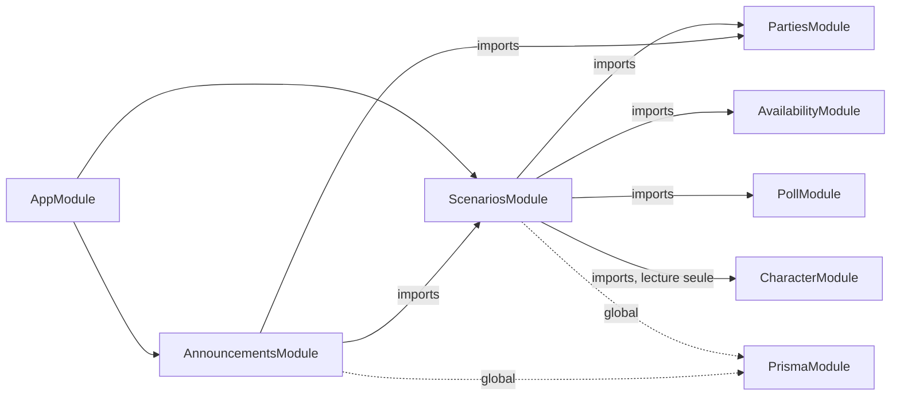
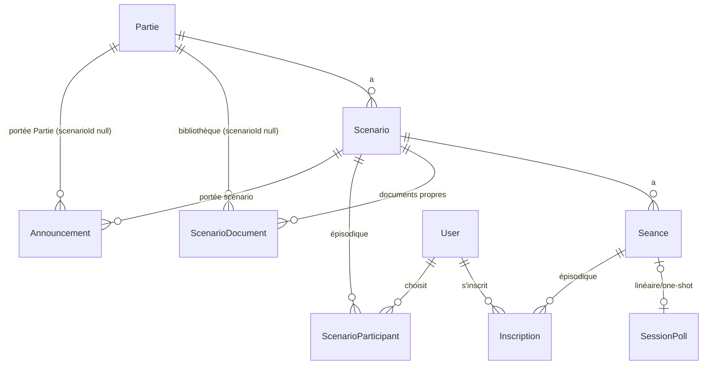

# Architecture Spine — Palier 4 (suite) : Sessions, rapports, événements/missions, annonces MJ

## Design Paradigm

**NestJS Modular + Angular Signals (brownfield).** Les invariants des Paliers 1, 2, 3 et 4-e-mail s'appliquent intégralement (cf. Inherited Invariants). Ce palier introduit le premier **cycle de vie d'objet avec anti-spoil** du produit (`Brouillon → À venir → Courant → Passé`) et la première **contrainte de capacité concurrente** (inscription à capacité limitée) — les deux fils conducteurs des décisions ci-dessous.

## Inherited Invariants

| Inherited | From parent | Binds here |
| --- | --- | --- |
| P1-AD-1 | Palier 1 | `PrismaService` global — `ScenariosModule`/`AnnouncementsModule` ne le réimportent jamais |
| P1-AD-2 | Palier 1 | Mutations exclusivement en couche Service — controllers `ScenariosController`/`AnnouncementsController` n'écrivent jamais Prisma directement |
| P1-AD-3 | Palier 1 | `PartiesService.getOwned`/`getViewable` seul point de vérité d'appartenance/rôle MJ — aucun nouveau guard NestJS |
| P1-AD-4 | Palier 1 | `import type` pour tout type de `@master-jdr/shared` côté `apps/api` |
| P1-AD-5 | Palier 1 | Angular : `@if`/`@for`, jamais `*ngIf`/`*ngFor` |
| P2-AD-1 | Palier 2 | `AvailabilityModule` reste propriétaire exclusif du calcul de créneaux — réutilisé tel quel pour la sélection de date en mode linéaire (FR-12) |
| P2-AD-2 | Palier 2 | `PollModule`/`SessionPoll` reste le mécanisme de vote de date pour `ONE_SHOT`/`CAMPAGNE_LINEAIRE` — jamais réimplémenté ni étendu pour l'épisodique (cf. AD-4 ci-dessous, mécanisme volontairement distinct) |
| P3-AD-9 | Palier 3 | Verrouillage optimiste `updatedAt` généralisé — **référence de comparaison** pour AD-3 ci-dessous, qui en diverge explicitement pour `Scenario` |
| P4e-AD-1 | Palier 4 (e-mail) | `EmailModule`/`EmailService.sendMail` — non utilisé par ce palier (Non-Goal PRD : pas de notification e-mail sur scénario/annonce en v1) |

## Invariants & Rules

### AD-1 — `ScenariosModule` : propriétaire exclusif de Scénario, Séance et rétrospective

**Binds :** FR-1 à FR-16 (tout ce qui touche `Scenario`/`Seance`)
**Prevents :** un deuxième module qui recréerait sa propre notion de scénario ou de séance ; `AnnouncementsModule` qui accéderait à `Scenario` via Prisma directement plutôt que via `ScenariosService`
**Rule :** `ScenariosModule` (`apps/api/src/scenarios/`) exporte `ScenariosService`. Résumé de fin et comptes-rendus de séance sont des **champs/sous-ressources** de `Scenario`/`Seance`, jamais des entités indépendantes avec leur propre controller — ils n'ont pas de cycle de vie propre en dehors de leur scénario/séance parent.

### AD-2 — `AnnouncementsModule` séparé, importe `ScenariosModule` + `PartiesModule`

**Binds :** FR-20
**Prevents :** logique de validation de portée dupliquée dans `ScenariosModule` ; `AnnouncementsService` qui vérifierait l'appartenance à la Partie sans passer par `PartiesService`
**Rule :** `AnnouncementsModule` (`apps/api/src/announcements/`) importe `PartiesModule` (vérification appartenance/rôle) et `ScenariosModule` (validation qu'un `scenarioId` de portée existe bien et appartient à la Partie visée). Même schéma de dépendance que `PollModule` (P2-AD-2, qui importe `PartiesModule` + `AvailabilityModule`). **Anti-spoil des annonces scopées (FR-20) : même philosophie qu'AD-6.** `AnnouncementsService.create()` accepte tout `scenarioId` valide de la Partie, y compris un scénario `Brouillon`/`À venir` — **aucune validation de statut côté backend**, pour ne pas réintroduire un filtrage serveur qu'AD-6 écarte explicitement. C'est `AnnonceCard`/`AnnouncementList` (Angular) qui, ayant déjà `ScenarioDto.status` en mémoire, n'affiche une annonce scopée que si le scénario visé est `Courant`/`Passé` pour un joueur non-MJ — même pattern de rendu conditionnel qu'AD-6.

### AD-3 — `Scenario` : pas de verrouillage optimiste, MJ seul écrivain

**Binds :** `ScenariosService.update/close/open` (édition description, ouverture `Brouillon→À venir`, clôture)
**Prevents :** sur-ingénierie d'un mécanisme de concurrence pour un profil d'écriture qui ne le justifie pas ; confusion future si quelqu'un « uniformise » avec P3-AD-9 en pensant que c'est un oubli
**Rule :** contrairement à `Character` (P3-AD-9, où MJ et joueur écrivent concurremment), seul le MJ écrit le contenu propre d'un `Scenario` — les joueurs n'agissent qu'à côté (vote, inscription, participation). `ScenariosService` fait un `prisma.scenario.update()` simple, sans comparaison `updatedAt`. **Ne pas généraliser P3-AD-9 ici** — divergence assumée, pas un gap.

### AD-4 — Deux mécanismes de date de séance, jamais fusionnés

**Binds :** `Seance` (FR-12, FR-19)
**Prevents :** un troisième mécanisme hybride qui tenterait de couvrir les deux cas ; confusion entre le vote consultatif (linéaire) et le hard cap numérique (épisodique)
**Rule :** `Seance` porte une relation optionnelle vers `SessionPoll` (existant, `ONE_SHOT`/`CAMPAGNE_LINEAIRE`) **ou** vers `Inscription[]` (nouveau, `CAMPAGNE_EPISODIQUE`) — jamais les deux peuplés simultanément sur la même séance ; lequel s'applique est déterminé par `Partie.kind`, pas par un champ de choix sur `Seance` lui-même. Même principe pour les participants (FR-17/18) : `ScenarioParticipant` n'est **jamais** peuplé/lu pour une Partie `ONE_SHOT`/`CAMPAGNE_LINEAIRE` — sa liste de participants est toujours dérivée en direct de `PartiesService`/`Membership` (implicite = tous les membres). `ScenarioParticipant` n'existe que pour `CAMPAGNE_EPISODIQUE` (choix individuel explicite, FR-18).

### AD-5 — Inscription à capacité limitée : contrainte au niveau service, pas au niveau DB

**Binds :** FR-19
**Prevents :** dépassement du quota maximum par une course entre deux inscriptions concurrentes
**Rule :** `ScenariosService.inscrire(seanceId, userId)` s'exécute dans une transaction Prisma qui **verrouille explicitement la ligne `Seance`** (`tx.$queryRaw` `SELECT ... FOR UPDATE` sur `Seance` par `id`) avant de faire `count(Inscription where seanceId)` puis `create` si `count < max`, sinon rejet (409). **L'isolation `READ COMMITTED` par défaut ne suffit pas** : sans ce verrou de ligne, deux `inscrire()` concurrents peuvent chacun lire `count < max` avant que l'autre ne commit, dépassant le quota (cf. EXPERIENCE.md §5, garantie « un seul obtient la place »). Le `SELECT ... FOR UPDATE` est la mesure requise, pas une option — même stratégie que P2-AD-4 (un seul `SessionPoll` OPEN par Partie, vérifié en service) mais avec ce verrou explicite en plus. **Aucune validation de date n'est jamais automatique** : atteindre `max` ferme l'inscription (`Inscription` supplémentaires rejetées) mais ne renseigne jamais `Seance.dateValidee` — seul un appel MJ explicite (`ScenariosService.validerDate`) le fait, à n'importe quel niveau de remplissage (cf. PRD FR-19, EXPERIENCE.md §4).

### AD-6 — Anti-spoil : frontend uniquement, aucun filtrage backend (y compris le téléchargement de documents)

**Binds :** FR-2, FR-3, FR-5, FR-6, FR-7 (statuts `Brouillon`/`À venir`, description, participants **et fichiers de documents**)
**Prevents :** duplication de logique de filtrage par endpoint (une réponse HTTP différente par rôle) ; deux méthodes de lecture (`findForMj`/`findForPlayer`) à maintenir en parallèle ; une incohérence où le JSON serait non filtré mais le téléchargement de fichier, lui, protégé (protection à moitié, pire que pas de protection du tout car trompeuse)
**Rule :** `[ADOPTED]` `GET /parties/:id/scenarios`, `GET /scenarios/:id`, et le futur endpoint de téléchargement de document (`GET /scenarios/:id/documents/:docId`) renvoient/servent toujours le contenu complet — description, participants, **et octets du fichier** — à tout membre de la Partie (`parties.getViewable`), quel que soit le statut du scénario (y compris `Brouillon`) ou le rôle de l'appelant. **Aucune donnée n'est retirée côté serveur, fichiers compris.** L'anti-spoil est un rendu Angular conditionnel (statut + `viewerIsMj`) qui masque aussi le lien de téléchargement — même pattern que l'existant. Décision explicite (2026-07-12, cf. memlog) : le risque qu'un joueur lise l'API ou appelle directement l'URL de téléchargement pour spoiler sa propre partie est accepté en contexte hobby, **explicitement étendu aux fichiers** (pas seulement le JSON) pour éviter une protection partielle trompeuse. *Diverge de la note EXPERIENCE.md §7 (ux-jdr-master-20260711) qui demandait un rendu backend strict — à corriger dans cette source (cf. Deferred).*

### AD-7 — One-shot : scénario unique créé à la création de la Partie

**Binds :** FR-1 (cas `ONE_SHOT`)
**Prevents :** un état intermédiaire « Partie `ONE_SHOT` sans scénario » que d'autres endpoints devraient gérer en cas limite
**Rule :** `PartiesService.create()` crée la `Partie` et, si `kind === ONE_SHOT`, son unique `Scenario` (statut `Brouillon` par défaut) dans la même transaction. Aucune Partie `ONE_SHOT` n'existe jamais sans scénario associé. L'ouverture (`Brouillon`→`À venir`) reste une action MJ explicite comme pour tout scénario (cf. FR-7) — **jamais automatique**, y compris pour ce scénario unique.

### AD-8 — Documents : réutilisation du pattern d'upload de portrait (Story 4.5)

**Binds :** FR-2, FR-3
**Prevents :** un deuxième mécanisme d'upload/stockage divergent
**Rule :** upload `multer` + stockage disque local, plafond **5 Mo par fichier** — mêmes contraintes que `updatePortrait` (Story 4.5). `ScenarioDocument.scenarioId` nullable : `null` = bibliothèque de Partie/campagne (FR-3, toujours visible), renseigné = document propre au scénario (FR-2, anti-spoil frontend cf. AD-6).

### AD-9 — Accès : lecture ouverte aux membres, écriture MJ-only

**Binds :** tous les endpoints `ScenariosModule`/`AnnouncementsModule`
**Prevents :** un guard NestJS dédié qui coexisterait avec la convention `PartiesService` déjà établie (P1-AD-3, P3-AD-8)
**Rule :** lecture (`GET`) = tout membre de la Partie, `parties.getViewable`. Écriture de contenu (créer/éditer/ouvrir/clôturer un scénario, rédiger résumé/compte-rendu, publier une annonce) = MJ seul, `parties.getOwned`. Actions joueur (voter, s'inscrire à une séance, choisir un scénario épisodique — FR-18) = tout membre participant, pas de restriction MJ, vérifiée via appartenance simple (pas un troisième pattern — réutilise la vérification de `Membership` déjà faite par `PartiesService`).

### AD-10 — Un seul scénario `Courant` à la fois en linéaire, vérifié en service

**Binds :** FR-9 (`CAMPAGNE_LINEAIRE` uniquement — ne s'applique pas à `CAMPAGNE_EPISODIQUE`, cf. AD-4/EXPERIENCE.md §4)
**Prevents :** deux scénarios `Courant` simultanés sur une même Partie `CAMPAGNE_LINEAIRE`, par appel concurrent ou par oubli d'un futur endpoint qui ouvrirait un scénario sans vérifier l'état des autres
**Rule :** `ScenariosService.ouvrir(scenarioId)` — pour une Partie `CAMPAGNE_LINEAIRE` uniquement — verrouille (`SELECT ... FOR UPDATE`, même mécanisme qu'AD-5) les lignes `Scenario` de la Partie dans une transaction Prisma, vérifie qu'aucune n'a déjà `status = COURANT`, avant de procéder ; sinon rejet `ConflictException` (409) avec message explicite au MJ (`sessions.scenario_already_courant`, cf. EXPERIENCE.md §3). Action MJ-only à faible fréquence (pas de course réaliste entre joueurs comme pour AD-5), mais le verrou de ligne reste requis pour la même raison : `READ COMMITTED` seul ne bloque pas deux `ouvrir()` concurrents sur deux scénarios différents. Pas un guard/contrainte DB dédiée, cohérent avec le reste du palier.

### AD-11 — Réglage d'association automatique du journal : champ sur `Character`, lu par `ScenariosModule`

**Binds :** FR-16 ; `Character` (nouveau champ, propriété de `CharacterModule`) ; `ScenariosModule` (lecture cross-module)
**Prevents :** le réglage stocké au mauvais niveau (par scénario ou par entrée, explicitement écarté par le PRD §9 Assumptions Index) ; `ScenariosModule` qui accéderait à `CharacterNote` via Prisma directement plutôt que par le service propriétaire
**Rule :** `Character.journalAutoAssociate Boolean @default(false)` (nouveau champ, `CharacterModule` reste propriétaire d'écriture — même pattern que tout champ `Character`, P1-AD-2). Un booléen **par personnage**, pas par joueur au sens compte `User` (le journal `CharacterNote`, Story 6.5, est déjà scopé au personnage, pas à l'utilisateur — cohérent avec l'existant) ; réglage désactivé par défaut (association manuelle entrée par entrée, cf. EXPERIENCE.md §4/§5). `ScenariosModule` importe `CharacterModule` en lecture seule pour assembler `RetrospectivePanel` : requête les `CharacterNote` `shared: true` du personnage datées dans la fenêtre du scénario (entre la première et la dernière séance), filtrées côté `CharacterService` (nouvelle méthode exportée, pas un accès Prisma direct depuis `ScenariosModule`).



## Consistency Conventions

| Concern | Convention |
| --- | --- |
| Naming (entités) | `Scenario`, `Seance` (français non accentué, cohérent avec `Partie` déjà en base — **jamais `Session`**, nom déjà pris par le store `express-session`, cf. `@@map("session")` existant) |
| Statuts | `ScenarioStatus` enum : `BROUILLON | A_VENIR | COURANT | PASSE` — jamais de booléens `isOpen`/`isClosed` en parallèle |
| Accès | Lecture = `parties.getViewable` ; écriture MJ = `parties.getOwned` ; jamais un guard NestJS dédié (cf. AD-9) |
| Erreurs | `ForbiddenException` (403, accès), `NotFoundException` (404), `ConflictException` (409, capacité atteinte à l'inscription) — mêmes classes Nest déjà utilisées partout ailleurs |
| Fichiers | Un module = un dossier `apps/api/src/<module>/` avec `<module>.module.ts`, `<module>.service.ts`, `<module>.controller.ts`, `dto/` — pattern déjà uniforme (`xp-distributions/`, `poll/`) |

## Stack

Aucun ajout — réutilise la stack existante (NestJS 11, Prisma 7, Angular 22, Postgres 17, multer déjà en place pour l'upload portrait).

## Structural Seed

### Modèle de données (ajouts)

Migration : `scenarios_seances_p4`

```prisma
enum ScenarioStatus {
  BROUILLON
  A_VENIR
  COURANT
  PASSE
}

model Scenario {
  id           String         @id @default(uuid())
  partieId     String
  partie       Partie         @relation(fields: [partieId], references: [id], onDelete: Cascade)
  title        String
  description  String?
  status       ScenarioStatus @default(BROUILLON)
  dureeHeures  Int?
  dureeSeances Int?
  resumeFin    String?        // rétrospective, FR-15
  createdAt    DateTime       @default(now())
  closedAt     DateTime?

  seances       Seance[]
  documents     ScenarioDocument[]
  participants  ScenarioParticipant[]   // épisodique, choix individuel FR-18
  announcements Announcement[]

  @@index([partieId, status])
}

model Seance {
  id             String        @id @default(uuid())
  scenarioId     String
  scenario       Scenario      @relation(fields: [scenarioId], references: [id], onDelete: Cascade)
  pollId         String?       @unique          // linéaire/one-shot (AD-4)
  poll           SessionPoll?  @relation(fields: [pollId], references: [id])
  inscriptionMin Int?                            // épisodique (AD-4)
  inscriptionMax Int?
  dateValidee    DateTime?                       // renseigné uniquement par validation MJ explicite (AD-5)
  compteRendu    String?                         // FR-14
  createdAt      DateTime      @default(now())

  inscriptions Inscription[]
}

model Inscription {
  id        String   @id @default(uuid())
  seanceId  String
  seance    Seance   @relation(fields: [seanceId], references: [id], onDelete: Cascade)
  userId    String
  user      User     @relation(fields: [userId], references: [id], onDelete: Cascade)
  createdAt DateTime @default(now())

  @@unique([seanceId, userId])
}

model ScenarioParticipant {
  id         String   @id @default(uuid())
  scenarioId String
  scenario   Scenario @relation(fields: [scenarioId], references: [id], onDelete: Cascade)
  userId     String
  user       User     @relation(fields: [userId], references: [id], onDelete: Cascade)

  @@unique([scenarioId, userId])
}

model ScenarioDocument {
  id           String    @id @default(uuid())
  partieId     String
  partie       Partie    @relation(fields: [partieId], references: [id], onDelete: Cascade)
  scenarioId   String?                          // null = bibliothèque Partie/campagne (AD-8)
  scenario     Scenario? @relation(fields: [scenarioId], references: [id], onDelete: Cascade)
  filename     String
  originalName String
  sizeBytes    Int
  createdAt    DateTime  @default(now())

  @@index([partieId])
}

model Announcement {
  id         String    @id @default(uuid())
  partieId   String
  partie     Partie    @relation(fields: [partieId], references: [id], onDelete: Cascade)
  scenarioId String?                            // null = portée Partie/campagne entière
  scenario   Scenario? @relation(fields: [scenarioId], references: [id], onDelete: Cascade)
  text       String
  createdAt  DateTime  @default(now())

  @@index([partieId, createdAt])
}
```

*(Rétrocompatibilité `Partie`/`User` : ajouter les relations inverses `scenarios`, `scenarioDocuments`, `announcements`, `inscriptions`, `scenarioParticipations` sur `Partie`/`User` — mécanique, pas un choix.)*

**Ajout sur `Character` (existant, `CharacterModule`) — AD-11 :**

```prisma
model Character {
  // ... champs existants inchangés ...
  journalAutoAssociate Boolean @default(false)   // FR-16, AD-11
}
```

### ERD (relations)



### Source tree (ajouts)

```text
apps/api/src/
  scenarios/
    scenarios.module.ts          # imports: [PartiesModule, AvailabilityModule, PollModule], exports: [ScenariosService]
    scenarios.service.ts         # Scenario/Seance/Inscription/ScenarioParticipant/ScenarioDocument, AD-1 à AD-8
    scenarios.controller.ts      # /parties/:id/scenarios, /scenarios/:id, sous-routes séance/inscription/documents
    scenarios.service.spec.ts
    scenarios.controller.spec.ts
    dto/
      create-scenario.dto.ts
      update-scenario.dto.ts
      create-seance.dto.ts
      inscription.dto.ts
  announcements/
    announcements.module.ts      # imports: [PartiesModule, ScenariosModule], exports: [AnnouncementsService]
    announcements.service.ts
    announcements.controller.ts  # /parties/:id/announcements
    announcements.service.spec.ts
    announcements.controller.spec.ts
    dto/
      create-announcement.dto.ts

apps/web/src/app/features/scenarios/
  scenario-timeline/scenario-timeline.ts       # ScenarioTimeline (DESIGN.md §4/§7) — horizontal desktop / vertical mobile
  scenario-detail/scenario-detail.ts           # ScenarioCard/RetrospectivePanel (Courant/Passé)
  fill-indicator/fill-indicator.ts             # FillIndicator (DESIGN.md §7)
  scenario-status-badge/scenario-status-badge.ts

apps/web/src/app/features/announcements/
  announcement-list/announcement-list.ts       # AnnonceCard

apps/web/src/app/core/scenarios/
  scenarios.service.ts                          # GET/POST/PATCH /scenarios, /seances, /inscriptions
apps/web/src/app/core/announcements/
  announcements.service.ts
```

### Types partagés (`packages/shared`)

```typescript
export type ScenarioStatus = 'BROUILLON' | 'A_VENIR' | 'COURANT' | 'PASSE';

export interface ScenarioDto {
  id, partieId, title,
  description: string | null,  // toujours présent dans la réponse (AD-6) — null = pas encore rédigé, jamais omis pour raison d'accès
  status: ScenarioStatus,
  dureeHeures?, dureeSeances?, resumeFin?,
  createdAt, closedAt?,
  seances: SeanceDto[],
  documents: ScenarioDocumentDto[],
  participants?: { userId, characterId?, pseudo }[],   // épisodique uniquement
}
export interface SeanceDto {
  id, scenarioId,
  poll?: SessionPollDto,                 // linéaire/one-shot
  inscription?: { min: number, max: number, inscrits: { userId, pseudo }[], dateValidee?: string },  // épisodique
  compteRendu?: string,
}
export interface CreateScenarioDto { title, description?, dureeHeures?, dureeSeances? }
export interface ScenarioDocumentDto { id, scenarioId?, originalName, sizeBytes, createdAt }
export interface AnnouncementDto { id, partieId, scenarioId?, text, createdAt }
export interface CreateAnnouncementDto { text, scenarioId?: string }  // absent = portée Partie/campagne
```

## Capability → Architecture Map

| Capability / FR | Lives in | Governed by |
| --- | --- | --- |
| FR-1 à FR-4 (création/contenu scénario) | `ScenariosModule` | AD-1, AD-7, AD-8 |
| FR-5 à FR-8, FR-10 (cycle de vie, anti-spoil, chronologie) | `ScenariosModule` + `apps/web/.../scenario-timeline` | AD-3, AD-6, DESIGN.md §4/§7 |
| FR-9 (un seul scénario courant, linéaire) | `ScenariosModule` | AD-10 |
| FR-11 à FR-13 (séances, sélection de date) | `ScenariosModule` + `PollModule`/`AvailabilityModule` (réutilisés) | AD-4 |
| FR-14 (compte-rendu) | `ScenariosModule` | AD-1, AD-9 |
| FR-15 (résumé de fin) | `ScenariosModule` | AD-1 |
| FR-16 (journal associé, configurable) | `ScenariosModule` (lecture) + `CharacterModule` (champ + `CharacterNote` existant) | AD-11 |
| FR-17/18 (participation linéaire/épisodique) | `ScenariosModule` (`ScenarioParticipant`) | AD-4, AD-9 |
| FR-19 (inscription capacité limitée) | `ScenariosModule` (`Inscription`) | AD-5, AD-9 |
| FR-20 (annonces) | `AnnouncementsModule` | AD-2, AD-6, AD-9 |

## Deferred

| Sujet | Raison du report |
| --- | --- |
| Filtrage backend de l'anti-spoil | Explicitement écarté pour ce palier (AD-6) — à reconsidérer seulement si l'usage réel montre un problème concret, pas préventivement |
| Correction de `EXPERIENCE.md` §7 **et** `DESIGN.md` §8 (ux-jdr-master-20260711) | `EXPERIENCE.md` §7 (« rendu backend strict ») et `DESIGN.md` §8 (« Brouillon = seule barrière anti-spoil **totale** du produit », implicitement serveur) contredisent tous deux AD-6, qui traite `Brouillon` et `À venir` de façon identique (frontend uniquement, aucune donnée retirée côté serveur). Les deux documents à corriger lors de la clôture de ce run (offre faite à l'utilisateur, cf. étape Finalize) |
| Vue MJ dédiée aux `Brouillon` (layout, navigation) | Détail d'implémentation UI non structurant à cette altitude — `ScenariosController` expose déjà tout le nécessaire (lecture incluant `Brouillon` pour le MJ), reste un choix de composant Angular |
| Notifications e-mail sur scénario/annonce | Non-Goal PRD explicite — `EmailModule` (P4e-AD-1) existe déjà et pourrait être réutilisé tel quel si le besoin apparaît, aucun changement structurel prévu |
| Flow « agence » complet (Conte de Minuit) | Palier 8 — `Inscription`/`ScenarioParticipant` posés ici sont les briques réutilisables, pas le flow complet |
| Environnement/déploiement | Aucun changement pour ce palier (pas de nouveau service externe, pas de nouvelle variable d'environnement au-delà du plafond de taille documents déjà couvert par AD-8) — reste porté par le Palier 7 (mise en production) |
| Limite de taille/nombre de documents par scénario | Plafond par fichier fixé (AD-8), pas de plafond de nombre total — à revoir si l'usage réel montre un besoin |
