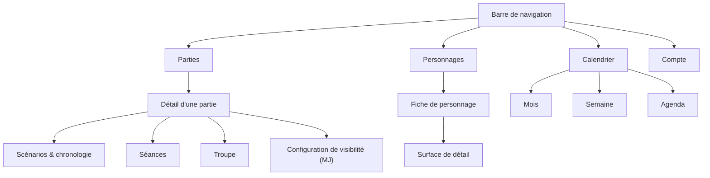

# jdr-master — Experience — Delta Palier 9

Ce document décrit **comment ça marche** ; `DESIGN.md` décrit **comment ça se voit**. Les tokens y sont cités en `{path.to.token}`.

Il **réécrit** l'architecture de l'information de la base (bâtie sur une bascule MJ/joueur que FR-7 supprime) et **amende** son plancher d'accessibilité (en tension avec le principe P-2 du PRD). Les autres sections l'étendent. *Amender n'est pas remplacer* : les règles de navigation clavier, d'ordre de focus et d'`aria-label` de la base restent intégralement en vigueur — P-2 ne les remet pas en cause.

En cas de conflit avec une planche de `.working/`, **ce document gagne**.

> ## ⚠️ Le contrat UI du calendrier
>
> [`mockups/contrat-ui-calendrier.html`](mockups/contrat-ui-calendrier.html) est la **planche contractuelle** de la reprise calendrier : l'interface réelle — chrome existant, libellés de `tones.ts`, tokens de `styles.scss` — avec tous les choix actés intégrés, en desktop et en mobile.
>
> **Ce qu'elle engage :** tout élément qui y est dessiné sera implémenté ; rien n'y figure pour embellir. Les annotations distinguent ce qui **change** de ce qui **existe déjà**.
>
> **Règle de travail, posée par l'utilisateur le 2026-08-17 :** toute spécification écrite ensuite — story, critère d'acceptation, décision d'implémentation — qui **modifierait** cette planche doit le signaler **explicitement par une icône ⚠️ placée juste avant la partie concernée**, en disant ce qui change et pourquoi.
>
> *Motif : une validation d'UI portant sur une maquette partiellement décorative fait prendre pour acquis des choix qui n'en étaient pas, puis dérive silencieusement au fil des stories. Le contrat rend cette dérive visible.*

**Reprise du 2026-08-17 — lisibilité du calendrier.** L'épic 30 a livré le modèle de couches décrit ici ; l'usage a montré que *les informations étaient présentes et illisibles*. Cette reprise amende cinq sections (§4.3 couches, §4.4 les trois vues, §5 risque assumé, §6 primitives, §9 responsive) et en ajoute quatre (§4.3 bis préséance, §4.4 bis Agenda, §4.4 ter mode Destinée, §4.4 quater légende). Source : PRD §4.7 bis, FR-49 → FR-57. Les quatre questions ouvertes du PRD (Q-19 → Q-22) sont tranchées ici.

---

## 1. Foundation

**Form-factor** : application web responsive, desktop **et** mobile, le mobile étant désormais testable sur appareil réel.

**Pondération d'usage** (estimation utilisateur, à re-vérifier) : joueur 60-80 % sur téléphone, MJ ~30 %. La parité signifie *aucune surface cassée sur l'un des deux supports*, pas *même effort partout* — la cible d'optimisation se décide surface par surface.

**UI System** : Angular Material 22, tokens en CSS custom properties. Identité visuelle : `./DESIGN.md`.

**Rôles** : il n'existe pas de rôle MJ global. On est MJ *d'une partie* en la créant. Toute évaluation de rôle est **par partie**, jamais globale.

---

## 2. Information Architecture

### Réécriture de la table des « 5 surfaces »

La base organisait l'application autour d'une bascule MJ/joueur globale — jusqu'à donner au *Dashboard joueur* la mention « MJ : Non, le MJ a son propre dashboard ». **FR-7 supprime cette bascule.** La table est donc remplacée, pas étendue.

### Navigation

Quatre destinations de premier niveau, en **barre basse sur mobile** et **barre haute sur desktop** :

Références visuelles : [`mockups/q8-navigation.html`](mockups/q8-navigation.html) — les deux navigations comparées sur téléphone, chacune sur les deux écrans.

Cette navigation traite d'un coup trois choses : la bascule parties ↔ personnages (Q-8), l'entrée Compte (FR-1) et le vide laissé par la suppression du sélecteur MJ/joueur (FR-7). **Motif décisif** : l'empilement vertical — avec des onglets en tête de page, titre + onglets + barre de contrôles + intertitre repoussent la première partie au quart de l'écran mobile.

### Navigation contextuelle locale (Story 29.4/29.5)

*Ajouté après correct-course (2026-08-09), à l'usage de la barre à 4 destinations livrée par 29.3 : le bandeau du haut restait vide sur tous les écrans, et rien ne signalait localement « où je suis » sur les écrans qui ont des sous-sections. Validé sur maquette, voir [`mockups/key-partie-detail-navigation-contextuelle.html`](mockups/key-partie-detail-navigation-contextuelle.html).*

**La barre à 4 destinations ne devient jamais contextuelle.** Elle reste le seul porteur de l'accès global en un geste (FR-48) — la sous-navigation locale s'y **ajoute**, sur un autre niveau visuel, elle ne la remplace ni ne la masque jamais sur aucun écran.

Deux ajouts, tous deux optionnels par écran :

1. **Bandeau contextuel** (remplace la zone jusqu'ici vide du haut) : `{components.ContextualHeader}` — wordmark réduit + titre de l'écran + sous-titre optionnel. Voir Component Patterns §4.8.
2. **Sous-navigation locale** : une rangée d'onglets sous le bandeau, propre à l'écran, distincte visuellement de la barre globale (fond de surface, pas de fond de barre). Sur l'écran de détail d'une partie, elle **réutilise telle quelle** la structure d'onglets déjà en place (Détails, Ma fiche, Invitations, Scénarios, Chronologie) — aucune reconstruction. Sur la fiche personnage (29.5), elle est **nouvelle** : la fiche n'a aujourd'hui aucune structure de sections, l'équipement et le journal y sont empilés dans une page qui défile. Ce découpage **résout la condition de révision posée en §4.7** — le journal ne devient pas une destination globale « Documents » (non déclenché), il devient une entrée de la sous-navigation *locale* de la fiche.

**Règle de l'entrée active de la barre globale, tranchée avec l'utilisateur** : une fois qu'un écran contextualisé s'affiche (détail de partie, fiche personnage…), **aucune** entrée de la barre globale ne reste surlignée — elle redevient neutre, y compris celle par laquelle on est arrivé (ex. « Parties »). Motif : `aria-current="page"` doit rester honnête (une entrée active qui déplace au clic quand on croit déjà y être est un signal faux), la règle ne s'ambiguïfie pas avec l'imbrication (une fiche personnage ouverte depuis une partie ne rallume ni « Personnages » ni « Parties »), et les deux bandeaux se partagent proprement le travail : la barre globale répond à *« où puis-je aller »*, jamais à *« où suis-je »* — c'est le rôle du bandeau contextuel et de la sous-navigation locale. Comportement déjà obtenu par la correspondance de route par défaut (`routerLinkActive` non-exact ne matche pas une route enfant plus profonde) — rien à ajouter techniquement.

Écrans **sans** sous-sections propres (Dashboard, Mes personnages, Calendrier, Compte) : le bandeau contextuel peut porter un titre, mais aucune sous-navigation locale vide n'apparaît.

### Qui accède à quoi

| Surface | Joueur | MJ |
| --- | --- | --- |
| Parties | Toutes ses parties, rôle indiqué par partie | Idem — une seule liste, jamais deux |
| Personnages | Ses propres personnages, toutes parties confondues | Idem |
| Calendrier | Couches personnelles + « disponibilité du groupe » en contexte de partie, **en compteurs anonymes** | Idem, mais la couche de groupe montre la disponibilité **par membre, nommément** |
| Compte | Profil, préférences, favoris | Idem |
| Configuration de visibilité | Non | Oui, par partie |
| Création de partie | Accessible, non mise en avant | Accessible et mise en avant |

**Créer une partie reste ouvert à tout utilisateur connecté.** Seule la *mise en avant* du bouton dépend du fait d'être déjà MJ d'au moins une partie.

### Réserve consignée sur l'échelle

L'utilisateur n'a **aucune partie** au moment de ce run, et en projette **2 à 4 en simultané**. À cette échelle, les trois modes d'affichage, les tris multi-critères et les filtres par rôle sont de l'outillage pour quinze parties ou plus : le seul regroupement par urgence suffirait, sans aucun contrôle à l'écran.

La décision de tout construire maintenant a été prise **en connaissance de cause, contre recommandation**, après deux mises en garde dont le signal d'échec du PRD lui-même. Motif retenu : ne jamais avoir à y repasser. **Cette réserve est consignée ici, elle n'a plus à être rediscutée** — elle sert de repère si le coût de maintenance de ces contrôles devait un jour être réévalué.

### Grammaire d'interaction commune

> Liste des parties et calendrier partagent la **même grammaire** : des **modes d'affichage** plus des **filtres/couches**. Une seule chose à apprendre pour les deux écrans.

La liste des personnages réutilise **exactement** la grammaire de la liste des parties — ce n'est pas un écran de plus à concevoir, c'est le même écran avec un autre contenu.

---

## 3. Voice and Tone

Registre inchangé (base §3). Trois ajouts propres à ce palier :

- **Les libellés d'état sont des mots, pas des codes.** « Réponds au vote », « Aucun scénario », « À débriefer ». Ils portent l'état précis que la couleur ne dit pas.
- **Les libellés d'imminence sont humains** au dernier palier : « demain soir », « ce soir » — jamais « J-1 ».
- **Un message d'erreur ne ment jamais sur la cause** (FR-38). Une API injoignable ne se dit pas « identifiants invalides ».

---

## 4. Component Patterns

### 4.1 Carte de partie

Trois modes d'affichage, un seul vocabulaire d'état.

| Mode | Contenu | Densité mobile |
| --- | --- | --- |
| Grande vignette | Bannière complète animée, nom, rôle, signaux en toutes lettres | ~2 par écran |
| Moyen | Vignette 44 px, nom, rôle, signaux en toutes lettres | ~4-5 par écran |
| Liste | Pastille d'état, vignette atténuée + monogramme 28 px, nom, **libellé du signal dominant** + compte | ~12 par écran |

La bande d'état `{components.StateRail}` en grande vignette et en moyen est l'équivalent exact de la pastille du mode liste.

**En mode liste, la pastille n'est jamais seule** : elle est doublée du libellé du signal dominant (« 2 à faire », « 12 août », « Terminée »). Une bande ou une pastille de 4 à 8 px ne peut porter ni contour tireté ni nuance — un scénario **brouillon** y est donc signalé par son libellé, jamais par sa seule forme.

**Regroupement par urgence** : la liste se trie d'elle-même sous **quatre** intertitres — « Ça t'attend », « En cours », « À venir », « Terminées ». Le quatrième correspond à `status-soon` : une partie créée dont la première séance est datée mais qui n'a pas encore commencé.

### 4.1 bis — Les signaux d'état d'une partie

Les dix signaux de CAP-5 se répartissent sur trois teintes seulement. Le libellé porte le détail.

| Signal | Côté | Teinte |
| --- | --- | --- |
| Personnage à créer | Joueur | `status-todo` |
| Vote en cours, sans réponse de ma part | Joueur | `status-todo` |
| Compte-rendu non rédigé sur une partie terminée | Joueur | `status-todo` |
| Homme Dragon à créer | MJ | `status-todo` |
| Aucun membre invité | MJ | `status-todo` |
| Aucun scénario en cours | MJ | `status-todo` |
| Aucune date, aucun vote | MJ | `status-todo` |
| Rapport de fin manquant | MJ | `status-todo` |
| Prochaine séance connue | Les deux | `status-soon` |
| Partie terminée *(FR-44)* | Les deux | `status-done` — la carte passe en retrait |

**Plafond d'affichage** : au plus **deux badges** par carte en modes grande et moyen, le reste résumé en « +N ». En mode liste, un seul compteur. `[ASSUMPTION]` — plafond proposé, jamais discuté ; à confirmer.

**Ordre de priorité** quand plusieurs signaux coexistent : ce qui bloque le démarrage d'abord (personnage à créer, aucun membre, aucun scénario), puis ce qui a une échéance (vote en cours, prochaine séance), puis ce qui est en retard (compte-rendu, rapport de fin).

**La teinte de la carte est celle du signal le plus prioritaire** ; une partie terminée reste en `status-done` même si un rapport de fin manque — le badge ambre le signale sans repeindre la carte.

### 4.2 Barre de contrôles

Modes d'affichage en **icônes**, tri, filtres (rôle, statut).

**Recherche** : visible en permanence sur desktop uniquement. Sur mobile elle n'est pas supprimée — CAP-8 l'exige pour la liste des personnages, et le mobile porte 60-80 % de l'usage joueur — elle est **atteignable par l'icône de révélation** de la barre. Permanente sur desktop, à un geste sur mobile.

Trois comportements retenus **ensemble** :
- **Masquage au défilement** — disparaît en descendant, revient en remontant.
- **Pastille de résumé** — dès qu'un réglage s'écarte du défaut, une pastille compacte reste visible et propose de rétablir. C'est elle qui empêche de se demander « pourquoi ma liste est dans cet ordre ».
- **Révélation par icône** — une icône déplie la barre à la demande.

Le **défaut** (mode d'affichage, tri) vit dans les **Préférences du compte**, pas dans la barre.

### 4.2 bis — La barre de contrôles du calendrier *(ajoutée le 2026-08-17)*

⚠️ **Remplace la bande de chips permanente** livrée par la story 30.6. Cinq chips, plus la légende, plus la Destinée occupaient une à deux lignes en permanence — sur mobile, la grille commençait sous la ligne de flottaison.

**Le patron n'est pas neuf : c'est celui de la liste des parties** (§4.2). La spine pose déjà que *liste et calendrier partagent la même grammaire d'interaction* — des modes d'affichage plus des filtres. On le réutilise tel quel, sans inventer de concept.

| Élément | Comportement |
| --- | --- |
| **☰ Affichage** | Ouvre le panneau des couches — menu ancré sur desktop, feuille montant du bas sur mobile |
| **Pastille de résumé** | N'apparaît **que** si l'affichage s'écarte du défaut : « Affichage filtré · 3 sur 5 · Rétablir ». Elle porte l'action de rétablissement — le bouton « Rétablir mon grimoire par défaut » y **déménage** |
| **Bascule de vues** | Reste sur la même ligne, inchangée |
| **✦ Destinée** | **Reste en dehors du panneau** — c'est un **mode**, pas un filtre, et il doit se voir tant qu'il est actif |

Le panneau contient les couches **et** l'interrupteur de légende. Au repos, la barre tient sur **une seule ligne**.

**Écarté :** une barre d'icônes sans libellé. Cinq pictogrammes de couches ne s'apprennent pas, et la spine interdit déjà la pastille seule pour les modes d'affichage de la liste.

Référence visuelle : [`mockups/iteration-groupe-participation-filtres.html`](mockups/iteration-groupe-participation-filtres.html) — section 1.

### 4.3 Calendrier — le modèle de couches

Le calendrier est **une surface portant des couches combinables**. Mois, Semaine et Agenda ne sont pas trois écrans mais **trois présentations des mêmes couches** ; l'Agenda n'est que « les couches actives triées par date ».

| Couche | Contenu | Portée |
| --- | --- | --- |
| Mes indisponibilités | Ce que j'ai déclaré indisponible — **et** les créneaux occupés par une séance d'une autre partie | Partout |
| Mes disponibilités | Ce que j'ai déclaré disponible | Partout |
| Mes séances confirmées | Séances dont la date est validée | Partout |
| Les votes en cours | Créneaux proposés par un vote non tranché | Partout |
| Les inscriptions ouvertes | Séances épisodiques à capacité limitée où je peux m'inscrire | Partout |
| Disponibilité du groupe | Agrégation des membres — **par membre et nommément pour le MJ, en compteurs anonymes pour un joueur** | **Contexte de partie uniquement**, tous rôles |

**La couche de groupe n'est pas réservée au MJ** (tranché le 2026-08-05) : elle est disponible à tout membre d'une partie, et c'est **son contenu** qui dépend du rôle. Les deux vues existent déjà côté serveur — statut par membre pour le MJ, compteurs sans identité pour un joueur (`AD-9`) — et cette couche les expose telles quelles. La réserver au MJ aurait retiré aux joueurs une lecture qu'ils ont aujourd'hui.

**Scission volontaire** de disponible et indisponible en deux interrupteurs : asymétrie d'usage réelle — pour répondre à un vote on garde les indisponibilités visibles (elles empêchent de voter un mauvais soir) tout en éteignant les disponibilités, qui ne sont que du bruit à ce moment-là.

**« Occupé par une autre partie » n'est pas une couche.** C'est une indisponibilité, portée par la couche correspondante — cohérent avec AD-9 de la spine, où une séance d'une autre partie se traduit à la lecture en `UNAVAILABLE` sans statut distinct. *Le front n'introduit aucun concept que le serveur ne connaît pas.* Cette notion n'existe que dans le calendrier **d'une partie** : dans le calendrier personnel, toutes les séances sont identifiables et relèvent de « mes séances confirmées ». **Ne pas implémenter de couche fantôme côté perso.**

**Conséquence structurelle** : le panneau du bas — « Voir les créneaux calculés », disponibilité du groupe — cesse d'être un panneau séparé atteint par un bouton de défilement. Il devient une couche, affichable dans n'importe laquelle des trois vues.

Référence visuelle : [`mockups/q6-vue-semaine.html`](mockups/q6-vue-semaine.html) — saisie rapide par glissement et vue Agenda comparées.

**Mémorisation** : le jeu de couches par défaut est une préférence de compte ; les bascules faites en cours de visite sont **temporaires** ; une pastille signale tout écart au défaut et propose de rétablir.

#### Amendements du 2026-08-17 (reprise calendrier)

**« Les inscriptions ouvertes » n'est pas une couche de grille.** Une séance à inscription ouverte **n'a pas de date** tant que les inscriptions courent : elle n'a aucune case où se poser, et l'interrupteur ne pouvait rien produire à l'écran. Elle quitte les filtres de la grille et devient une **section de la vue Agenda** (§4.4 bis).
*La clé de couche reste dans l'union et dans la préférence de compte — c'est l'interrupteur qui disparaît, pas la clé. Aucune préférence enregistrée n'est invalidée.*

**Le réglage par défaut se formule en intentions, pas en clés.** L'écran de compte pose la question utile — *« quand j'ouvre un calendrier, je veux voir : »* — avec quatre entrées : **mes dispos & indispos** · **les séances confirmées** · **les votes en cours** · **la dispo du groupe**. La scission disponible / indisponible (ci-dessus) **reste entière dans les filtres de l'écran**, où l'asymétrie d'usage a du sens ; elle disparaît seulement du réglage de départ, où elle n'en a pas.

**Mémoire de session.** Le réglage de compte est l'état d'**arrivée**, jamais un verrou. Les bascules faites en cours de visite survivent si l'on revient sur **le même** calendrier dans **la même** session ; un rechargement, une déconnexion ou l'ouverture d'un **autre** calendrier repartent du défaut. Le retour après fermeture de l'application repart également du défaut — garantie **acquise sans mécanisme dédié**, une mémoire de portée session expirant d'elle-même. *Si elle devait demander une détection, elle serait abandonnée.*

### 4.3 bis — La préséance dans un créneau

> Une case n'empile pas les couches actives. **Elle affiche ce qui compte le plus**, et le reste attend au tap.

**L'unité d'affichage est le créneau, pas la journée** (tranché le 2026-08-17). La case du Mois est **découpée en trois bandes horizontales pleine largeur** — matin en haut, après-midi au milieu, soir en bas — et la préséance ci-dessous s'applique **bande par bande**. Une séance du soir occupe la bande du soir ; elle ne prend jamais la journée, et n'efface donc jamais la disponibilité du matin. *Le mélange redouté — une teinte moyenne entre « libre le matin » et « pris le soir » — n'a plus lieu d'être : il n'y a rien à moyenner.* Voir §4.3 ter pour la structure de la case.

| Rang | Ce qui gagne la case | Traitement |
| --- | --- | --- |
| 1 | **Séance confirmée** | La case est teintée « engagé » et porte le **titre** ; selon la place, le créneau et les informations pratiques |
| 2 | **Vote en cours** | Liseré `{colors.status-todo}`, libellé du vote, **barre de tendance** à trois segments, rappel de ma réponse |
| 3 | **Mes indisponibilités** | Fond `{colors.status-unavailable}` atténué |
| 4 | **Mes disponibilités** | Fond `{colors.accent-1}` atténué |

⚠️ **La disponibilité du groupe est sortie de ce classement le 2026-08-17.** Elle y occupait le dernier rang, ce qui la rendait **invisible dès que j'avais déclaré quoi que ce soit** ou qu'une séance était posée — c'est-à-dire presque toujours. *Une couche qu'on n'allume que pour ne rien voir ne sert à rien.* Elle passe sur un **canal séparé** (§4.3 quater) et ne concourt plus jamais avec la préséance.

Règle unique aux trois vues, la **densité** seule s'adapte : le Mois arbitre plus durement que la Semaine, dont les cases sont larges. L'information écartée reste atteignable au tap ou au survol — **elle est déclassée, jamais supprimée**.

**Une séance confirmée rend ses participants indisponibles, indépendamment de l'affichage.** Éteindre la couche « mes séances » retire le **texte** du créneau, jamais le fait d'être pris. *C'est la seule couche dont l'extinction ne change rien à la vérité du créneau* — voir §5, où le risque assumé du modèle est restreint en conséquence.

**Informations pratiques** *(amendé le 2026-08-19)*. Une séance porte trois informations facultatives — **heure de rendez-vous**, **lieu**, **note libre** — composées à l'affichage (« chez Marc · 20 h 30 · pensez aux dés ») et rendues **telles quelles et tronquées**, jamais reformatées. Quand la place manque, **la note cède la première** ; l'heure et le lieu tiennent plus longtemps. L'heure est une **étiquette**, jamais un instant : rien ne la calcule, et l'unité d'arbitrage du calendrier reste le créneau de journée. Lecture sur le créneau et dans l'Agenda ; **écriture depuis la chronologie du scénario**, où la séance vit déjà.

Référence visuelle : [`mockups/reprise-calendrier-propositions.html`](mockups/reprise-calendrier-propositions.html) — planches A et B, avant / après.
⚠️ **La case du Mois de la planche A est périmée** : elle dessinait des cases pleines et ignorait les trois créneaux. Elle est remplacée par §4.3 ter. Le reste de la planche — la case de la Semaine, la tendance de vote, le rappel de ma réponse — tient toujours.

### 4.3 ter — La case du Mois : trois bandes horizontales

**Tranché le 2026-08-17 sur un mois entier**, cinq traitements rendus aux deux largeurs avec les mêmes données.

> La case n'est pas une surface avec un bandeau d'état en bas. **C'est trois bandes empilées**, une par créneau, chacune occupant toute la largeur.

| | Contenu de la bande |
| --- | --- |
| **Haut** | Matin |
| **Milieu** | Après-midi |
| **Bas** | Soir |

Chaque bande porte l'état du rang gagnant pour **ce créneau** (§4.3 bis) : disponible, indisponible, non déclaré, séance, vote.

**Ce que cette structure obtient, et qu'aucune des autres n'obtenait :**

1. **La position dit le moment** — pas d'icône, pas de légende, aucun code à apprendre. C'est la lecture la plus économique possible.
2. **Une bande fait toute la largeur, donc elle porte du texte** dès qu'il y a la place. Une journée à deux séances montre **deux bandes nommées**, là où une réglette avec puces donnait deux pastilles et un résumé donnait « 2 séances ».
3. **La structure survit à l'étroitesse.** En dessous du seuil mobile le texte tombe, les trois bandes restent : on voit *quand* sans savoir *quoi*, et le détail s'obtient au tap dans le rail. *Même dégradation que partout ailleurs — la forme survit, le texte cède.*

**Le jour uniforme fusionne ses trois bandes en une seule.** Quand les trois créneaux portent le même état et qu'aucun événement ne s'y pose, il n'y a rien à distinguer. C'est aussi l'atténuation retenue du seul vrai grief de ce traitement : **une grille plus bariolée** que la réglette fine, chaque jour portant trois surfaces pleine largeur au lieu d'un trait de 5 px.

**Écartés, et pourquoi :**

| Traitement | Raison du rejet |
| --- | --- |
| **Découpage vertical** (trois colonnes) | L'œil balaie un calendrier **horizontalement**, jour après jour. Des colonnes *dans* la case créent une seconde lecture horizontale qui concurrence la première : deux surfaces voisines, sont-ce deux moments d'un jour ou deux jours ? Le texte vertical, lisible une fois, est pénible à la dixième |
| **Réglette + puces à icône** | La grille la plus calme des cinq, mais le moment passe par une icône de 10 px là où la position le dit gratuitement |
| **Case haute** (une ligne par créneau) | Plus de 800 px de grille : le Mois cesse de tenir sur un écran, c'est-à-dire qu'il perd la seule chose qu'il sait faire. Et les jours vides y coûtent autant que les jours pleins |
| **Résumé + détail au tap** | Gaspille visiblement la largeur sur desktop — « 2 séances » dans une case qui pourrait nommer les deux. Reste la bonne réponse *sous* le seuil mobile, où ce traitement est simplement N1 dégradé |

Référence visuelle : [`mockups/mois-complet-cinq-traitements.html`](mockups/mois-complet-cinq-traitements.html) — août 2026 complet, cinq traitements, desktop et mobile.

### 4.3 quater — La disponibilité du groupe : un canal séparé

> Le fond de la bande dit **ma** situation. Le groupe dit **autre chose**, sur **un autre canal** — donc les deux cohabitent au lieu de se disputer une place.

| Rôle | Traitement | Où |
| --- | --- | --- |
| **Joueur** | **Jauge** de 5 px au bord droit de la bande, remplie à proportion des membres disponibles | Toutes les vues de grille |
| **MJ**, jusqu'à 6 membres | **Une pastille par membre**, dans l'**ordre fixe de la troupe** — la position identifie la personne, la couleur son statut | Toutes les vues de grille |
| **MJ**, au-delà de 6 | Retour à la jauge | Idem |
| **Les deux** | Les **noms** et leur statut | Dans le rail |

**Deux vides à ne pas confondre.** Jauge **rouge pleine** = tout le monde est bloqué. Jauge **vide** = personne n'est disponible *et* personne ne s'est prononcé. Ce ne sont pas les mêmes informations, et elles ne se ressemblent pas.

**La jauge survit sous une séance ou un vote** — c'était impossible tant que le groupe concourait sur le canal du fond. C'est tout l'intérêt de la séparation, et c'est ce qui rend la couche réellement utilisable.

**Conséquence sur « Fenêtres de la destinée ».** La section conserve sa place, mais change de statut : elle n'est plus le **seul** endroit où lire la disponibilité du groupe, elle en devient la **lecture longue**. Elle gagne au passage la lecture par membre pour le MJ (FR-53), déjà servie par le serveur.

Référence visuelle : [`mockups/iteration-groupe-participation-filtres.html`](mockups/iteration-groupe-participation-filtres.html) — section 2.

### 4.4 Les trois vues du calendrier

**Table révisée le 2026-08-17** — la case à trois bandes redistribue les rôles.

| Vue | Rôle | Saisie |
| --- | --- | --- |
| Mois | Vue d'ensemble **et saisie fine** | Glissement **au créneau** — la bande du soir, du mardi au samedi — *et* à la journée entière |
| Semaine | **Lecture détaillée** d'une semaine précise | Glissement au créneau, inchangé |
| Agenda | **« Qu'est-ce qui m'attend »** | Aucune — consultation par urgence, voir §4.4 bis |

**Ce qui a changé, et il faut le dire clairement.** Q-6 avait spécialisé la vue Semaine en outil de saisie fine pour une raison précise : *la vue Mois ne savait sélectionner qu'à la journée entière, ses segments de ~15 px n'étant pas attrapables au doigt*. **Les bandes de §4.3 ter font toute la largeur de la case** — cette justification tombe.

**La vue Semaine reste**, et elle n'est pas pour autant redevenue le doublon qu'elle était avant l'épic 30 : son rôle propre est désormais la **lecture détaillée** — titre, lieu et heure dans la cellule, travail sur une semaine précise. Ses cases sont les plus grandes des trois vues ; les laisser porter une pastille était le gaspillage le plus visible du calendrier livré.

*Les deux gestes existent maintenant aux deux endroits.* C'est un choix, plus une nécessité — et c'est un gain : l'utilisateur n'a plus à changer de vue pour changer de finesse.

### 4.4 bis — La vue Agenda : par ce qu'on attend de moi

**Tranché le 2026-08-17 sur planche comparative** (trois pistes rendues : liste enrichie, ruban calendaire, tri par urgence).

> L'Agenda **n'a pas d'axe temporel**. Le Mois et la Semaine portent déjà le temps ; le porter une troisième fois n'aurait produit qu'un doublon.

Trois sections, dans cet ordre :

| Section | Contenu | Badge |
| --- | --- | --- |
| **Ça t'attend** | Votes ouverts · **inscriptions ouvertes** | `{colors.status-todo}` |
| **C'est programmé** | Séances datées, avec leurs informations pratiques | `{colors.status-soon}`, intensité d'imminence (§4.1 bis) |
| **C'est passé** | Séances jouées dont le compte-rendu manque | `{colors.status-done}` |

**« Votes ouverts », pas « sans ma réponse »** : la section garde **tous** les votes ouverts, pas seulement ceux auxquels je n'ai pas répondu — lu littéralement, « sans ma réponse » ferait disparaître un vote de l'Agenda dès que j'y réponds, alors que l'Agenda reste le seul chemin pour changer sa réponse depuis cette vue. Les non-répondus restent en tête ; le **libellé de la ligne** (pas la section) change selon l'état de ma réponse.

**Aucun jour en en-tête** : la date redevient une propriété de la ligne. C'est ce qui distingue cette vue des deux autres et ce qui l'a fait retenir — se représenter des dates en liste est l'effort mental que la grille supprime, et qu'une liste groupée par jour réimpose.

C'est aussi la seule des trois pistes qui donne un **foyer naturel aux inscriptions ouvertes**, sans date à occuper.

Une séance **s'ouvre directement** depuis l'Agenda.

**L'Agenda du MJ permet de sceller sans changer de vue** *(ajouté le 2026-08-17)*. L'Agenda est organisé par ce qu'on attend de moi ; ce qu'on attend d'un MJ dont le vote est mûr, c'est de **trancher**.

- Les options du vote se **déplient dans la ligne**, triées par faveur, chacune avec sa piste de participation et un bouton **Sceller**. Le favori est mis en avant **sans masquer les autres** — la décision reste au MJ.
- Le dépliement est **conditionné à la maturité du vote**, pas systématique : trois votes ouverts feraient sinon une page interminable. *La définition de « mûr » reste à écrire — point ouvert 13.*
- Une séance **sans date** porte **« Lancer un vote »**. C'est ce qui reste du sélecteur « Planifier un vote pour : » supprimé de l'Oracle, posé là où le MJ constate le manque.
- **Côté joueur, la même structure de ligne** — options et mon choix, sélecteur de réponse au tap — mais aucun bouton *Sceller*. *Une seule structure, deux rôles.*
- **Une ligne de vote non dépliée n'affiche jamais de piste dans sa méta — un compteur en toutes lettres, valant le minimum de réponses sur les options du vote.** *(précisé le 2026-08-24)* Une piste segmentée yes/maybe/no au niveau du VOTE agrégerait les réponses de plusieurs options, or un membre peut répondre différemment sur chacune — elle affirmerait un consensus que personne n'a exprimé, exactement ce que la piste de participation (par option, story 36.6) existe pour éviter. La piste reste réservée à l'OPTION, jamais au vote dans son ensemble.

**Vue par défaut sur mobile.**

Piste écartée, et pourquoi : le **ruban calendaire** (deux ou trois semaines en bandes au-dessus du détail) répondait le plus littéralement à l'intuition initiale — « une sorte de calendrier avec seulement les infos de l'agenda » — mais réintroduisait le doublon que la piste retenue évite.

Référence visuelle : [`mockups/reprise-calendrier-propositions.html`](mockups/reprise-calendrier-propositions.html) — planche C, les trois pistes et leur tableau comparatif.

### 4.4 ter — Le mode Destinée

Le vote quitte le panneau latéral et entre dans la grille. **La Destinée n'est pas une couche de plus, c'est un mode** : elle estompe tout ce qui ne relève pas du vote courant et concentre l'écran sur un vote à la fois.

- Chaque créneau proposé porte sa **tendance** — barre à trois segments, oui / peut-être / non — et le rappel de **ma** réponse.
- Des chevrons **‹ n / N ›** passent d'un vote ouvert à l'autre.
- La même lecture sert à **sceller** : le créneau qui ne porte que des oui se repère sans lire une liste.
- Un **mode de sélection** compose les options — créer un vote, ou **ajouter et retirer** des créneaux sur un vote déjà ouvert, avant validation.

**Ce que devient le panneau « Vote en cours »** : il se réduit à **« qui manque »** — la liste des votants sans réponse. *Motif : « qui n'a pas répondu » est une information de personnes ; elle n'a aucune case où se poser, exactement comme les inscriptions ouvertes.* Tout le reste — dates, tendance, ma réponse — passe dans la grille. **La fenêtre de la Destinée disparaît en tant que fenêtre** : elle est devenue ce mode.

**Retirer une option d'un vote ouvert** est permis même si des membres ont voté dessus, **avec avertissement préalable** nommant le nombre de votants concernés. Les réponses portées par l'option retirée sont supprimées ; celles des autres créneaux sont intactes. *Écarté : l'interdiction dès le premier vote (le MJ doit pouvoir corriger un créneau devenu impossible) et le retrait silencieux (des réponses disparaîtraient sans témoin).*

Référence visuelle : [`mockups/reprise-calendrier-propositions.html`](mockups/reprise-calendrier-propositions.html) — planche D.

### 4.4 quater — La légende

Le calendrier porte une légende **dépliable**, et l'écran doit rester lisible **sans elle**.

> **Vert et rouge se passent d'explication.** Tout ce qui code par l'intensité, la trame, ou une teinte sans sens partagé en demande une.

| Se passe de légende | La demande |
| --- | --- |
| Disponible · indisponible | Séance confirmée (teinte `{colors.status-soon}`) |
| | Créneau proposé au vote (liseré `{colors.status-todo}`) |
| | **Piste de participation** — longueur remplie, couleurs, part tramée |
| | **Jauge de groupe** au bord de la bande, et pastilles par membre |
| | Trame « personne n'a répondu » |

**La légende se range dans le panneau « Affichage »** (§4.2 bis) : c'est un réglage d'affichage, pas une action. Une chip de moins sur la barre.

Référence visuelle : [`mockups/reprise-calendrier-propositions.html`](mockups/reprise-calendrier-propositions.html) — planche F.

### 4.5 IdentityLabel — la convention joueur / personnage

**Le personnage domine, le joueur passe en second.** La couleur (`{colors.accent-1}` personnage / `{colors.text-muted}` joueur) ne fait que doubler.

> **Deux noms affichés ensemble → la typographie suffit** (italique personnage, romain joueur) : la position et le style font le travail.
> **Un seul nom affiché, quel qu'il soit → l'icône est obligatoire** (écu personnage, silhouette joueur).

Cette règle couvre explicitement le cas où une vue choisit délibérément de n'afficher qu'un des deux pour la lisibilité. **Nuance apportée à FR-15** : « afficher joueur et personnage là où c'est utile » ne signifie pas « toujours les deux » ; n'en afficher qu'un est une option de conception légitime, dont l'icône est la contrepartie obligatoire.

Référence visuelle : [`mockups/convention-identite.html`](mockups/convention-identite.html) — les trois traitements sur quatre écrans, dont le cas d'un seul nom affiché.

En cas d'homonymie de noms affichés, le **pseudo** prend le relais dans les écrans sans personnage.

### 4.6 Surface de détail

Panneau latéral à droite sur desktop, feuille montant du bas sur mobile. Sert indifféremment les **termes de règle du catalogue** (FR-19) et les **éléments possédés par le personnage** (FR-20) — mutualisation confirmée.

Sur desktop, la fiche **ne bouge pas** pendant la lecture : attributs et équipement restent visibles. C'est ce qui la distingue du dépliant, dont l'usage reste autorisé mais d'exception (texte court, élément qui reste en place, décision explicite à la conception de l'écran).

### 4.7 Menu de fiche

Les cinq actions d'export (fiche éditable, fiche 2 pages, équipement, notes, recadrage du portrait PDF) vivent dans le **menu à trois points de l'en-tête** de la fiche. Aucune navigation ajoutée, rien à l'écran au repos.

**Condition de révision explicite** : si le journal devient une destination à part entière, une destination « Documents » sera créée dans la foulée et ce choix sera rouvert.

*Mise à jour 29.5 : la condition ne se déclenche pas — le journal (et l'équipement) sortent de la fiche principale, mais restent une entrée de la sous-navigation **locale** de la fiche (§ Navigation contextuelle locale), jamais une destination globale.*

### 4.8 Bandeau contextuel

*Ajouté avec la sous-navigation contextuelle (29.4/29.5), voir § Navigation contextuelle locale et maquette liée.*

Trois éléments, de gauche à droite : **wordmark réduit** (le nom de l'app en typographie, cliquable, retour à l'accueil — jamais un vrai logo graphique, cf. `DESIGN.md` §1 « pas de logo ») · **titre contextuel** (nom de la partie, du personnage… selon l'écran) · **sous-titre optionnel**, affiché **seulement quand il apporte une information utile non visible ailleurs sur l'écran** — jamais systématique. Exemple retenu : le rôle (« Maître ») sur l'écran de détail d'une partie, où les actions disponibles diffèrent selon qu'on est MJ ou joueur.

Le déclencheur exact de « utile » n'est pas figé en règle rigide ici — il s'apprécie écran par écran à l'implémentation, sur le même principe que les autres décisions locales de ce document (ex. §4.6 Surface de détail).

Sur les écrans sans contexte propre (Dashboard, Mes personnages, Calendrier, Compte), le bandeau porte un titre neutre sans sous-titre.

---

## 5. State Patterns

### Les dix états

| Objet | États |
| --- | --- |
| Scénario | Brouillon *(MJ seul)* · À venir · Courant · Passé |
| Séance | À planifier · En vote · Inscriptions ouvertes · Programmée · À débriefer · Jouée |

Leur traduction visuelle est en `{colors}` de `DESIGN.md` §2 — quatre teintes, le libellé portant l'état précis.

Référence visuelle : [`mockups/signaletique-etats.html`](mockups/signaletique-etats.html) — chronologie MJ contre chronologie joueur.

### États dépendants du lecteur

> Certains états dépendent **du lecteur**, pas de l'objet. Une séance en vote est `status-todo` si *tu* n'as pas répondu, `status-live` si tu as répondu — la même séance, deux badges selon qui la regarde.

**Deux teintes imposent deux libellés.** Un même mot « En vote » sur deux couleurs ferait porter à la teinte seule la distinction *à faire / fait* — c'est-à-dire le cœur du palier, en violation de P-1. Les libellés sont donc **« Réponds au vote »** (`status-todo`) et **« Vote en cours »** (`status-live`). La règle vaut au-delà de ce cas : *deux teintes pour un même état sous-jacent exigent deux libellés distincts.*

Ces états sont **résolus par lecteur**. Vérification faite dans le code, **aucun changement serveur n'est nécessaire aujourd'hui** : `PollOptionDto.votes` porte déjà les `userId` de tous les votants, donc le front sait si l'utilisateur courant a répondu ; et les scénarios brouillons vivent derrière un endpoint distinct (`GET /parties/:id/scenarios/drafts`), donc la liste servie à un joueur les exclut déjà — le compteur de la chronologie diffère de lui-même selon le lecteur.

Imposer un calcul serveur créerait du travail sans bénéfice. Il redeviendrait justifié le jour où l'on voudrait masquer l'identité des autres votants, ou tout autre resserrement de la charge utile — c'est le sens de la dérogation **D-12**, inscrite au PRD à ampleur nulle pour que le sujet reste visible.

### Anti-spoil

L'anti-spoil tient **dans la signalétique elle-même**, pas dans une discipline d'affichage :

- La chronologie du joueur s'arrête au dernier scénario publié — **aucun espace vide, aucun nœud fantôme**.
- **Le compteur d'en-tête diffère selon le lecteur** (4 scénarios pour le MJ, 3 pour le joueur). C'est voulu : afficher « 4 » à un joueur qui en voit 3 trahirait l'existence du brouillon.

### Risque assumé du modèle de couches

> Éteindre une couche d'indisponibilité masque des blocages réels : **un créneau peut sembler libre alors qu'il ne l'est pas**, et l'on pourrait voter pour un soir déjà pris.

Ce risque est **inhérent et symétrique** au principe même des couches — une indisponibilité déclarée pour raison personnelle produit exactement le même effet qu'une séance jouée ailleurs. Mitigation retenue : la pastille « Affichage filtré · Rétablir » signale que l'écran ne montre pas tout. **Consigné comme risque assumé, pas comme défaut à corriger.**

**Restreint le 2026-08-17.** Le risque ne vaut plus que pour les indisponibilités **déclarées à la main**. Une séance confirmée bloque le créneau **quel que soit l'état des couches** (§4.3 bis) : éteindre sa couche masque un texte, jamais un engagement. La part du risque qui portait sur « une séance jouée ailleurs » disparaît donc — c'était la plus dangereuse des deux, puisqu'on ne l'avait pas choisie.

---

## 6. Interaction Primitives

| Geste | Effet |
| --- | --- |
| Glissement sur la grille Semaine | Sélection multiple **au créneau**, puis déclaration en une fois |
| Glissement sur la grille Mois | Sélection multiple **au créneau**, le long d'une bande *(révisé le 2026-08-17, voir §4.3 ter)*. La journée entière s'obtient par la **portée de la barre**, jamais par un geste dédié — le glissement vertical reste au défilement de la page |
| Défilement vers le bas | Masque la barre de contrôles ; le retour vers le haut la ramène |
| Tap sur une icône de mode | Change le mode d'affichage (icônes seules, jamais de libellé texte) |
| Tap sur un élément à texte descriptif | Ouvre la surface de détail (feuille mobile / panneau desktop) |
| Tap sur la pastille de résumé | Rétablit l'affichage par défaut |

**Le balayage horizontal est proscrit** pour révéler des contrôles : il entre en conflit avec le retour arrière système et avec les actions de ligne d'une liste.

**Le glissement de sélection n'est jamais le seul chemin.** Trois garanties :
- Le **tap case par case** reste pleinement fonctionnel et ouvre le panneau de déclaration comme aujourd'hui. Le glissement est un raccourci, pas un remplacement.
- Sur mobile, le glissement **s'amorce par un appui maintenu** sur la première cellule, pour ne pas entrer en conflit avec le défilement vertical de la page.
- Un **équivalent clavier** existe : sélection d'une cellule, puis extension de la plage avec `Maj` + flèches, validation par `Entrée`.

### La sélection devient le geste principal (2026-08-17)

L'usage a montré que la sélection est plus naturelle que le panneau ouvert créneau par créneau. Le rapport s'inverse : **la sélection est le geste, le panneau est le chemin avancé.**

| Geste | Effet |
| --- | --- |
| Glissement sur la grille | Sélection multiple, puis barre d'action |
| **Tap sur une case** | **Sélection d'une seule case** — même barre, même flux |
| « Autre… » dans la barre | Ouvre le **panneau de déclaration** |

*La garantie de non-régression tient* : le tap reste pleinement fonctionnel, il change seulement de destination.

**La portée se choisit après la sélection, pas avant.** La barre porte quatre options — journée entière · matin · après-midi · soir — applicables à toute la sélection. Sélectionner sept jours en vue Mois puis dire « le soir seulement » est un seul geste plus un choix.

**Le panneau de déclaration ne disparaît pas.** Il reste le **seul chemin** de la contrainte **récurrente** : « tous les mardis soir » est une règle, pas une énumération de dates, et aucun glissement ne peut l'exprimer. *Le supprimer retirerait une capacité livrée.*

### Le conflit cesse d'être un mur

Quand une sélection recouvre des créneaux déjà déclarés, l'application ne refuse plus le lot. Trois issues :

| Choix | Effet |
| --- | --- |
| **Remplacer** | Les créneaux en conflit prennent la nouvelle valeur |
| **Conserver** | Les créneaux en conflit restent tels quels, le reste du lot s'applique |
| **Au cas par cas** | Les conflits défilent un par un |

Le dialogue **nomme les créneaux concernés**, il ne se contente pas de les compter.

> **« Remplacer » ne remplace que mes propres déclarations.** Une indisponibilité issue d'une séance résiste toujours : me déclarer disponible du 3 au 9 ne me rend pas disponible le 8 si j'y ai une séance. Si cette séance est annulée, la disponibilité revient d'elle-même.

Le dialogue **le dit explicitement**, sur une ligne distincte des trois choix — c'est une exception qu'on subit, pas une option qu'on prend. *Cette garantie est structurelle : l'indisponibilité dérivée d'une séance n'est pas stockée, elle est calculée à la lecture. Il n'y a rien à écraser.*

Référence visuelle : [`mockups/reprise-calendrier-propositions.html`](mockups/reprise-calendrier-propositions.html) — planche E.

### 6 bis — Table des interactions du calendrier *(ajoutée le 2026-08-17)*

Audit d'exhaustivité et de non-ambiguïté : **un même geste, dans un même contexte, ne déclenche jamais deux actions**.

#### Les quatre principes d'arbitrage

1. **La bande qui porte un objet répond à son objet ; la bande qui n'en porte pas répond à la sélection.** Un tap sur une séance l'ouvre ; un tap sur un créneau libre le sélectionne. *Il n'y a jamais d'ambiguïté parce qu'il n'y a jamais les deux à la fois : là où un objet est posé, déclarer sa disponibilité n'a aucun effet — la séance gagne de toute façon (§4.3 bis).*
2. **Le rail suit, il ne se commande pas.** Aucun geste n'est dépensé à « ouvrir le détail » : le rail reflète la dernière case touchée, quelle que soit la raison du toucher. Un consommateur passif ne peut pas entrer en conflit.
3. **Le mode Destinée ne réassigne aucun geste.** Il change **ce qui est affiché**, jamais ce que fait le doigt. *C'est ce qui l'empêche de devenir un mode au sens dangereux du terme.*
4. **Un seul mode réassigne le tap : la composition d'un vote** (MJ). Il est armé explicitement, porte une barre persistante, se quitte par Échap ou Annuler, et se signale visuellement pendant toute sa durée.

#### Table 1 — d'un geste vers son action

| Geste | Vue Mois | Vue Semaine | Vue Agenda |
| --- | --- | --- | --- |
| **Tap** sur une bande / cellule **vide** | Sélectionne ce créneau | Sélectionne ce créneau | — |
| **Tap** sur une bande portant une **séance** | Ouvre la séance | Ouvre la séance | Ouvre la séance |
| **Tap** sur une bande portant une **option de vote** | Ouvre le **sélecteur de réponse** | Idem | Idem |
| **Tap** sur une bande d'un **jour uniforme fusionné** | Sélectionne la journée entière | — | — |
| **Glissement** le long d'une bande | Sélection multiple **au créneau** | Sélection multiple au créneau | — |
| **Glissement vertical** dans une case | **Rien** — laissé au défilement de la page | — | — |
| **Appui maintenu** (mobile) | Arme la sélection, **y compris sur une bande à objet** | Idem | — |
| **Survol** (desktop) | Révèle l'information déclassée par la préséance | Idem | — |
| **Défilement vertical** | Fait défiler la page ; masque la barre de contrôles | Idem | Idem |
| **Balayage horizontal** | **Proscrit** — conflit avec le retour arrière système | Proscrit | Proscrit |
| **Double-clic / clic droit** | **Inutilisés et réservés** | Idem | Idem |

**Clavier** (identique aux vues de grille) : `Tab` atteint la case — *jamais la bande, qui produirait 126 arrêts sur une grille de six semaines* · `1` `2` `3` sélectionnent matin, après-midi, soir · `Espace` sélectionne la journée entière · `Maj` + flèches étend la plage · `Entrée` valide la sélection armée · `Échap` l'annule.

#### Table 2 — d'une action vers ses déclencheurs

| Action | Comment on la déclenche | Condition préalable |
| --- | --- | --- |
| Déclarer sur un créneau | Tap sur bande vide, ou `1`/`2`/`3` | Créneau non passé |
| Déclarer sur une journée | **Sélectionner, puis basculer sur *Journée* dans la barre**, ou `Espace` | Idem — *aucun geste de pointeur ne vise directement la journée, voir la collision 1* |
| Déclarer sur plusieurs créneaux | Glissement, ou `Maj` + flèches | Idem |
| Choisir la portée d'une sélection | Segments de la barre de sélection | **Une sélection active** |
| Valider une déclaration | Boutons *Disponible* / *Indisponible* de la barre, ou `Entrée` — *qui valide **ce que la barre affiche*** | Une sélection active |
| Annuler une sélection | Bouton *Annuler*, ou `Échap` | Une sélection active |
| Résoudre un conflit | Dialogue *Remplacer* / *Conserver* / *Au cas par cas* | Le lot recouvre des déclarations existantes |
| Déclarer une contrainte **récurrente** | *Autre…* dans la barre de sélection | **Seul chemin existant** |
| Consulter le détail d'un jour | **Aucun** — le rail suit le dernier toucher | — |
| Ouvrir le scénario qui porte une séance | Tap sur sa bande, sa ligne d'agenda, ou sa ligne de rail | — |
| Répondre à un vote | Tap sur la bande → **sélecteur oui / peut-être / non** | Vote ouvert, membre de la partie |
| Retirer sa réponse | **Même sélecteur**, quatrième entrée *Retirer ma réponse* | Avoir répondu |
| Mettre un vote en avant | Bouton *Destinée* de la barre de filtres | Au moins un vote ouvert |
| Passer d'un vote à l'autre | Chevrons `‹ n / N ›` | Mode Destinée, ≥ 2 votes ouverts |
| **Composer les options d'un vote** | Bouton *Ajouter des dates* → mode de composition | **MJ**, mode Destinée |
| Sceller un créneau | Bouton *Sceller* de la barre du créneau | **MJ**, créneau sélectionné, vote ouvert |
| Écrire les informations pratiques | Depuis la séance dans la chronologie | **MJ** — *jamais depuis le calendrier* |
| Afficher / masquer la légende | Interrupteur dans le panneau **☰ Affichage** | — |
| Changer les couches visibles | Panneau **☰ Affichage** | — |
| Rétablir l'affichage par défaut | Action portée par la pastille « Affichage filtré » | Écart au défaut |
| Sceller depuis l'Agenda | Bouton *Sceller* sur une option dépliée | **MJ**, vote mûr |
| Lancer un vote depuis l'Agenda | Bouton *Lancer un vote* sur la ligne | **MJ**, séance sans date |

> ⚠️ **Précisé le 2026-08-17 — la destination d'une séance activée.** Cette table disait « Ouvrir une séance », ce qui laissait supposer un écran de séance. **Il n'en existe aucun** : une séance n'a d'existence à l'écran qu'à l'intérieur de son scénario. La règle, tranchée par l'utilisateur, vaut désormais partout — **une surface nomme une séance, et l'activer ouvre le niveau au-dessus, le scénario qui la porte.** Ce n'est pas un repli : le scénario est le niveau qui porte le contexte utile — la chronologie, les autres séances, le compte rendu. La règle s'applique à la ligne de rail, à la ligne d'agenda et à la bande de la case, sans exception. Le libellé accessible de l'action doit annoncer l'ouverture du **scénario**, jamais de la séance.

#### Les huit collisions, et leur arbitrage

Toutes tranchées le 2026-08-17, prétendant contre prétendant.

| # | Geste ambigu | Prétendants | Retenu |
| --- | --- | --- | --- |
| 1 | **Glissement vertical** dans une case du Mois | Sélectionner la journée · **Faire défiler la page** | **Le défilement.** Aucun geste de pointeur ne vise la journée : on sélectionne une bande puis on bascule sur *Journée* dans la barre. *Cohérent avec « la portée se choisit après la sélection », et ne crée aucune cible fragile* |
| 2 | **Tap** sur une bande vide | Sélectionner · Ouvrir le détail du jour | **Sélectionner.** Le détail n'a pas de geste — principe 2 |
| 3 | **Tap** sur une bande portant une séance | Sélectionner · **Ouvrir la séance** | **Ouvrir.** L'objet gagne — et sans perte : déclarer sur un créneau qu'une séance occupe n'a aucun effet visible, la séance l'emporte par préséance |
| 4 | **Tap** sur une bande portant une option de vote | Répondre « oui » · Cycler les réponses · **Ouvrir un sélecteur** | **Le sélecteur à trois choix**, ancré sur la bande, plus une entrée *Retirer ma réponse*. *Un tap est binaire, une réponse de vote ne l'est pas — le cycle n'annonce pas son ordre, et « tap = oui » rendrait le non plus coûteux que le oui, ce qui biaiserait les réponses* |
| 5 | **Tap** en mode composition (MJ) | Ajouter l'option · Répondre · Sélectionner | **Ajouter / retirer.** Seul mode qui réassigne le tap — principe 4 |
| 6 | **Appui maintenu** sur une bande à objet | Ouvrir l'objet · **Armer la sélection** | **Armer.** Les durées séparent : tap court ouvre, maintenu arme. La sélection reste possible partout |
| 7 | **`Entrée`** sur une sélection armée | Valider en « indisponible » · **Valider ce que la barre affiche** | **La barre fait foi** — voir la dette ci-dessous |
| 8 | **Tap** sur un jour uniforme fusionné | Sélectionner la journée · Sélectionner un créneau | **La journée.** La fusion supprime la cible du créneau ; la portée de la barre la rend. *Le geste perd en précision, la barre la rattrape* |

> **Dette relevée dans le code existant, à corriger dans cet épic.** `onCellEnterKey()` valide aujourd'hui en **« indisponible » d'office** — la story 30.3 l'assumait explicitement, *« aucune touche unique ne peut exprimer disponible/indisponible »*. C'était vrai **quand aucune barre n'existait**. Le chemin pointeur, lui, demande : **deux chemins, deux résultats, pour la même intention.** `Entrée` doit valider *ce que la barre affiche*, comme le ferait un clic sur son bouton.
>
> Second point du même ordre : hors sélection armée, `Entrée` et `Espace` produisent aujourd'hui le même effet. `Espace` garde la journée entière, `Entrée` est désormais **réservée à la validation**.

---

## 7. Accessibility Floor

### Une tension à arbitrer, laissée ouverte

La base pose un plancher **chiffré** : cibles tactiles ≥ 44 × 44 px, contraste ≥ 4.5:1 et ≥ 3:1, ordre de focus détaillé. Le principe **P-2** du PRD retire explicitement les seuils chiffrés après retour d'usage réel : *« vigilance, pas conformité — aucun critère d'acceptation chiffré, aucun audit rétroactif »*.

**Tranché le 2026-08-05 — formulation validée par l'utilisateur** (Q-16 du PRD close) :

> Le plancher chiffré passe de **critère de recette** à **valeur de conception par défaut**. Ce qui est déjà à 44 px le reste ; les surfaces neuves de ce palier s'y conforment par défaut, parce que c'est la bonne valeur — mais aucun seuil ne devient un critère d'acceptation à décliner dans chaque story, et aucun audit rétroactif n'est mené. Tout irritant constaté à l'usage se traite au cas par cas.

Les règles de navigation clavier, d'ordre de focus et d'`aria-label` de la base (§7) **restent en vigueur telles quelles**.

Si un besoin d'accessibilité réel se présente, la réponse retenue est le **quatrième thème dédié** décrit au §11 — jamais un compromis sur les trois univers existants.

### Acquis de ce palier, non négociables

- **`prefers-reduced-motion: reduce` coupe toutes les animations**, sans exception, et **aucune composition ne perd d'élément** au repos.
- **Aucune information n'est portée par la couleur seule** : icône, libellé, ou traitement typographique la double toujours.
- L'imminence est signalée par une **densité de remplissage**, donc perceptible sans distinguer les couleurs.
- Les icônes d'identité et de navigation portent toujours un libellé ou un `aria-label` explicite.
- Les quatre statuts d'un thème sont **distinguables entre eux** — c'est l'invariant de palette de `DESIGN.md` §2.

---

## 8. Key Flows

### Flow 1 — Incon ouvre l'app sur son téléphone entre deux réunions

1. Il ouvre l'application ; la **barre basse** est là, « Parties » est actif.
2. La liste s'affiche **regroupée par urgence** : sous « Ça t'attend », *Les Cendres de Kavaan* porte deux badges en toutes lettres — « Personnage à créer », « Vote en cours ».
3. **Climax** : il n'a rien eu à chercher, à filtrer ni à ouvrir. En moins de deux secondes, il sait que deux choses l'attendent et lesquelles.
4. Il tape la carte, répond au vote, revient. Le badge a disparu, la partie est descendue sous « En cours ».

### Flow 2 — Ombreflèche, ou la levée d'ambiguïté

1. Incon ouvre l'onglet Troupe de sa partie.
2. Chaque ligne montre *Ombreflèche* en italique et « Incon » en romain dessous — le personnage domine, le joueur suit.
3. Il passe à l'écran de gestion des membres, où **seuls les joueurs** apparaissent.
4. **Climax** : parce qu'un seul nom est affiché, chaque ligne porte l'icône silhouette. Aucune hésitation possible sur ce qu'il regarde — la règle a fait son travail sans qu'il ait à la connaître.

### Flow 3 — Le MJ cherche une date pour Le Convoi du Nord

1. Il ouvre **Calendrier** depuis la barre — une destination, pas une entrée de menu enfouie.
2. Il allume la couche **disponibilité du groupe** ; celle-ci s'affiche dans la vue Mois, sans quitter l'écran ni faire défiler vers un panneau du bas.
3. Il éteint **mes disponibilités** pour ne garder que le groupe. Une **pastille** apparaît : « Affichage filtré · Rétablir ».
4. Il bascule en vue **Semaine**, glisse du mardi soir au vendredi soir pour marquer ses propres indisponibilités — quatre créneaux, un geste.
5. **Climax** : il lance le vote sur les deux créneaux où le groupe est au complet, sans avoir jamais quitté le calendrier ni compté à la main.

### Flow 4 — La séance approche

1. Trois jours avant, la carte de partie de *Le Convoi du Nord* porte un badge teinté « Dans 3 jours ».
2. Sur la vue de partie, le **manomètre** du compte à rebours a son aiguille à mi-course, la conduite à moitié pleine.
3. La veille, le badge devient **plein** : « demain soir ». L'aiguille entre dans la zone rouge.
4. **Climax** : le jour même, tout est au rouge et le libellé dit « ce soir ». Et pour qui a coupé les animations, le badge plein et le libellé disent exactement la même chose — rien n'a été perdu.

### Flow 5 — Incon ouvre son calendrier et sait, sans chercher *(ajouté le 2026-08-17)*

1. Il ouvre **Calendrier** sur son téléphone. La vue **Agenda** s'affiche, parce que c'est le défaut mobile.
2. Sous **« Ça t'attend »**, deux lignes : un vote sur *Les Cendres d'Ashal* — « 2 réponses sur 4 » — et une inscription ouverte sur *La Halte du Griffon*, sans date, qui n'a nulle part ailleurs où vivre.
3. Sous **« C'est programmé »**, *Le Convoi du Nord*, jeudi soir, « chez Marc · 20 h 30 · pensez aux dés », badge plein : **dans 3 jours**.
4. **Climax** : il n'a rien tapé, rien déplié, rien filtré. Il sait ce qu'on attend de lui et ce qui l'attend — et il n'a pas eu à se représenter une liste de dates pour y arriver.
5. Il bascule en **Mois** pour répondre au vote : les deux créneaux proposés portent leur tendance. Le 29 est majoritairement « non ». Il vote le 28.

### Flow 6 — Le MJ compose un vote sur la grille *(ajouté le 2026-08-17)*

1. Le MJ ouvre le calendrier de la partie et active le mode **Destinée**. Tout ce qui ne relève pas du vote s'estompe.
2. Il passe en **mode sélection** et désigne trois soirs de fin août directement sur la grille, au lieu de saisir des dates dans un formulaire.
3. Deux jours plus tard, un joueur signale que le 29 est impossible. Il rouvre la Destinée, **retire le 29** ; l'écran l'avertit que deux personnes ont voté pour ce créneau. Il confirme.
4. **Climax** : le 28 ne porte plus que des oui — il se voit, sans lire une liste. Le MJ **scelle** le créneau depuis la case elle-même.
5. La séance devient confirmée. Sur le calendrier de chacun, la case du 28 se teinte en « engagé », prend le titre, et rend tous les participants indisponibles — que la couche « mes séances » soit allumée ou non.

---

## 9. Responsive & Platform

| Surface | Mobile | Desktop |
| --- | --- | --- |
| Navigation | Barre basse, 4 destinations | Barre haute, mêmes entrées |
| Liste des parties | Contrôles en icônes, pas de recherche | Contrôles étiquetés + recherche |
| Calendrier — Semaine | Glissement au doigt, grille resserrée | Glissement à la souris, grille large |
| Calendrier — vue par défaut | **Agenda** | Mois |
| Surface de détail | Feuille montant du bas | Panneau latéral à droite |
| Fiche de personnage | Page qui défile, menu ⋮ | Idem + panneau de détail à droite |

### La grille Semaine à densité variable (Q-20, tranchée le 2026-08-17)

**Une seule grille à sept colonnes, qui change de densité selon la largeur.** Pas de seconde vue à concevoir, pas de mise en page mobile divergente : les mêmes cellules, le même geste, la même préséance.

| Largeur | Gouttière | Ce que porte la case | Détail |
| --- | --- | --- | --- |
| **< 500 px** (portrait) | **Icônes** de créneau | **Un mot** — « Convoi », « Vote » | **Rail de détail** sous la grille — il porte l'essentiel |
| **≥ 500 px** (paysage, tablette, bureau) | Icônes ou libellés | Titre · lieu · heure | **Rail de détail** sous la grille — il déplie ce que la cellule abrège |

> ⚠️ **Corrigé le 2026-08-17.** Cette table disait auparavant « Aucun — tout est dans la cellule » au-delà de 500 px, et les planches faisaient disparaître le rail en paysage et sur ordinateur. **Tranché par l'utilisateur : le rail est permanent à toutes les largeurs**, en vue Mois comme en vue Semaine. Motif : la largeur disponible n'est pas une raison de retirer une surface, c'en est une d'y mettre **plus** d'information. Le rail cesse d'être une compensation mobile pour devenir la surface de lecture la plus riche de l'écran. La densité de la **cellule** reste, elle, variable selon la largeur — c'est ce que cette table décrit désormais.

**Le rail de détail** est une bande **toujours visible** sous la grille, jamais un panneau à ouvrir, **en vue Mois comme en vue Semaine, quelle que soit la largeur**. Il nomme ce que porte la case touchée ; au repos, il montre le prochain jour qui porte quelque chose.

**Il nomme toujours les trois créneaux du jour** — matin, après-midi, soir — y compris ceux qui ne portent rien, qui disent alors leur état (« Disponible », « Indisponible », « Rien de prévu »).

> ⚠️ **Précisé le 2026-08-17.** Le rendu mobile de la planche contractuelle omettait les créneaux vides et n'affichait que deux lignes sur trois. **Tranché par l'utilisateur : « Matin est important, il faut qu'il soit là aussi. »** Aucune largeur, aucun état, aucune couche éteinte ne peut faire disparaître une des trois lignes. Un jour sans rien le dit ; il ne se tait pas.

**La largeur change ce que chaque ligne déplie, jamais combien il y en a.** En portrait, le libellé de créneau s'abrège et les accessoires (lieu, heure, note) se replient ; à partir du seuil, tout se déplie. Trois lignes, toujours.

**La bascule est le geste que l'utilisateur fait déjà** — tourner le téléphone. Rien à apprendre, rien à activer.

#### Le calcul qui a tranché

L'hypothèse de départ était de récupérer la gouttière des libellés (« Matin / Après-midi / Soir ») pour sauver les sept colonnes en portrait. **Mesure faite sur 375 px, 351 px utiles, sept colonnes et six espaces de 2 px :**

| Gouttière | Par jour | Gain |
| --- | --- | --- |
| « Matin / Après-m. / Soir » | 42,4 px | — |
| « M / AM / S » | 44,7 px | +2,3 px |
| Icônes | 44,1 px | +1,7 px |
| Supprimée entièrement | 47,9 px | +5,5 px |

Un titre comme « Convoi du Nord » réclame ≈ 90 px en corps 11. **La gouttière n'était pas le problème : sept colonnes en portrait, si.** D'où le renoncement au titre en portrait, et le report du texte dans le rail.

En paysage — 812 px, gouttière 26 px — chaque jour dispose de **≈ 107 px** : le titre, le lieu et l'heure tiennent dans la cellule, sans rail et sans compromis.

**Écartées par cette décision** : la grille pivotée (jours en lignes), l'amputation à trois jours, et la suppression de la vue Semaine sur mobile — chacune sacrifiait soit la semaine entière, soit le texte, soit la finesse par créneau sur le support majoritaire.

#### Les icônes de créneau

**Soleil levant · soleil haut · croissant de lune**, en SVG inline (autorisé par `DESIGN.md` amendement 1), avec `aria-label` explicite.

Adoptées **indépendamment** de la question de largeur — le gain de place est négligeable, la levée d'ambiguïté ne l'est pas : « M / AM / S » fait cohabiter trois lectures du même caractère sur un seul écran, **M pour matin et M pour mardi et mercredi** dans l'en-tête des colonnes.

Référence visuelle : [`mockups/q20-vue-semaine-mobile.html`](mockups/q20-vue-semaine-mobile.html) et [`mockups/q20-gouttiere-et-paysage.html`](mockups/q20-gouttiere-et-paysage.html).

---

## 10. À répercuter en amont

Trois décisions de ce run **sortent du périmètre contractuel** du PRD et du SPEC. Elles doivent y être portées **avant le découpage en épics**, sinon les stories seront écrites sur un contrat qui ne les contient pas — ce que la contrainte « rien de silencieux côté serveur » (P-5) interdit explicitement.

| # | Ajout | Où le porter |
| --- | --- | --- |
| 1 | **Modes d'affichage** de la liste (grande vignette / moyen / liste). Le tri et les filtres, eux, sont déjà couverts par FR-10 | PRD, puis re-dérivation du SPEC |
| 2 | **Couches du calendrier** et leurs préférences, plus **deux préférences de compte supplémentaires** (mode d'affichage, tri par défaut) au titre d'AD-1 | PRD + SPEC ; la spine d'architecture prévoit déjà la forme de persistance |
| 3 | **Image de couverture téléversable** — 11ᵉ dérogation serveur (champ, endpoint, stockage), à acter au titre de P-5 | PRD §5, table des dérogations |

## 11. Piste retenue pour plus tard — un thème d'accessibilité

La revue a mesuré trois rapprochements de teintes en vision dichromatique : Émeraude `live`/`soon` (cyan et rose deviennent deux bleus pâles en deutéranopie), Forêt `todo` contre l'accent or, Atelier Cuivré `done` contre l'accent bronze.

**Décision : les trois palettes ne sont pas modifiées.** Les compromettre coûterait à l'ambiance des trois univers pour un cas aujourd'hui théorique — un seul utilisateur, qui distingue les couleurs, et un PRD qui écarte explicitement la conformité (P-2).

> La réponse passera par un **quatrième thème, conçu pour la vision dichromatique**, plutôt que par un rabotage des trois autres. Le mécanisme de thème existe déjà (classe CSS racine, tokens redéfinis) : ajouter un thème est un travail de contenu, pas d'architecture. Il devra respecter l'invariant de palette de `DESIGN.md` §2, avec en plus une séparation de **luminance** entre les quatre statuts et les deux accents.

À reprendre le jour où un joueur concerné rejoint une partie, ou dans un palier de finition dédié.

## 12. Points ouverts

| # | Question | Quand trancher |
| --- | --- | --- |
| 1 | *Close.* Plancher d'accessibilité — la formulation « valeur de conception par défaut » (§7) est **validée** ; en cas de besoin réel, la réponse sera le quatrième thème du §11 | — |
| 2 | L'image de couverture téléversée remplace-t-elle la bannière dans **tous** les modes, ou seulement en grande carte ? Et l'animation du thème, alors ? | Conception de l'écran de partie |
| 3 | Technique de rouage **D** rejetée sur la foi d'une lecture — l'utilisateur visait bien le tracé technique au contour ? | À reconfirmer, réversible |
| 4 | Pondération d'usage mobile/desktop (60-80 % / 30 %) issue d'un seul utilisateur, test récent | À re-vérifier à l'usage réel |
| 5 | *Close.* Trois rapprochements en vision dichromatique — tranché : **les trois palettes restent inchangées**, et la réponse passera par un **quatrième thème dédié à l'accessibilité** plutôt que par un compromis sur les trois univers | — |
| 6 | Plafond de **deux badges** par carte et ordre de priorité des signaux (§4.1 bis) — proposés, jamais discutés | Conception de la liste |
| 7 | *Close le 2026-08-17.* Forme de la vue Agenda (Q-19 du PRD) — tranchée sur planche comparative : **tri par ce qu'on attend de moi**, aucun jour en en-tête, défaut mobile (§4.4 bis) | — |
| 8 | *Close le 2026-08-17.* Vue Semaine sur mobile (Q-20 du PRD) — tranchée après mesure : **une grille à densité variable**, un mot en portrait, titre · lieu · heure dans la cellule en paysage. **Amendée le même jour : le rail est permanent à toutes les largeurs**, il n'est plus réservé au portrait (§9) | — |
| 9 | *Close le 2026-08-17.* Panneau « Vote en cours » et fenêtre de la Destinée (Q-21 du PRD) — tranchés : la fenêtre devient un **mode**, le panneau se réduit à **« qui manque »** (§4.4 ter) | — |
| 10 | *Close le 2026-08-17.* Retrait d'une option de vote ouvert (Q-22 du PRD) — tranché : **permis avec avertissement**, réponses de l'option supprimées (§4.4 ter) | — |
| 11 | *Close le 2026-08-17.* Le **rail de détail** suit-il la sélection multiple en cours, ou seulement la dernière case touchée ? — tranché : **la dernière case touchée**, conformément au principe d'arbitrage n° 2 (« le rail suit, il ne se commande pas »). Un rail multi-jours demanderait une autre surface ; à rouvrir seulement si l'usage le réclame | — |
| 12 | Seuil exact de bascule de densité (≈ 500 px), à caler sur un téléphone réel en paysage | Implémentation |
| 13 | **Qu'est-ce qu'un vote « mûr »**, dont les options se déplient d'office dans l'Agenda du MJ (§4.4 bis) ? Proposition à confirmer : *tout le monde a répondu*, **ou** une option réunit la majorité absolue des membres, **ou** l'échéance du vote approche | Conception de l'Agenda, avant les stories |
